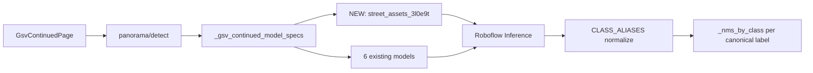

# Add `3-l0e9t/14` to GSV Continued

## Finding: model does not exist yet

Searched the repo for `3-l0e9t` / `l0e9t` — **no match.**

### Current GSV Continued models (7 after this change)

| Source key | Model ID | Scope |
|------------|----------|-------|
| `primary` | `vehicle-detection-7nnx0/4` | App-wide |
| `street_light_ci0on` | `street-light-ci0on/1` | App-wide |
| `street_light_pkozz` | `street-light-pkozz/1` | GSV-only |
| `traffic_signal` | `traffic-signal-sg7ou/4` | App-wide |
| `traffic_signs` | `street-view-traffic-signs/3` | GSV-only |
| `traffic_light_1wdof` | `traffic-light-1wdof/3` | GSV-only |
| **`street_assets_3l0e9t`** | **`3-l0e9t/14`** | **GSV-only (new)** |



---

## 1. Backend model wiring — [`backend/detector.py`](backend/detector.py)

Add env-driven config (mirror [`GSV_TRAFFIC_LIGHT_1WDOF_*`](backend/detector.py)):

```python
GSV_STREET_ASSETS_3L0E9T_PROJECT_ID = os.getenv("GSV_STREET_ASSETS_3L0E9T_PROJECT_ID", "3-l0e9t")
GSV_STREET_ASSETS_3L0E9T_MODEL_VERSION = os.getenv("GSV_STREET_ASSETS_3L0E9T_MODEL_VERSION", "14")
ENABLE_GSV_STREET_ASSETS_3L0E9T = os.getenv("ENABLE_GSV_STREET_ASSETS_3L0E9T", "true").lower() in (...)
GSV_STREET_ASSETS_3L0E9T_MODEL_ID = f"{...}/{...}"
```

Wire into:

- [`_gsv_continued_model_specs()`](backend/detector.py) — append `("street_assets_3l0e9t", GSV_STREET_ASSETS_3L0E9T_MODEL_ID)` when enabled
- [`get_gsv_continued_model_registry()`](backend/detector.py) — entry with `"gsv_only": True`
- Update docstrings: “six models” → “seven models”

**Do not** add to [`_default_model_specs()`](backend/detector.py) — map/dataset pages unchanged.

---

## 2. Class normalization — overlaps + pass-through (your choice)

Extend [`CLASS_ALIASES`](backend/detector.py). `_normalize_class()` already lowercases before lookup.

### Map to existing canonical classes

| Roboflow class | Canonical label |
|----------------|-----------------|
| `car` | `Car` |
| `motorcycle` | `Motorcycle` |
| `person` | `Person` |
| `traffic light` | `Traffic Signal` |
| `tree trunk` | `Tree` |

### Pass-through as Title Case (new app classes)

| Roboflow class | Canonical label |
|----------------|-----------------|
| `truck` | `Truck` |
| `bus` | `Bus` |
| `bicycle` | `Bicycle` |
| `train` | `Train` |
| `bench` | `Bench` |
| `fire hydrant` | `Fire Hydrant` |
| `potted plant` | `Potted Plant` |
| `Dustbin` / `dustbin` | `Dustbin` |
| `Bollards` / `bollards` | `Bollards` |
| `Garbage container` | `Garbage Container` |
| `Stairs` / `stairs` | `Stairs` |
| `Street railing` | `Street Railing` |

Add lowercase alias keys for all of the above so mixed-case Roboflow outputs normalize consistently.

### Display metadata — [`backend/detector.py`](backend/detector.py) + [`frontend/src/constants/classes.js`](frontend/src/constants/classes.js)

Add `CLASS_COLORS`, `CLASS_EMOJIS`, and frontend `CLASS_META` / colors for the **12 new classes** (existing 5 reuse current entries). Example backend entries:

```python
"Truck": (200, 100, 50),
"Bus": (180, 80, 40),
"Bicycle": (100, 200, 100),
# ... etc
```

No geolocation changes required — new classes use default bearing/distance geo like `Car`/`Person`; only `STATIC_GROUND_CLASSES` get height-based sizing (unchanged).

NMS: overlapping `car` from `primary` and `street_assets_3l0e9t` both normalize to `Car` → per-class NMS keeps higher-confidence box.

---

## 3. Config / deployment

| File | Change |
|------|--------|
| [`.env.example`](.env.example) | Document `GSV_STREET_ASSETS_3L0E9T_*` + universe URL comment |
| [`docker-compose.yml`](docker-compose.yml) | Pass 3 env vars to `backend` |
| [`.env`](.env) | Add vars locally (user file, not committed) |

```env
# https://universe.roboflow.com/3-l0e9t/3-l0e9t/model/14
GSV_STREET_ASSETS_3L0E9T_PROJECT_ID=3-l0e9t
GSV_STREET_ASSETS_3L0E9T_MODEL_VERSION=14
ENABLE_GSV_STREET_ASSETS_3L0E9T=true
```

---

## 4. Timeout bump (7 models)

Per-view inference timeout becomes `30 + 6×15 = 120s` via [`_inference_timeout_for_specs()`](backend/detector.py).

| File | Change |
|------|--------|
| [`frontend/src/api.js`](frontend/src/api.js) | `detectGsvContinuedPanorama` timeout `300000` → **`360000`** (6 min) |
| [`frontend/src/api.js`](frontend/src/api.js) | `getGsvContinuedModelsHealth` timeout `180000` → **`240000`** |

Panorama runs 4 views × 7 models; semaphore(2) keeps concurrency manageable but total wall time increases.

---

## 5. No other file changes required

These pick up the 7th model automatically:

- [`probe_models()`](backend/detector.py) + [`scripts/test_gsv_models.py`](scripts/test_gsv_models.py)
- [`GET /gsv-continued/models/health`](backend/main.py)
- [`POST .../panorama/detect`](backend/main.py) — uses `detect_gsv_continued_from_base64` per view
- [`GsvContinuedImagePanel.jsx`](frontend/src/components/GsvContinuedImagePanel.jsx) model OK counter
- Detection table `source_model` column shows `street_assets_3l0e9t`

---

## 6. Verification

| Step | Pass criteria |
|------|---------------|
| Restart backend | New env vars loaded |
| `python scripts/test_gsv_models.py` | 7 rows; `3-l0e9t/14` shows `ok` |
| GSV Continued panorama | `model_status` shows 7/7 OK; table includes Truck, Bus, Bollards, etc. |
| Overlap check | `car`/`person`/`traffic light` appear as `Car`/`Person`/`Traffic Signal` (not raw Roboflow labels) |
| Regression | Map/dataset detect still 3-model pipeline |

**If probe fails:** confirm inference server has access to `3-l0e9t/14` and API key/workspace permissions.

---

## Files to change

| Action | File |
|--------|------|
| Modify | [`backend/detector.py`](backend/detector.py) — env, specs, registry, aliases, colors, emojis |
| Modify | [`frontend/src/constants/classes.js`](frontend/src/constants/classes.js) — 12 new class entries |
| Modify | [`.env.example`](.env.example), [`docker-compose.yml`](docker-compose.yml), [`.env`](.env) |
| Modify | [`frontend/src/api.js`](frontend/src/api.js) — timeout bumps |

**Optional:** add alias unit test in `backend/tests/test_gsv_panorama.py` or new `test_gsv_3l0e9t_aliases.py` (no inference).
