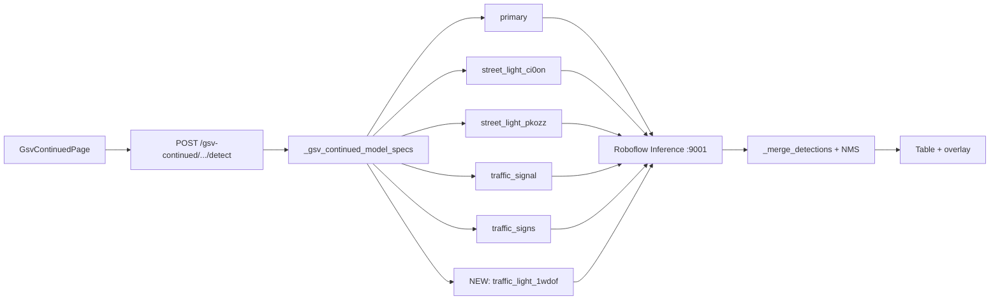

# Add `traffic-light-1wdof/3` to GSV Continued

## Finding: model does not exist yet

Searched the repo for `traffic-light-1wdof`, `1wdof`, and related IDs. **No match.** A prior plan ([`.cursor/plans/gsv_model_add_and_health_8017e6d5.plan.md`](.cursor/plans/gsv_model_add_and_health_8017e6d5.plan.md)) discussed a different model (`traffic-signs-and-traffic-lights/6`) but that was never wired into [`backend/detector.py`](backend/detector.py).

### Current GSV Continued models (5 today)

| Source key | Model ID | Scope |
|------------|----------|-------|
| `primary` | `vehicle-detection-7nnx0/4` | App-wide |
| `street_light_ci0on` | `street-light-ci0on/1` | App-wide |
| `street_light_pkozz` | `street-light-pkozz/1` | GSV-only |
| `traffic_signal` | `traffic-signal-sg7ou/4` | App-wide |
| `traffic_signs` | `street-view-traffic-signs/3` | GSV-only |

**New 6th model:** `traffic-light-1wdof/3` (GSV-only), source key `traffic_light_1wdof`.



---

## Implementation (mirror `GSV_TRAFFIC_SIGNS` pattern)

### 1. Backend model wiring — [`backend/detector.py`](backend/detector.py)

Add env-driven config next to existing GSV vars (~lines 48–67):

```python
GSV_TRAFFIC_LIGHT_1WDOF_PROJECT_ID = os.getenv("GSV_TRAFFIC_LIGHT_1WDOF_PROJECT_ID", "traffic-light-1wdof")
GSV_TRAFFIC_LIGHT_1WDOF_MODEL_VERSION = os.getenv("GSV_TRAFFIC_LIGHT_1WDOF_MODEL_VERSION", "3")
ENABLE_GSV_TRAFFIC_LIGHT_1WDOF = os.getenv("ENABLE_GSV_TRAFFIC_LIGHT_1WDOF", "true").lower() in ("1", "true", "yes")
GSV_TRAFFIC_LIGHT_1WDOF_MODEL_ID = f"{GSV_TRAFFIC_LIGHT_1WDOF_PROJECT_ID}/{GSV_TRAFFIC_LIGHT_1WDOF_MODEL_VERSION}"
```

Wire into three existing helpers (same pattern as `traffic_signs`):

- [`_gsv_continued_model_specs()`](backend/detector.py) — append `("traffic_light_1wdof", GSV_TRAFFIC_LIGHT_1WDOF_MODEL_ID)` when enabled
- [`get_gsv_continued_model_registry()`](backend/detector.py) — add entry with `"gsv_only": True`
- Update docstring/comments: “five models” → “six models”

**Do not** add to [`_default_model_specs()`](backend/detector.py) — Mapillary map and dataset pages stay on the existing 3-model pipeline.

### 2. Class normalization — all 10 Roboflow labels → `Traffic Signal`

Extend [`CLASS_ALIASES`](backend/detector.py) (~lines 97–121). `_normalize_class()` already lowercases before lookup, so lowercase keys cover mixed-case Roboflow outputs.

Map these model classes (and close variants) to **`Traffic Signal`** (your choice — reuses existing color, emoji, geolocation height, and NMS bucket with `traffic-signal-sg7ou/4`):

| Roboflow class | Alias key(s) to add |
|----------------|---------------------|
| `green_light` / `Green_light` | `green_light`, `green-traffic-lights` |
| `red_light` | `red_light`, `red-traffic-lights`, `traffic-light-red` |
| `yellow_light` | `yellow_light`, `yellow-light`, `yellow-traffic-lights` |
| Catch-all (if model emits generic label) | `traffic light`, `traffic-light`, `traffic_light`, `traffic lights` |

No changes needed to [`VERTICAL_SLIM_CLASSES`](backend/detector.py) — `Traffic Signal` is already included for GSV bbox-size filtering.

No frontend changes — [`frontend/src/constants/classes.js`](frontend/src/constants/classes.js) and [`GsvContinuedDetectionTable.jsx`](frontend/src/components/GsvContinuedDetectionTable.jsx) already render `Traffic Signal`.

### 3. Config / deployment files

| File | Change |
|------|--------|
| [`.env.example`](.env.example) | Document `GSV_TRAFFIC_LIGHT_1WDOF_*` vars + Roboflow universe URL comment |
| [`docker-compose.yml`](docker-compose.yml) | Pass the 3 new env vars to `backend` (after `GSV_TRAFFIC_SIGNS_*` block) |
| [`.env`](.env) | Add the 3 vars explicitly (user local; not committed) |

Example `.env.example` block:

```
# https://universe.roboflow.com/traffic-light-1wdof/traffic-light-1wdof/model/3
GSV_TRAFFIC_LIGHT_1WDOF_PROJECT_ID=traffic-light-1wdof
GSV_TRAFFIC_LIGHT_1WDOF_MODEL_VERSION=3
ENABLE_GSV_TRAFFIC_LIGHT_1WDOF=true
```

### 4. Timeout bump (recommended)

6 parallel models → backend inference timeout becomes `30 + 5×15 = 105s` per [`_inference_timeout_for_specs()`](backend/detector.py).

In [`frontend/src/api.js`](frontend/src/api.js), raise `detectGsvContinuedLocation` and `getGsvContinuedModelsHealth` timeout from `150000` → **`180000`** ms to avoid client-side aborts on cold starts.

### 5. No other file changes required

These already pick up new models automatically via the registry:

- [`probe_models()`](backend/detector.py) + [`scripts/test_gsv_models.py`](scripts/test_gsv_models.py)
- [`GET /gsv-continued/models/health`](backend/main.py)
- [`GET /config`](backend/main.py) → `gsv_continued_models`
- [`GsvContinuedImagePanel.jsx`](frontend/src/components/GsvContinuedImagePanel.jsx) model OK counter (`model_status`)

---

## Verification checklist

| Step | Command / action | Pass criteria |
|------|------------------|---------------|
| Restart backend | `docker compose up -d backend` (or local uvicorn) | Backend loads new env vars |
| Probe all models | `python scripts/test_gsv_models.py` | 6 rows; `traffic-light-1wdof/3` shows `ok` |
| API health | `GET /gsv-continued/models/health` | `summary.total == 6`, new model in list |
| Live detect | GSV Continued page → pick a location | `model_status` shows 6/6 OK; table shows `Traffic Signal` (not color sub-labels); `source_model` column may show `traffic_light_1wdof` |
| Regression | Map / dataset detect | Still 3-model pipeline unchanged |

**If probe fails:** confirm inference server has workspace access to `traffic-light-1wdof/3`, `ROBOFLOW_API_KEY` is set, and cold-start completes within timeout.

---

## Expected behavior after merge

- Overlapping boxes from `traffic_signal` (sg7ou) and `traffic_light_1wdof` (1wdof) both normalize to `Traffic Signal` → per-class NMS in [`_nms_by_class()`](backend/detector.py) keeps the higher-confidence box.
- GSV table “Model” column will show which source produced each detection (`traffic_light_1wdof` vs `traffic_signal`).
- Geolocation uses existing `ASSUMED_TRAFFIC_SIGNAL_HEIGHT_M` from [`backend/geolocation.py`](backend/geolocation.py) — no geo changes.
