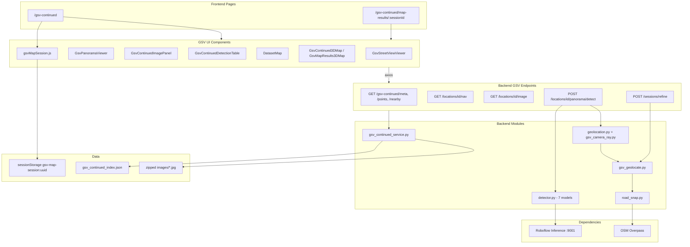
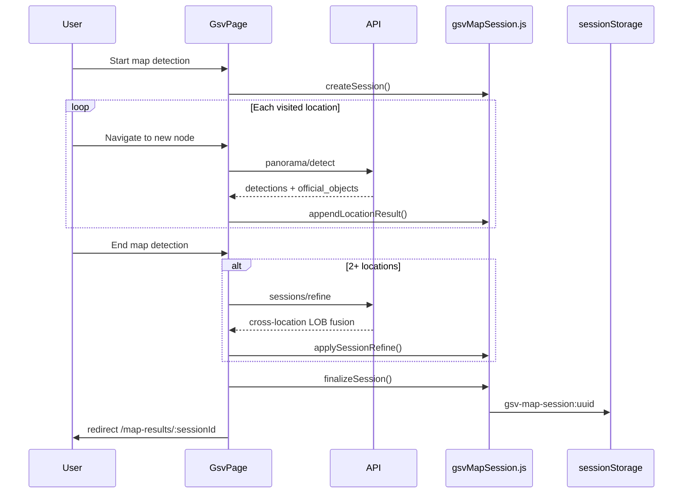
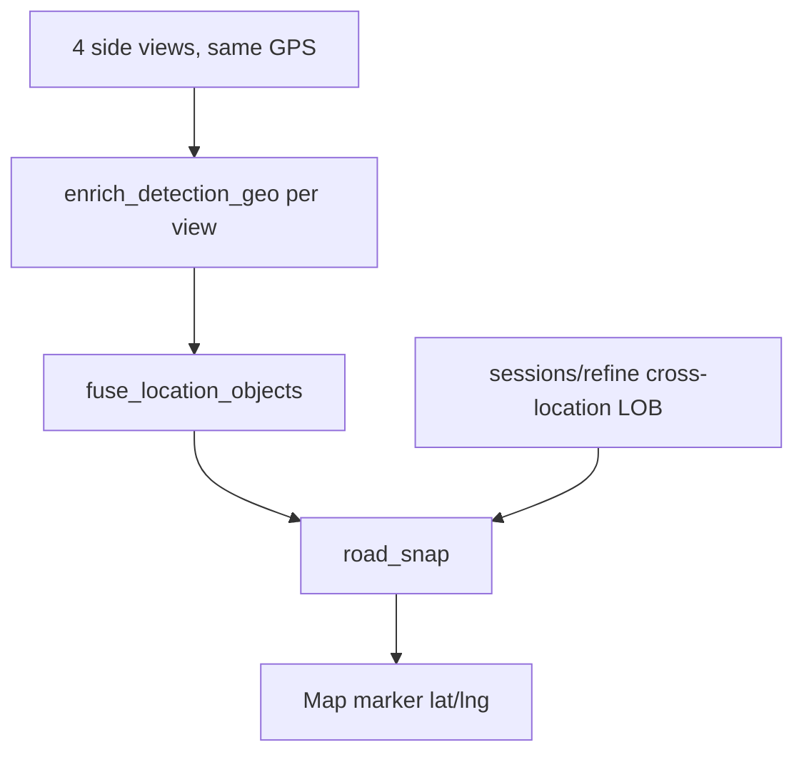
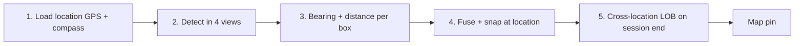

# GSV Continued — Technical Director Briefing

Save this document to [`docs/gsv-continued-manager-briefing.md`](docs/gsv-continued-manager-briefing.md) after approval.

---

## 1. What GSV Continued Is

**GSV Continued** is a self-contained workflow inside the Urban Infrastructure Detector that lets a user:

1. **Walk a pre-built road graph** like Google Street View (forward / back / left / right)
2. **Run 360° panorama detection** at each location (4 side views, 7 ML models in parallel)
3. **Geolocate static street assets** (poles, lights, signals, signs) onto a map
4. **Record a corridor session** — drive multiple locations, fuse detections across the path, review on 2D/3D map, export HTML

**Imagery source:** Local **PitOrlManh / UCF dataset** (`Dataset_PitOrlManh/`) — JPG tiles with GPS, compass, and nav links. **Not** the Google Street View API.

**Business value:** Map static infrastructure along a corridor without field surveys, using offline street imagery and automated detection + geo estimation.

---

## 2. One-Line Pipeline (GSV Only)

```text
Road graph location → 4-view panorama detect → Per-view geo → Location fusion → Session LOB refine → Road snap → Map session → Review & export
```

---

## 3. Architecture (GSV Scope Only)



---

## 4. User Workflows

### 4.1 Browse & Detect — `/gsv-continued`

**Page:** [`frontend/src/pages/GsvContinuedPage.jsx`](frontend/src/pages/GsvContinuedPage.jsx)

| Step | What happens |
|------|--------------|
| Load | Fetch dataset meta + all location points (`getGsvContinuedMeta`, `getGsvContinuedPoints`) |
| Select | Click blue dot on 2D/3D map, or coord search (`getGsvContinuedNearby`) |
| Auto-detect | `detectGsvContinuedPanorama(locationId)` — 4 side views, stitched annotated panorama |
| Navigate | Arrow keys / UI → `getGsvContinuedNav(id, fromId)` — pre-built graph edges |
| View | `GsvStreetViewViewer` + `GsvPanoramaViewer` — horizontal 360° scroll, view chips 0–5 |
| Filter | Class filter redraws panorama client-side via [`gsvPanoramaClassFilter.js`](frontend/src/lib/gsvPanoramaClassFilter.js) |

**Views per location** (from [`gsv_continued_service.py`](backend/gsv_continued_service.py)):

| View | Label | Role |
|------|-------|------|
| 0 | Overlay | Map overlay tile |
| 1–4 | Side 1–4 | 90° apart; used for panorama detection |
| 5 | Sky | Upward view |

Compass: UCF `.mat` compass is CCW from north; converted to standard bearing via `GSV_COMPASS_CCW`.

### 4.2 Map Detection Session (optional)

Started from GSV Continued page — records geo results as user drives the corridor.



**Session object** (client-side only):

- `locations[]` — ordered trail of visited nodes
- `detections[]` — official/estimated map pins (`tier: official` after fusion)
- `raw_detections[]` — per-view estimates before fusion
- `official_counts`, `verified_counts` — aggregate KPIs
- `location_panorama_cache` — for refine + HTML export
- `geo_pipeline_version` — tracks backend geo logic version

Managed in [`frontend/src/lib/gsvMapSession.js`](frontend/src/lib/gsvMapSession.js). **Not persisted on server.**

### 4.3 Map Results Review — `/gsv-continued/map-results/:sessionId`

**Page:** [`frontend/src/pages/GsvMapResultsPage.jsx`](frontend/src/pages/GsvMapResultsPage.jsx)

| Step | What happens |
|------|--------------|
| Load | `loadSession(sessionId)` from `sessionStorage` — redirect if missing |
| Map | Camera trail + detection pins on 2D Leaflet or 3D MapLibre |
| Filter | Static-only (Pole, Light, Signal, Sign); verified-only (official tier / high quality) |
| Click pin | Lazy-load nav + panorama detect for that location (cached) |
| Export | Self-contained HTML via [`gsvMapExportHtml.js`](frontend/src/lib/gsvMapExportHtml.js) |

---

## 5. Dataset & Index

**Root:** `Dataset_PitOrlManh/` (mounted read-only in Docker at `/app/Dataset_PitOrlManh`)

| Asset | Path | Purpose |
|-------|------|---------|
| GPS/compass source | `GPS_Long_Lat_Compass.mat` | Original UCF metadata |
| Built index | `gsv_continued_index.json` | Locations with lat/lng/compass/nav/views |
| Image tiles | `zipped images/` | JPG per location × view |

**Index build** (offline, one-time or after dataset changes):

```powershell
pip install scipy
python backend/scripts/build_gsv_continued_index.py
```

Script: [`backend/scripts/build_gsv_continued_index.py`](backend/scripts/build_gsv_continued_index.py)

Each index entry contains: `id`, `lat`, `lng`, `compass`, `nav` (forward/back/left/right location IDs), `views` availability.

---

## 6. Detection Pipeline (GSV — 7 Models)

GSV Continued runs **7 models in parallel** via local Roboflow Inference Server.

| # | Source key | Model | Scope |
|---|------------|-------|-------|
| 1 | `primary` | vehicle-detection-7nnx0 v4 | App-wide |
| 2 | `street_light_ci0on` | street-light-ci0on v1 | App-wide |
| 3 | `traffic_signal` | traffic-signal-sg7ou v4 | App-wide |
| 4 | `street_light_pkozz` | street-light-pkozz v1 | GSV only |
| 5 | `traffic_signs` | street-view-traffic-signs v3 | GSV only |
| 6 | `traffic_light_1wdof` | traffic-light-1wdof v3 | GSV only |
| 7 | `street_assets_3l0e9t` | 3-l0e9t v14 | GSV only (benches, bollards, hydrants, etc.) |

Config: [`.env.example`](.env.example) lines 29–47. Registry exposed via `GET /gsv-continued/models/health`.

**Panorama detect flow** ([`detector.detect_gsv_continued_panorama`](backend/detector.py)):

1. Load views 1–4 as base64
2. Run all 7 models per view in parallel
3. Merge predictions → IoU NMS → class alias normalization
4. Filter implausible vertical boxes (`GSV_MAX_BBOX_RATIO` = 50% of image)
5. Stitch annotated side views into horizontal panorama strip
6. Return per-view detections + stitched image + model status per model

**Map display classes** (static infrastructure focus):

`Pole`, `Street Light`, `Traffic Signal`, `Traffic Sign` — defined in [`gsvMapSession.js`](frontend/src/lib/gsvMapSession.js) as `STATIC_MAP_CLASSES`. Cars and other classes appear in detection table but are filtered from default map view.

---

## 7. Geolocation Pipeline (GSV-Specific)

This is the core technical challenge. GSV tiles lack Mapillary's OpenSfM `computed_rotation`, so GSV uses a dedicated geo stack.

### 7.1 Per-view enrichment

Priority chain when `gsv_mode=True` in `enrich_detection_geo()`:

| Priority | Method | Module | How |
|----------|--------|--------|-----|
| 1 | `gsv_horizon_ray` | [`gsv_camera_ray.py`](backend/gsv_camera_ray.py) | Depression angle from horizon line to bbox anchor → ground hit |
| 2 | `bearing_size` | [`geolocation.py`](backend/geolocation.py) | Assumed object height × bbox pixel height → distance |
| 3 | `bearing_single` | [`geolocation.py`](backend/geolocation.py) | Bearing from HFOV + default 15 m (low quality; excluded from fusion by default) |

Inputs per view: camera `lat/lng`, `compass_angle` (view-specific heading), `image_width`, bbox anchor pixel.

**Key constraint:** All 4 side views share **one camera GPS** — zero lateral parallax within a location. Cannot LOB-triangulate from views at the same node.

### 7.2 Per-location fusion

[`gsv_geolocate.fuse_location_objects()`](backend/gsv_geolocate.py):

1. Cluster detections within `GSV_LOC_CLUSTER_RADIUS_M` (12 m)
2. Pick best detection per cluster (method rank → confidence → bbox height)
3. Produce `official_objects` for that location

### 7.3 Panorama official objects + snap

After per-view geo, `process_panorama_official_objects()` in [`gsv_geolocate.py`](backend/gsv_geolocate.py) then [`road_snap.snap_official_objects()`](backend/road_snap.py):

| Class | Snap strategy |
|-------|---------------|
| Traffic Signal, Traffic Sign | Intersection corner snap (OSM Overpass + GSV nav graph fallback) |
| Street Light, Pole | Roadside edge snap (perpendicular offset `ROAD_EDGE_OFFSET_M`) |

Rejection: if snap displacement > `SNAP_MAX_DISPLACEMENT_M` (25 m), keep raw estimate.

### 7.4 Cross-location session refine

`POST /gsv-continued/sessions/refine` — when user ends session with 2+ locations:

1. Frontend sends all visited locations + their raw detections
2. Backend runs session-wide LOB clustering (`GSV_SESSION_CLUSTER_RADIUS_M`)
3. Intersect bearing rays from different camera positions along the corridor
4. Re-snap official objects
5. Return updated `official_objects_by_location` + counts

This is the **primary accuracy mechanism** for GSV — fusion across driven path, not within-location parallax.



---

## 8. API Endpoints (GSV Only)

All in [`backend/main.py`](backend/main.py):

| Method | Endpoint | Purpose |
|--------|----------|---------|
| GET | `/gsv-continued/models/health` | Probe all 7 models on inference server |
| GET | `/gsv-continued/meta` | Dataset bounds, location count |
| GET | `/gsv-continued/points` | All location lat/lng for map |
| GET | `/gsv-continued/nearby` | Nearest location to coord search |
| GET | `/gsv-continued/locations/{id}/nav` | Graph edges + suggested view |
| GET | `/gsv-continued/locations/{id}/image` | Serve JPG tile (view 0–5, optional resize) |
| POST | `/gsv-continued/locations/{id}/detect` | Single-view detect + geo |
| POST | `/gsv-continued/locations/{id}/panorama/detect` | 4-view detect + fusion + snap |
| POST | `/gsv-continued/sessions/refine` | Cross-location LOB re-fusion |

Frontend wrappers: [`frontend/src/api.js`](frontend/src/api.js) — panorama detect timeout 360 s, refine 120 s, abort on navigation.

---

## 9. Frontend Component Map (GSV Only)

```text
frontend/src/
├── pages/
│   ├── GsvContinuedPage.jsx       # Main walk + session recording
│   └── GsvMapResultsPage.jsx      # Post-session review
├── components/
│   ├── GsvStreetViewViewer.jsx    # Immersive nav + keyboard
│   ├── GsvPanoramaViewer.jsx      # 360° horizontal scroll strip
│   ├── GsvContinuedImagePanel.jsx # View selector, counts, model status
│   ├── GsvContinuedDetectionTable.jsx  # Per-detection geo table
│   ├── GsvCoordSearch.jsx         # Lat/lng lookup
│   ├── DatasetMap.jsx             # 2D Leaflet (shared map base)
│   ├── GsvContinued3DMap.jsx      # 3D browse map
│   ├── GsvMapResults3DMap.jsx     # 3D results map
│   ├── Map3DBase.jsx              # Shared MapLibre + terrain
│   └── MapModeToggle.jsx          # 2D ↔ 3D switch
└── lib/
    ├── gsvMapSession.js           # Session create/append/finalize
    ├── gsvPanoramaClassFilter.js  # Client-side class filter redraw
    ├── gsvMapExportHtml.js        # Standalone HTML export
    └── map3d/                     # 3D map config, layers, markers
```

**State:** Page-local React `useState` — no global store. `AbortController` cancels in-flight panorama detect on location change.

**Maps:**

- 2D: Leaflet + OSM/Esri satellite basemap, marker clustering, navigation trail polyline
- 3D: MapLibre GL + OpenFreeMap tiles + AWS Terrarium DEM + extruded buildings (no API keys)

---

## 10. Configuration (GSV-Relevant Env Vars)

From [`.env.example`](.env.example):

**Models (GSV-specific):**
- `GSV_STREET_LIGHT_PK0ZZ_*`, `GSV_TRAFFIC_SIGNS_*`, `GSV_TRAFFIC_LIGHT_1WDOF_*`, `GSV_STREET_ASSETS_3L0E9T_*`
- `GSV_MAX_BBOX_RATIO`, `DETECTION_CONFIDENCE_MIN`, `DETECTION_IOU_THRESHOLD`

**Geo / bearing:**
- `HORIZONTAL_FOV_DEG`, `HFOV_SCALE`, `COMPASS_BEARING_OFFSET_DEG`, `GSV_COMPASS_CCW`
- `ASSUMED_POLE_HEIGHT_M`, `ASSUMED_STREET_LIGHT_HEIGHT_M`, `ASSUMED_TRAFFIC_SIGNAL_*`
- `GSV_HORIZONTAL_FOV_DEG` (optional override)

**Fusion:**
- `GSV_LOC_CLUSTER_RADIUS_M`, `GSV_SESSION_CLUSTER_RADIUS_M`, `GSV_LOB_ANGLE_THRESHOLD_DEG`
- `GSV_EXCLUDE_BEARING_SINGLE`, `GSV_FUSION_BEARING_AGREE_DEG`, `GSV_OFFICIAL_STATIC_ONLY`

**Snapping:**
- `SNAP_SEARCH_RADIUS_M`, `INTERSECTION_CORNER_OFFSET_M`, `ROAD_EDGE_OFFSET_M`
- `SNAP_MAX_DISPLACEMENT_M`, `SNAP_ROADSIDE_MAX_DISPLACEMENT_M`, `ROADSIDE_ACCEPT_MAX_M`
- `SNAP_OSM_WAYS_ENABLED`, `OVERPASS_URLS`

**Dataset:**
- `GSV_CONTINUED_ROOT=./Dataset_PitOrlManh`

---

## 11. Testing & Validation

| Test / script | What it validates |
|---------------|-------------------|
| `test_gsv_camera_ray.py` | Horizon ray ground intersection |
| `test_gsv_geolocate.py` | Location fusion, official counts, bearing_single exclusion |
| `test_gsv_continued_geo.py` | Compass normalization, view headings, HFOV |
| `test_gsv_panorama.py` | Panorama stitching, side views |
| `test_road_snap.py` | Intersection corner snap |
| `test_roadside_snap.py` | Roadside offset for poles/lights |
| `test_gsv_3l0e9t_aliases.py` | Class alias normalization for street assets model |
| `audit_gsv_session_geo.py` | Quantify pin error on real sessions |
| `validate_gsv_intersections.py` | Ground-truth intersection zones |

Fixtures: `backend/tests/fixtures/gsv_geo/sample_session.json`, `validation_zones.json`

Recent geo fix plan: [`.cursor/plans/gsv_geo_estimation_fix_88d223b5.plan.md`](.cursor/plans/gsv_geo_estimation_fix_88d223b5.plan.md)

---

## 12. Known Limitations (GSV-Specific)

Present honestly to a technical director:

1. **No within-location parallax** — 4 views share one GPS; accuracy depends on cross-location session refine + road snapping, not single-node triangulation.

2. **Heuristic distance** — `bearing_size` uses assumed object heights; wrong height → wrong pin. Horizon ray helps but is approximate without full camera intrinsics.

3. **Sessions are ephemeral** — `sessionStorage` only; lost on browser clear. HTML export is the persistence path. No server-side session DB.

4. **Local dataset only** — PitOrlManh UCF corpus, not live Google Street View. Production would need GSV API or equivalent imagery provider in the same pipeline slot.

5. **OSM snap dependency** — intersection/roadside snap quality varies with Overpass uptime and OSM completeness in the AOI.

6. **7-model latency** — panorama detect runs 4 views × 7 models; first call after cold start can take 30–60+ seconds. 360 s API timeout configured.

7. **Snap rejection** — pins that would move >25 m to snap are kept at raw (often wrong) position with lower quality tier.

---

## 13. Demo Script for Manager (10 min, GSV Only)

1. **Prerequisites** — inference server running (`inference server start`), app up (`docker compose up`), dataset indexed
2. **Open** `http://localhost:5173/gsv-continued`
3. **Select location** on map — show auto panorama detect, annotated 360° strip, detection table with geo methods
4. **Navigate** 2–3 nodes with arrows — show trail on map, re-detect per location
5. **Toggle 3D map** — terrain + buildings for spatial context
6. **Start map detection** → visit 3+ locations → **End** → show refine step
7. **Map results page** — static-only filter, verified-only filter, click pin → street view sync
8. **Export HTML** — self-contained report
9. **Optional** — `GET /gsv-continued/models/health` to show 7-model status

---

## 14. Production Path (GSV Continued)

| Dimension | Today | Production gap |
|-----------|-------|----------------|
| Imagery | Local PitOrlManh JPG tiles | Live GSV API or owned imagery pipeline |
| Session storage | Browser sessionStorage | Server-side persistence + user accounts |
| Geo accuracy | Heuristic + LOB + OSM snap | Ground-truth calibration per city; possibly LiDAR/DSM |
| Scale | Single-user demo | Batch corridor processing without manual walk |
| Models | 7 Roboflow models via env | Model versioning, A/B, confidence calibration per class |

---

## Deliverables

After plan approval, write **two** markdown files:

1. **`docs/gsv-continued-manager-briefing.md`** — technical reference (Sections 1–14 above)
2. **`docs/gsv-continued-verbal-guide.md`** — spoken explanation guide (Section 15 below)

---

## 15. Verbal Explanation Guide (Second Document)

This is a **talk track** — not a slide deck. Use it to rehearse explaining GSV Continued out loud to your technical director.

---

### 15.1 Opening — 30-Second Pitch

> "GSV Continued lets us drive through a pre-mapped street corridor like Google Street View, automatically detect street infrastructure in every panorama — lights, poles, signals, signs — and place those objects on a map. We can record a full drive session, fuse detections across multiple camera positions, snap pins to real road geometry, and export a reviewable map report. Right now it runs on a local UCF street-view dataset; the same pipeline slot accepts live GSV or any street imagery provider."

---

### 15.2 Opening — 2-Minute Version

Add to the 30-second pitch:

> "The user opens the GSV Continued page, picks a point on the map, and the system immediately runs detection on all four side views of that location — seven AI models in parallel. They navigate forward, back, left, right along a pre-built road graph. Each stop re-detects automatically.
>
> If they want a corridor inventory, they start a **map detection session**. Every location they visit gets appended with geo-placed detections. When they finish, the backend re-fuses everything across the whole driven path — that's where multi-view triangulation actually helps, because each location has a different camera GPS.
>
> The results page shows the full trail, filtered pins on a 2D or 3D map, linked back to the annotated street view imagery. They can export a standalone HTML report. Sessions live in the browser for now — export is the persistence mechanism."

---

### 15.3 Feature-by-Feature — What to Say

Explain each feature as: **what the user sees → what happens internally**.

#### Street View Navigation

**Say:** "It feels like Google Street View — arrow keys, forward/back/left/right — but it's our own dataset with a pre-built navigation graph, not the Google API."

**Internal:** Each location is a node in `gsv_continued_index.json`. Nav links (`forward`, `back`, `left`, `right`) point to adjacent node IDs. `GET /locations/{id}/nav` returns edges + which side view to show. Images served on demand from `zipped images/`.

#### Auto Panorama Detection

**Say:** "You don't click Detect — as soon as you land on a location, all four side views are scanned automatically. You see a stitched 360° panorama with bounding boxes drawn on it."

**Internal:** `POST /panorama/detect` loads views 1–4, runs 7 Roboflow models per view, merges with NMS, filters absurdly large boxes, geo-enriches each detection, fuses within location, snaps to road/intersection, returns stitched annotated strip + detection table.

#### Detection Table with Geo Columns

**Say:** "Every box shows class, confidence, estimated lat/lng, geo method, and quality tier. You can see whether a pin came from horizon ray, height-based distance, or fused triangulation."

**Internal:** `geo_method` tells you the pipeline branch: `gsv_horizon_ray`, `bearing_size`, `bearing_single`, `gsv_lob_triangulation`, `intersection_corner_snap`, `road_edge_snap`. `geo_quality` and `tier: official` indicate confidence after fusion/snap.

#### Class Filter on Panorama

**Say:** "Filter to just street lights or just signals — the panorama redraws client-side without re-running inference."

**Internal:** `gsvPanoramaClassFilter.js` uses Canvas to redraw only matching bboxes on the cached annotated image. Map markers filter separately via `gsvMapSession.js`.

#### 2D / 3D Map Toggle

**Say:** "2D is fast Leaflet for overview. 3D is MapLibre with terrain and building extrusion — better for judging whether a pin is on the road or on a building."

**Internal:** Shared `Map3DBase` + `lib/map3d/*`. OpenFreeMap tiles + AWS Terrarium DEM. No Google Maps API key.

#### Map Detection Session

**Say:** "Start session → drive the corridor → end session. The system records every stop, then runs a second-pass fusion across all visited locations before saving."

**Internal:** `createSession()` → `appendLocationResult()` per visit → on end, if 2+ locations call `POST /sessions/refine` for cross-location LOB → `finalizeSession()` writes to `sessionStorage` key `gsv-map-session:{uuid}`.

#### Map Results & Filters

**Say:** "After a session you get a dedicated results page — camera trail, detection pins, static-only filter so cars don't clutter the map, verified-only filter for high-confidence official objects."

**Internal:** `STATIC_MAP_CLASSES` = Pole, Street Light, Traffic Signal, Traffic Sign. `verifiedOnly` filters `tier === 'official'` or `geo_quality === 'high'`.

#### HTML Export

**Say:** "One click produces a self-contained HTML file with embedded images — shareable without the app running."

**Internal:** `gsvMapExportHtml.js` inlines base64 imagery from session cache + map markers into a standalone page.

#### Coord Search

**Say:** "Type a lat/lng, jump to the nearest road-graph location within 25 metres."

**Internal:** `GET /gsv-continued/nearby?lat=&lng=&max_dist_m=25` — haversine nearest-neighbor over index.

---

### 15.4 Internal Working — Explain Like a Story

Use this **5-step narrative** when walking through how the system works:

**Step 1 — "Where are we?"**
> The dataset index tells us GPS, compass heading, which JPG tiles exist, and which neighbors we can walk to. The camera is assumed to sit on the road centerline at that GPS point.

**Step 2 — "What's in the image?"**
> Seven detection models run on each of the four side views. Results merge — if two models both see the same pole, NMS keeps the best box. We reject boxes that cover more than half the image (usually false positives).

**Step 3 — "Where is the object on the map?"**
> For each bounding box we compute a bearing from the camera compass + where the box sits horizontally in the frame. Distance comes from either a horizon-ray ground hit or an assumed object height (pole ≈ 8 m, light ≈ 6 m). That gives a raw lat/lng. Important caveat: all four views share the same camera GPS, so we cannot triangulate from views at one stop.

**Step 4 — "Make it plausible"**
> We cluster duplicate detections at one location, pick the best per cluster, then snap: signals/signs to intersection corners via OpenStreetMap, lights/poles to the road edge. If snap would move the pin more than 25 m, we reject the snap and keep the raw estimate (flagged lower quality).

**Step 5 — "Fuse across the drive"**
> When the user ends a session with multiple stops, we send all locations to the refine endpoint. Now we have different camera positions along the corridor — we can intersect lines of bearing from multiple views of the same object. That's the main accuracy win. Re-snap after fusion. Save to browser storage.



---

### 15.5 Analogies (If They Ask "How Is This Different From X?")

| Comparison | What to say |
|------------|-------------|
| vs Google Street View | "Same UX metaphor — walk a corridor — but we own the imagery pipeline and run our own detection + geo on top. No GSV API dependency." |
| vs Mapillary batch (rest of app) | "Mapillary batch discovers images in a polygon automatically. GSV Continued is manual corridor walk with richer per-location panorama and session-based fusion. Mapillary has OpenSfM 3D camera metadata; GSV uses horizon-ray + road snapping instead." |
| vs manual GIS survey | "Instead of a surveyor placing pins, AI draws boxes in street photos and math places them on the map. Human reviews on the results page." |
| vs single-model detection | "Seven models — general urban + specialists for lights, signals, signs, street assets. Ensemble catches more classes at the cost of latency." |

---

### 15.6 Likely Questions & Short Answers

| Question | Answer |
|----------|--------|
| "How accurate are the map pins?" | "Single-stop pins are heuristic — bearing + assumed height. Accuracy improves after session refine (multi-stop LOB) and OSM snapping. We have validation scripts against known intersections." |
| "Why are some pins on buildings?" | "Camera sits on road centerline; a pole at the road edge projects as if it's on the building facade when bearing is slightly off. Roadside snap and cross-location fusion mitigate this; perfect accuracy needs better camera intrinsics or LiDAR." |
| "Why not use Google Street View API?" | "This prototype uses a local UCF dataset for cost/control. The pipeline is provider-agnostic — swap imagery source, keep detection + geo + session logic." |
| "Where is data stored?" | "Sessions in browser sessionStorage — ephemeral. Batch jobs elsewhere in the app use SQLite, but GSV sessions don't. HTML export is the save mechanism today." |
| "How long does detection take?" | "Panorama detect: 4 views × 7 models. Cold start 30–60+ seconds; cached inference faster. 360 s timeout configured." |
| "What classes matter?" | "Business focus: Pole, Street Light, Traffic Signal, Traffic Sign. Others detected (cars, benches, bollards) but filtered from default map view." |
| "Can this run at city scale?" | "Not yet as-is — it's interactive walk + session. Production path is automated corridor batching with server-side session storage." |
| "What external services?" | "Roboflow inference (local), OSM Overpass for road snapping. No Google APIs. Map tiles are OpenFreeMap/Esri on frontend." |

---

### 15.7 What to Emphasize vs What to Caveat

**Lead with (strengths):**
- End-to-end corridor inventory workflow — walk, detect, map, export
- Multi-model ensemble tuned for street infrastructure
- Deliberate geo pipeline: per-view estimate → location fusion → road snap → cross-location LOB
- 2D/3D review UI with linked street view evidence per pin
- Provider-agnostic imagery slot (local today, GSV API tomorrow)

**Be upfront about (honest caveats):**
- Single-location geo is approximate — fusion across the drive is the real accuracy mechanism
- Sessions not persisted server-side yet
- Local dataset only in current deployment
- 7-model cost/latency trade-off
- OSM quality affects snap accuracy

---

### 15.8 Suggested Verbal Walkthrough Order (10 min live demo + talk)

| Min | Do | Say |
|-----|-----|-----|
| 0–1 | Open `/gsv-continued` | "This is our street corridor inspector — pre-mapped road graph, not live GSV API." |
| 1–3 | Click a location, wait for detect | "Four side views, seven models, auto-runs. Panorama shows all boxes. Table shows geo method per detection." |
| 3–5 | Navigate 2 nodes | "Graph navigation — each stop re-detects. Trail draws on map." |
| 5–6 | Toggle 3D | "3D helps judge pin placement against buildings and road." |
| 6–8 | Start session → 3 locations → End | "Session records the drive. Refine fuses across stops — that's the triangulation step." |
| 8–9 | Map results, filters | "Static-only, verified-only. Click pin — jumps to street view evidence." |
| 9–10 | Export HTML | "Standalone report, no server needed to review." |

---

### 15.9 One-Sentence Summaries per Component (Cheat Sheet)

| Piece | One sentence |
|-------|--------------|
| `gsv_continued_service.py` | Serves the dataset index, images, nav graph, and view headings. |
| `detector.py` (GSV path) | Runs 7 models on 4 views, merges, stitches panorama. |
| `geolocation.py` | Converts bbox position + compass into bearing and distance. |
| `gsv_camera_ray.py` | GSV-specific ground hit using horizon depression angle. |
| `gsv_geolocate.py` | Clusters duplicates, picks best, cross-location LOB fusion. |
| `road_snap.py` | Pulls pins onto intersection corners or road edges using OSM. |
| `gsvMapSession.js` | Client-side session recorder and filter logic. |
| `GsvStreetViewViewer` | The immersive walk UI with keyboard nav. |
| `GsvMapResultsPage` | Post-drive review map + export. |

---

### 15.10 Closing Line

> "GSV Continued is a working prototype of automated street-asset mapping along a corridor — detection, geolocation, fusion, and review in one flow. The open items for production are live imagery ingestion, server-side session persistence, and city-scale batching instead of manual walk."
