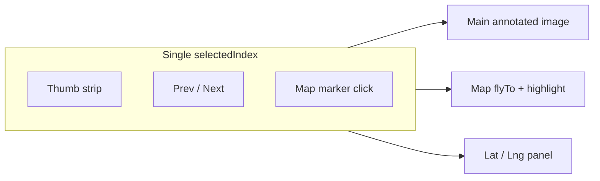
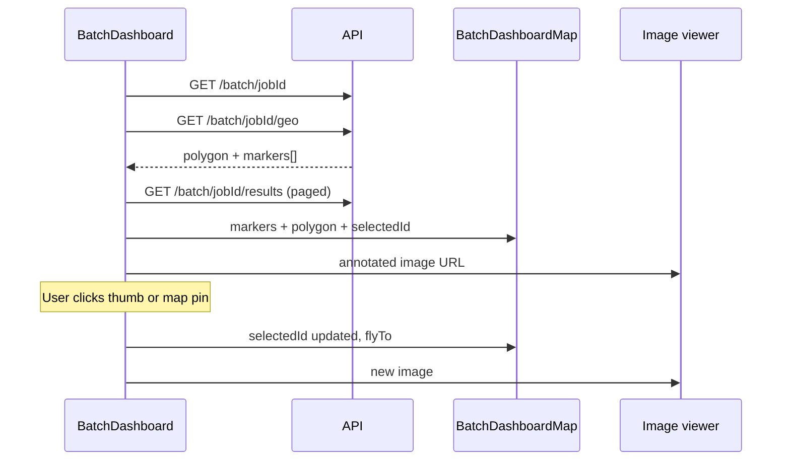

# Dashboard map + synced thumbnails

## Goal

Enhance [`frontend/src/pages/BatchDashboard.jsx`](frontend/src/pages/BatchDashboard.jsx) so users can:

- Browse **small changeable thumbnails** (filmstrip/grid)
- See a **map inside the dashboard** with one point per batch image
- **Change image** (thumb / prev-next / swipe / map click) and have the **active pin** and **lat/lng** update together

No change to detection logic or batch job pipeline.

## Current state

| Piece | Status |
|-------|--------|
| Results API | Each result has `lat`, `lng`, `image_id`, `annotated_url` ([`backend/storage.py`](backend/storage.py) `_row_to_result`) |
| Job API | Includes `polygon` ring for the search area ([`backend/main.py`](backend/main.py) `batch_get`) |
| Dashboard | Large viewer + 72px filmstrip + right detection panel; **no map**, **lat/lng not shown** |
| Pagination | Results load 30 at a time (`PAGE_SIZE`); map needs **all** coordinates for full coverage |



## Layout (dashboard body)

Replace the current 2-column body with a **3-column** layout (header + class chips unchanged):

| Column | Width | Content |
|--------|-------|---------|
| **Map** | ~38% | Leaflet map: batch polygon outline, all image pins, highlighted active pin, optional OSM/satellite toggle |
| **Viewer** | ~37% | Main annotated image, prev/next, swipe; **compact thumb grid** below (smaller tiles, e.g. 56–64px, scrollable) |
| **Details** | ~25% | **Lat / Lng** (prominent, 5–6 decimal places), image id, capture date, detection list |

On narrow viewports, stack map under viewer (CSS flex-wrap or single media query) — optional follow-up if you only target desktop.

## New / updated components

### 1. [`frontend/src/components/BatchDashboardMap.jsx`](frontend/src/components/BatchDashboardMap.jsx) (new)

Reusable map panel for dashboard only (not the main MapView draw flow):

- `MapContainer` + `TileLayer` (reuse basemap URLs from [`MapView.jsx`](frontend/src/components/MapView.jsx))
- **Polygon layer**: `job.polygon` as `[[lng,lat],...]` → Leaflet `Polygon` (green fill, same style as map page)
- **Markers**: one marker per result with valid `lat`/`lng`
  - Default: small blue dot (`divIcon`, ~10px)
  - **Selected**: larger green dot with ring / pulse (reuse `makeIcon` pattern from MapView)
- **`MapFlyTo` helper** (inner component using `useMap`): when `selectedImageId` changes, `map.flyTo([lat, lng], zoom ~17, { duration: 0.4 })`
- **Marker click**: `onSelect(image_id)` → parent sets `index` to matching result
- **Initial bounds**: `fitBounds` on all points + polygon when job loads (once)
- Optional: `MapillaryLayer` if [`getConfig`](frontend/src/api.js) token available (coverage context only; no draw)

Props: `results`, `selectedImageId`, `polygon`, `onSelect`, `mapillaryToken?`

### 2. [`frontend/src/components/ImageThumbGrid.jsx`](frontend/src/components/ImageThumbGrid.jsx) (new)

Extract filmstrip from BatchDashboard:

- Horizontal scroll row of **small** thumbnails (56–64px wide, fixed height)
- Active thumb: green border (keep current behavior)
- Click → `setIndex(i)`; scroll active thumb into view (`scrollIntoView`)
- Use `annotatedImageUrl(jobId, image_id)`; `loading="lazy"` on imgs

### 3. Refactor [`BatchDashboard.jsx`](frontend/src/pages/BatchDashboard.jsx)

- Keep single source of truth: `index` / `selectedResult` derived from `filteredResults`
- **Bidirectional sync**:
  - `goPrev` / `goNext` / thumb click / keyboard → updates `index` → map + meta update
  - Map `onSelect(imageId)` → find index in `filteredResults` by `image_id`, set `index`
- **Metadata block** (right column, above detections):

```text
Latitude:  21.170234
Longitude: 72.831102
Image:     <short id>
Captured:  <date if present>
```

- Load **all marker positions** for the map (see backend note below)
- Keep class filter: filtering thumbs also filters map markers (only show pins for filtered results)

## Backend: lightweight geo endpoint (recommended)

Paginated `/batch/{id}/results` is heavy for 200+ images on the map. Add:

- **`GET /batch/{job_id}/geo`** in [`backend/main.py`](backend/main.py)
- Implementation in [`backend/storage.py`](backend/storage.py): `get_results_geo(job_id)` → `[{ image_id, lat, lng }, ...]` (SQL only, no detections JSON)
- Dashboard: on job load, fetch geo once for map; keep paginated `/results` for viewer + detection panel (prefetch pages as today)

If you prefer zero backend change: loop `getBatchResults` with offset until `total` reached on mount — works but slower for large jobs; geo endpoint is the cleaner fix.

## API client

Extend [`frontend/src/api.js`](frontend/src/api.js):

- `getBatchGeo(jobId)` → `GET /batch/{jobId}/geo`

## Data flow



## Files to touch

| Action | File |
|--------|------|
| Add | `frontend/src/components/BatchDashboardMap.jsx` |
| Add | `frontend/src/components/ImageThumbGrid.jsx` |
| Edit | `frontend/src/pages/BatchDashboard.jsx` — layout, geo fetch, lat/lng UI |
| Edit | `frontend/src/api.js` — `getBatchGeo` |
| Add | `backend/storage.py` — `get_results_geo` |
| Edit | `backend/main.py` — `GET /batch/{job_id}/geo` |

## Testing (manual)

1. Open `/dashboard/{jobId}` with a completed batch — map shows polygon + all pins.
2. Click thumbnails / arrows — map centers on pin, lat/lng updates.
3. Click a different pin on map — main image and thumb selection change.
4. Class filter — map and thumbs show only filtered images; selection stays valid or resets to 0.
5. Job with 100+ images — geo endpoint returns all points without slow full-result payloads.

## Out of scope

- Re-running detection from dashboard
- Editing polygon from dashboard
- Street-view click-to-detect on dashboard map
