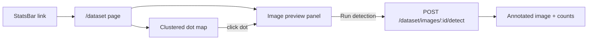

# Dataset Map Explorer

## What you have today

| Asset | Detail |
|-------|--------|
| [`dataset/coords.csv`](dataset/coords.csv) | 10,000 lines, format `latitude,longitude` (no header) |
| [`dataset/{N}.png`](dataset/) | 10,000 images: **`0.png` … `9999.png`** (0-based filenames) |
| CSV ↔ image pairing | **CSV row 1 → `0.png`**, row 2 → `1.png`, …, **row 10000 → `9999.png`** |
| Existing maps | Leaflet + react-leaflet in [`BatchDashboardMap.jsx`](frontend/src/components/BatchDashboardMap.jsx) and [`MapView.jsx`](frontend/src/components/MapView.jsx) |
| Gap | No backend or frontend code reads `dataset/`; Docker does not mount it |

Coordinates are **global** (Americas, Africa, Europe, Asia, Australia), so the map must **fit bounds to all points** on load — not a single city default.

## Target UX



- New nav button: **"Google Street View & Detection"** (in [`StatsBar.jsx`](frontend/src/components/StatsBar.jsx) beside "Batch dashboard"; mirror link back to map on the dataset page).
- Layout mirrors existing app: **map left (~60%)**, **image + detection panel right (~40%)**.
- On load: fetch all points, render **small clustered dots**, `fitBounds` to entire dataset.
- On dot click: show that PNG immediately (no inference yet).
- **"Run detection"** button: call backend once for the selected image; show annotated result + class counts (reuse styling from [`DetectionPanel.jsx`](frontend/src/components/DetectionPanel.jsx)).

## Backend changes

### 1. New module [`backend/dataset_service.py`](backend/dataset_service.py)

- Resolve root: `DATASET_ROOT = Path(os.getenv("DATASET_ROOT", repo_root / "dataset"))`.
- On startup (or first request): parse `coords.csv` into an in-memory list:

```python
# CSV row 1 (first data row) → id 0 → 0.png
# CSV row 10000 (last row)   → id 9999 → 9999.png
for row_index, line in enumerate(csv_lines, start=1):
    id = row_index - 1
    filename = f"{id}.png"
    # {"id": 0, "row": 1, "lat": ..., "lng": ..., "filename": "0.png"}
```

- **Mapping rule:** `id = csv_row_number - 1`, image path = `{id}.png`.
- Validate: exactly 10,000 CSV rows and files `0.png` … `9999.png` all present; log warning if mismatch.
- Helpers: `get_points()`, `get_image_path(id)`, `get_bounds()`.

### 2. New API routes in [`backend/main.py`](backend/main.py)

| Method | Path | Purpose |
|--------|------|---------|
| `GET` | `/dataset/meta` | `{ count, bounds: { south, west, north, east } }` |
| `GET` | `/dataset/points` | Lightweight `[{ id, lat, lng }, ...]` (~400–600 KB JSON) |
| `GET` | `/dataset/images/{id}` | `FileResponse` for `{id}.png` |
| `POST` | `/dataset/images/{id}/detect` | Read PNG → `detector.detect_from_base64()` → return same shape as `/detect/camera` |

- Validate `id` is int in `0..count-1` (reject path traversal).
- Detection response includes `lat`/`lng` from coords, `source: "dataset"`, `image_url` pointing to the image route.

### 3. Docker / env

- Mount dataset in [`docker-compose.yml`](docker-compose.yml):

```yaml
volumes:
  - ./dataset:/app/dataset:ro
```

- Add to [`.env.example`](.env.example): `DATASET_ROOT=/app/dataset` (optional; defaults to repo-relative path for local dev).

## Frontend changes

### 1. Routing — [`frontend/src/App.jsx`](frontend/src/App.jsx)

```jsx
<Route path="/dataset" element={<DatasetExplorerPage />} />
```

### 2. API helpers — [`frontend/src/api.js`](frontend/src/api.js)

```js
getDatasetMeta()
getDatasetPoints()
datasetImageUrl(id)          // `${BASE}/dataset/images/${id}`
detectDatasetImage(id)       // POST /dataset/images/:id/detect
```

### 3. New page — [`frontend/src/pages/DatasetExplorerPage.jsx`](frontend/src/pages/DatasetExplorerPage.jsx)

- Top bar: title + link "← Map".
- State: `points[]`, `selectedId`, `previewUrl`, `detectionResult`, `detecting`.
- On mount: `getDatasetPoints()` once.
- Split layout like [`MapPage.jsx`](frontend/src/pages/MapPage.jsx).

### 4. New map component — [`frontend/src/components/DatasetMap.jsx`](frontend/src/components/DatasetMap.jsx)

Reuse patterns from [`BatchDashboardMap.jsx`](frontend/src/components/BatchDashboardMap.jsx):

- Same OSM / satellite basemap toggle.
- `MapFitBounds` on all point coordinates (copy existing helper).
- `MapFlyTo` when a dot is selected.
- Small dot icons via existing `makeIcon()` pattern.

**Performance (10k markers):** add `leaflet.markercluster` + `react-leaflet-cluster` to [`frontend/package.json`](frontend/package.json). Cluster at low zoom; individual dots when zoomed in. Without clustering, 10,000 React `<Marker>` nodes will lag badly.

### 5. Image / detection panel — [`frontend/src/components/DatasetImagePanel.jsx`](frontend/src/components/DatasetImagePanel.jsx)

- Empty state: "Click a dot on the map".
- Selected: show ``, coords (`lat, lng`), image id.
- **"Run detection"** button → `detectDatasetImage(id)`; show loading spinner; on success swap to `annotated_image_b64` and class list (extract small shared sub-component from `DetectionPanel` or duplicate minimal markup — keep scope small).

### 6. Navigation button — [`frontend/src/components/StatsBar.jsx`](frontend/src/components/StatsBar.jsx)

Add link:

```jsx
<Link to="/dataset">Google Street View & Detection</Link>
```

## Data mapping (critical — confirmed)

Images are **`0.png` to `9999.png`**. CSV has **rows 1–10000** (no header). Pairing is 1:1 by position:

| CSV row | Image file | API `id` |
|---------|------------|----------|
| 1 | `0.png` | `0` |
| 2 | `1.png` | `1` |
| … | … | … |
| 10000 | `9999.png` | `9999` |

**Formula:** `id = row_number - 1`, `filename = f"{id}.png"`.

- No header row in CSV — row 1 is the first coordinate.
- Backend and frontend always use **`id` (0–9999)**; UI may show human-friendly "Row 1 / Image 0.png" if helpful.
- Spot-check: CSV row 13 (`16.5252514,79.2460586`) → `12.png` → API id `12`.

## Files to create / modify

| Action | File |
|--------|------|
| Create | `backend/dataset_service.py` |
| Modify | `backend/main.py` (4 routes) |
| Modify | `docker-compose.yml` (dataset volume) |
| Modify | `.env.example` |
| Create | `frontend/src/pages/DatasetExplorerPage.jsx` |
| Create | `frontend/src/components/DatasetMap.jsx` |
| Create | `frontend/src/components/DatasetImagePanel.jsx` |
| Modify | `frontend/src/App.jsx` |
| Modify | `frontend/src/api.js` |
| Modify | `frontend/src/components/StatsBar.jsx` |
| Modify | `frontend/package.json` (marker cluster deps) |

## Out of scope (unless you ask later)

- Pre-computing detections for all 10k images (batch job).
- Mapillary coverage overlay on dataset page (images are local PNGs, not Mapillary).
- Bbox-filtered point loading (only needed if dataset grows much larger).
- Committing the 10k PNGs to git (keep them local; mount via Docker).

## Test plan

1. Start backend with `./dataset` mounted; `GET /dataset/meta` returns `count: 10000`.
2. `GET /dataset/points` returns 10k entries; spot-check id `0` = CSV row 1, id `9999` = CSV row 10000 / `9999.png`.
3. Open `/dataset` — map fits world-spanning bounds; clusters visible.
4. Zoom in, click a dot — correct PNG appears in right panel with matching coords.
5. Click **Run detection** — annotated image + detection counts appear (requires inference server running).
6. Navigate from main map via new StatsBar button and back via "← Map".
