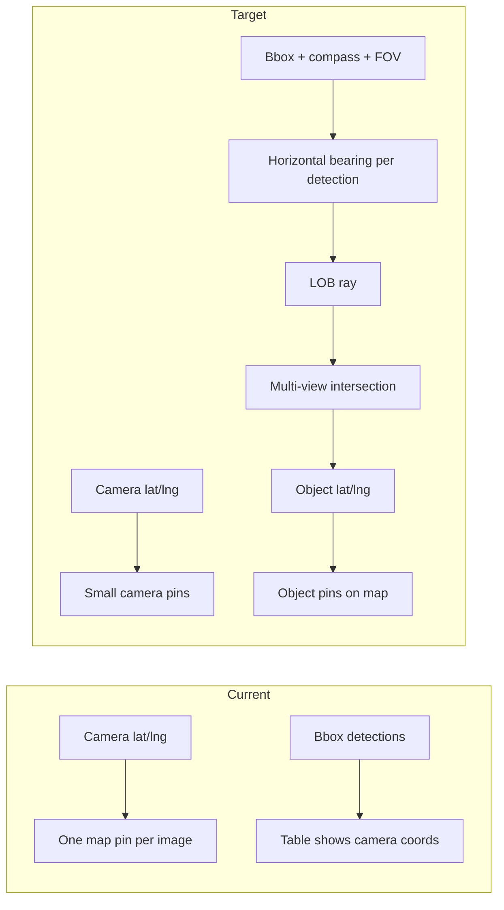

# Detection geolocation from street imagery

## Problem today

Your batch pipeline assigns **one lat/lng per image** (Mapillary camera GPS), not per object:

```150:159:backend/batch_service.py
                storage.insert_result(
                    job_id,
                    image_id,
                    lat=img["image_lat"],
                    lng=img["image_lng"],
                    ...
                    detections=result.get("detections", []),
```

So a pole seen from capture point **X** is plotted at **X**, even when the real pole is tens of meters ahead/behind along the road (thesis reports ~47% within 5 m only after LOB, vs image GPS).

`compass_angle` and `sequence_id` are already fetched in [`backend/mapillary_batch.py`](backend/mapillary_batch.py) but **not stored** in SQLite, so they cannot be reused after batch completes.



## Thesis method (reference)

From *Zhang et al., Sensors 2018* (your PDF):

1. **Azimuth from bbox** — horizontal center of box vs image center, scaled by horizontal FOV (their GSV tiles: 640 px, 90° FOV → ~0.14°/px).
2. **LOB** — ray from each camera position at that azimuth (max ~50 m ray length in their study).
3. **Triangulation** — intersect LOBs from **3+ nearby viewpoints** along the sequence; filter ghost intersections (angle / distance rules).
4. **Aggregation** — cluster intersection points within **10 m**, centroid = estimated pole location.

Mapillary batch images are **non-panoramic** (`is_pano: false` in [`mapillary_batch.py`](backend/mapillary_batch.py)), so the GSV-style pinhole bearing model is appropriate (not full equirectangular math).

---

## Phase 1 — Single-image bearing (MVP)

**Goal:** Each detection gets an estimated bearing and an optional **ground point along the ray** (configurable distance), shown on the map as distinct from the camera pin. Accuracy is limited without triangulation but immediately fixes “everything at camera GPS.”

### 1.1 New module [`backend/geolocation.py`](backend/geolocation.py)

Pure functions (unit-testable):

| Function | Purpose |
|----------|---------|
| `bbox_center_x(det)` | Use existing `x_center` or mean of `bbox[0], bbox[2]` |
| `pixel_to_bearing_delta(x_center, image_width, h_fov_deg)` | Thesis formula: offset from image center → degrees |
| `detection_bearing(compass_angle, x_center, image_width, h_fov_deg)` | Wrap angle to 0–360 |
| `destination_point(lat, lng, bearing_deg, distance_m)` | Haversine forward (reuse pattern from [`mapillary.py`](backend/mapillary.py)) |
| `lob_endpoint(camera_lat, camera_lng, bearing_deg, max_m)` | Ray end for map polyline |

**Config (`.env`):**

- `HORIZONTAL_FOV_DEG` (default `90`) — calibrate later against known poles
- `DEFAULT_OBJECT_DISTANCE_M` (default `15`) — single-view fallback distance along ray until phase 2
- `LOB_MAX_LENGTH_M` (default `50`) — cap ray length (thesis)
- `GEOLOCATE_MIN_BBOX_WIDTH_PX` (default `8`) — skip tiny boxes (thesis used 30 for ghost workload; start lower for cars)

### 1.2 Persist camera metadata

Extend [`backend/storage.py`](backend/storage.py) `batch_results`:

- `compass_angle REAL`
- `sequence_id TEXT`
- `image_width INTEGER`, `image_height INTEGER`

Migration: `ALTER TABLE` on init or lightweight migration helper.

Update [`batch_service.py`](backend/batch_service.py) `insert_result` to pass these from `img` + `result["image_size"]`.

### 1.3 Enrich each detection at inference time

In [`backend/detector.py`](backend/detector.py) after `_merge_detections`, or in batch `process_one` after `detect_from_url`:

Add per detection (all classes per your choice):

```json
{
  "bearing_deg": 127.4,
  "geo_lat": 21.17045,
  "geo_lng": 72.83112,
  "geo_method": "bearing_single",
  "geo_distance_m": 15,
  "camera_lat": ...,
  "camera_lng": ...
}
```

Store in existing `detections_json` (no new table yet).

### 1.4 API

- Extend `GET /batch/{job_id}/results` — detections already returned; clients read `geo_lat`/`geo_lng`.
- New `GET /batch/{job_id}/detections/geo` — flat list for map layer:

```json
{ "detection_id": "...", "image_id": "...", "class": "Pole", "lat", "lng", "bearing_deg", "method", "confidence" }
```

Implement in [`backend/main.py`](backend/main.py) + `storage.get_detections_geo(job_id)`.

### 1.5 Dashboard map ([`BatchDashboardMap.jsx`](frontend/src/components/BatchDashboardMap.jsx))

Two marker layers:

| Layer | Source | Style |
|-------|--------|-------|
| Cameras | existing `getBatchGeo` | Small blue dots (image GPS) |
| Objects | new `getBatchDetectionsGeo` | Class-colored pins at `geo_lat`/`geo_lng` |

- Click **object pin** → find parent `image_id`, select row, show annotated image.
- Optional toggle: “Show bearing rays” — `Polyline` from camera to `lob_endpoint` (debug/education).
- Update [`BatchResultsTable.jsx`](frontend/src/components/BatchResultsTable.jsx): columns **Camera lat/lng** vs **Est. object lat/lng** (from first detection or aggregated per image row).

---

## Phase 2 — Multi-view LOB triangulation (thesis)

**Goal:** Replace single-view distance guess with **intersection + clustering** using multiple images in the same `sequence_id` (and nearby sequences if needed).

### 2.1 Post-batch job step

After batch status `completed` (or on-demand `POST /batch/{id}/geolocate`):

New [`backend/geolocate_batch.py`](backend/geolocate_batch.py):

1. Load all results for job with `compass_angle`, `sequence_id`, `detections`, camera lat/lng.
2. Group images by `sequence_id`; sort by `captured_at` or chain distance along path.
3. For each detection in each image (all classes), build LOB: `(camera_lat, camera_lng, bearing_deg, class, image_id, det_idx)`.
4. For each LOB, consider **K nearest camera positions** along sequence (thesis: 2–8 neighbors → 3–9 views total).
5. **Pairwise intersections** of LOBs from distinct images within `LOB_MAX_LENGTH_M`; keep points where **≥3 LOBs** agree within angle threshold β (start β = 3°, tune).
6. **Ghost filter:** drop intersections within 3–5 m of road centerline if you have it (optional); drop clusters with min bbox width violations.
7. **Cluster** intersection points with radius **10 m** (thesis); centroid → `object_lat`, `object_lng`.
8. **Associate** detections: assign each detection to nearest cluster if its LOB passes within N m of centroid; update `geo_method: "lob_triangulation"`, `geo_lat`/`geo_lng`, `geo_confidence` (e.g. number of supporting views).

Persist clustered objects in new table `batch_object_locations` (job_id, object_id, lat, lng, class, support_count, detection_refs JSON) for fast map queries.

### 2.2 Simplified vs full thesis

Implement a **pragmatic subset** first:

- 3-view LOB intersection + 10 m clustering (core accuracy gain).
- Defer full brute-force ghost-node elimination loop until metrics show false positives.

Add [`backend/tests/test_geolocation.py`](backend/tests/test_geolocation.py) with synthetic cameras on a line and known intersection point.

### 2.3 Dashboard phase 2

- Map layer: clustered **object** markers (deduped poles/cars along street).
- Table: expandable row showing supporting image IDs + per-view bearings.
- Legend: camera vs estimated object vs triangulated cluster.

---

## Phase 3 — Main map page (optional)

Apply same bearing/LOB to [`POST /detect`](backend/main.py) single-click flow so live map detections also get `geo_lat`/`geo_lng` on [`MapView.jsx`](frontend/src/components/MapView.jsx) — reuse `geolocation.py`.

---

## What is new / required

| Item | Needed? |
|------|---------|
| **Code** | `geolocation.py`, `geolocate_batch.py`, storage migration, API routes, dashboard layers |
| **Data** | Persist `compass_angle`, `sequence_id`, image dimensions (already available at fetch/inference) |
| **Config** | FOV, LOB length, cluster radius, min views, default distance |
| **Dependencies** | None strictly required; optional `pyproj` later for large-area accuracy (haversine sufficient for &lt;1 km batches) |
| **Calibration** | Field-check `HORIZONTAL_FOV_DEG` and `DEFAULT_OBJECT_DISTANCE_M` against a few known pole GPS points |
| **Mapillary API** | Consider adding fields `camera_parameters` / `is_pano` to [`IMAGE_FIELDS`](backend/mapillary.py) if FOV varies by image type |
| **Ground truth** | Optional CSV of reference pole coords for validation (thesis used utility GIS) |

**Not required for MVP:** new ML models, depth estimation, or LiDAR.

---

## Risks and mitigations

| Risk | Mitigation |
|------|------------|
| Wrong FOV / thumbnail crop | Env-tunable FOV; log image_width from inference; compare bearing vs known landmarks |
| Same object detected in many frames → duplicate object pins | Phase 2 clustering dedupes; phase 1 will show multiple nearby pins (expected until triangulation) |
| `compass_angle` missing or 0 | Skip geo for that image; flag in UI |
| Cars/people move between frames | LOB triangulation less stable; show `geo_method` and lower confidence; user asked for all classes — document lower accuracy for non-static classes |
| Performance on large batches | Run geolocation post-process async; index by job_id + sequence_id |

---

## Suggested implementation order

1. Storage columns + persist compass/sequence/size in batch insert.
2. `geolocation.py` + unit tests for bearing and destination point.
3. Enrich detections in batch pipeline (`geo_method: bearing_single`).
4. `GET .../detections/geo` + dashboard object layer + table columns.
5. `geolocate_batch.py` post-processor + `batch_object_locations` + map clusters.
6. Optional main-map `/detect` integration.
