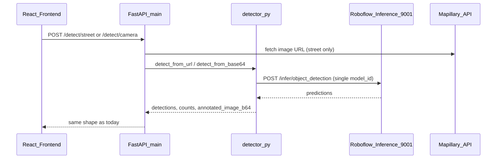
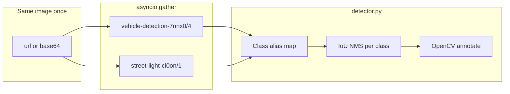

# Dual-model object detection integration

## Current architecture

Detection is **backend-only**. The frontend never calls Roboflow directly.



| Layer | Role |
|-------|------|
| [`backend/detector.py`](backend/detector.py) | Single `MODEL_ID`, `_call_inference`, parse/draw/count |
| [`backend/main.py`](backend/main.py) | `/detect/street`, `/detect/camera`, `/config`, `/health` |
| [`frontend/src/api.js`](frontend/src/api.js) | Thin axios wrappers — **no change required** |
| [`frontend/src/context/DetectionContext.jsx`](frontend/src/context/DetectionContext.jsx) | Aggregates `counts` by class name |
| UI maps | Hardcoded 8 classes in `StatsBar`, `DetectionPanel`, `MarkerPopup` |

**Inference stack:** Host runs `inference server start` (port 9001). Backend (Docker) calls `INFERENCE_SERVER_URL` with `ROBOFLOW_API_KEY`. Model ID format: `{project_id}/{version}`.

**Your new model (from Universe URL):**

| Field | Value |
|-------|--------|
| Workspace | `stret-light` |
| Project | `street-light-ci0on` |
| Version | `1` |
| `model_id` for inference | `street-light-ci0on/1` |
| Universe | https://universe.roboflow.com/stret-light/street-light-ci0on/model/1 |

**Existing model:** `vehicle-detection-7nnx0/4` (8 urban classes including `Street Light`).

> **Note:** Code-review-graph MCP returned an empty graph (not indexed yet). Plan is based on direct codebase scan.

---

## Target architecture (union + IoU dedup)

Run **both models in parallel** on the same image payload, normalize class labels, then merge with per-class IoU NMS so overlapping street-light boxes from both models collapse to one (highest confidence wins).



**Merge rules (your choice: union):**

1. Concatenate all parsed boxes from both models.
2. Map secondary-model class names to app canonical names (e.g. `street-light`, `StreetLight` → `Street Light`).
3. For each class, apply **IoU NMS** (suggested `iou_threshold=0.5`, keep highest `confidence`).
4. Recompute `counts` and draw boxes on the **single** decoded image (unchanged flow).

This keeps vehicle-model street lights **and** adds specialized detections, while avoiding double boxes when both models fire on the same pole.

---

## Implementation plan

### 1. Environment and deployment config

Add to [`.env.example`](.env.example) and document in [`README.md`](README.md):

```env
# Primary (existing)
PROJECT_ID=vehicle-detection-7nnx0
MODEL_VERSION=4
ROBOFLOW_WORKSPACE=power-house

# Secondary street-light specialist
STREET_LIGHT_PROJECT_ID=street-light-ci0on
STREET_LIGHT_MODEL_VERSION=1
STREET_LIGHT_WORKSPACE=stret-light
ENABLE_STREET_LIGHT_MODEL=true

# Optional tuning
DETECTION_IOU_THRESHOLD=0.5
DETECTION_CONFIDENCE_MIN=0.25
```

Wire the same vars through [`docker-compose.yml`](docker-compose.yml) `backend.environment` (mirror `PROJECT_ID` / `MODEL_VERSION` pattern).

**Prerequisite:** Your `ROBOFLOW_API_KEY` must have access to **both** projects. After deploy, first request may cold-load both weights on the inference server (~slower once).

---

### 2. Refactor [`backend/detector.py`](backend/detector.py) (main work)

**a) Model registry (config-driven)**

- `PRIMARY_MODEL_ID = f"{PROJECT_ID}/{MODEL_VERSION}"`
- `SECONDARY_MODEL_ID = f"{STREET_LIGHT_PROJECT_ID}/{STREET_LIGHT_MODEL_VERSION}"` when `ENABLE_STREET_LIGHT_MODEL=true`
- Change `_call_inference(payload)` → `_call_inference(model_id: str, payload: dict)`

**b) Parallel inference**

```python
async def _run_models(image_payload: dict) -> list[dict]:
    model_ids = [PRIMARY_MODEL_ID]
    if ENABLE_STREET_LIGHT_MODEL:
        model_ids.append(SECONDARY_MODEL_ID)
    tasks = [_call_inference(mid, {**image_payload}) for mid in model_ids]
    return await asyncio.gather(*tasks, return_exceptions=True)
```

- If secondary fails, log warning and continue with primary only (avoid 502 on partial failure).
- Consider bumping `httpx` timeout from 30s → 45s when two models run.

**c) Class normalization**

Add `CLASS_ALIASES` dict mapping secondary labels to canonical UI keys, starting with:

```python
CLASS_ALIASES = {
    "street light": "Street Light",
    "street-light": "Street Light",
    "StreetLight": "Street Light",
    "Street Light": "Street Light",
    # extend after inspecting first raw response from street-light-ci0on/1
}
```

Apply in `_parse_predictions` via a small `_normalize_class(name) -> str`.

**d) IoU NMS merge**

Add `_iou(box_a, box_b)` and `_nms_by_class(detections, iou_threshold)`:

- Group by normalized `class`
- Sort by `confidence` descending
- Suppress boxes with IoU ≥ threshold to already-kept boxes

**e) Unified detect entrypoints**

Replace single-model calls in `detect_from_url` / `detect_from_base64`:

1. Build `image_payload` once (`url` or `base64`)
2. `raw_results = await _run_models(image_payload)`
3. `detections = _nms_by_class(flatten(_parse_predictions(r) for r in ok_results))`
4. Decode image once, `_draw_and_encode`, return same response shape as today

Optional: add `source_model` on each detection (`"primary"` / `"secondary"`) for debugging — UI can ignore it initially.

---

### 3. API config endpoint — [`backend/main.py`](backend/main.py)

Extend `GET /config` `model_info` to an array (backward-compatible):

```json
{
  "model_info": { "...primary..." },
  "models": [
    { "role": "primary", "model_id": "vehicle-detection-7nnx0/4", "universe_url": "..." },
    { "role": "street_light", "model_id": "street-light-ci0on/1", "enabled": true, "universe_url": "..." }
  ]
}
```

Keep existing `model_info` fields so [`StatsBar.jsx`](frontend/src/components/StatsBar.jsx) does not break.

---

### 4. Frontend (minimal)

| File | Change |
|------|--------|
| [`frontend/src/api.js`](frontend/src/api.js) | None |
| [`frontend/src/components/StatsBar.jsx`](frontend/src/components/StatsBar.jsx) | Optional: show `+ street-light v1` under title when `models[1].enabled` |
| [`DetectionPanel.jsx`](frontend/src/components/DetectionPanel.jsx) | Optional: show `source_model` badge per row |
| [`DetectionContext.jsx`](frontend/src/context/DetectionContext.jsx) | None if class names stay canonical |

No new API routes; response contract unchanged (`detections`, `counts`, `annotated_image_b64`).

---

### 5. Verification checklist

1. **Inference server up:** http://localhost:9001/docs
2. **Warm both models** (one street click + one camera capture)
3. **Compare counts** on a scene with visible poles/lights:
   - Before: note `Street Light` count from vehicle model alone
   - After: expect same or higher lights; overlapping duplicates should not inflate counts (NMS)
4. **`GET /health`** — inference connected
5. **`GET /config`** — lists both models
6. **Logs** — confirm both `model_id` values in inference server output on first run

**Quick manual API test (after implementation):**

```powershell
curl -X POST http://localhost:8000/detect/camera -H "Content-Type: application/json" -d "{\"image_b64\":\"<small-test-image>\"}"
```

Inspect `counts["Street Light"]` and `detections[].class`.

---

### 6. Risks and mitigations

| Risk | Mitigation |
|------|------------|
| ~2× latency (two HTTP calls) | `asyncio.gather`; optional later: Roboflow workflow endpoint |
| Secondary class label unknown | Log raw `p["class"]` on first run; extend `CLASS_ALIASES` |
| API key lacks access to `stret-light` workspace | 401/403 on secondary — graceful fallback to primary-only |
| Cold start loads two models | Document first-click delay; optional startup warm-up call in `lifespan` |
| Union still misses rare classes | Only street-light model is added; other 7 classes unchanged |

---

## Files to touch (summary)

| File | Action |
|------|--------|
| [`backend/detector.py`](backend/detector.py) | Multi-model inference, alias map, IoU NMS merge |
| [`backend/main.py`](backend/main.py) | `/config` models array |
| [`.env.example`](.env.example) | New env vars |
| [`docker-compose.yml`](docker-compose.yml) | Pass new env vars to backend |
| [`README.md`](README.md) | Dual-model setup + troubleshooting |
| [`frontend/src/components/StatsBar.jsx`](frontend/src/components/StatsBar.jsx) | Optional subtitle for 2nd model |

**Out of scope (unless you ask later):** automated tests, Roboflow Workflow single-call fusion, GPU batching, new UI classes from the street-light dataset.
