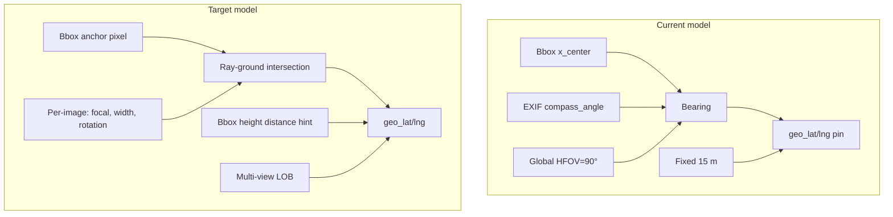

# Geolocation accuracy: bearing + distance calibration

## Problem (your symptom)

Estimated object pins do not match what you see in the photo: **wrong direction and wrong distance**. The current pipeline in [`backend/geolocation.py`](backend/geolocation.py) uses a simplified pinhole model:

```45:52:backend/geolocation.py
def detection_bearing(
    compass_angle: float,
    x_center: int,
    image_width: int,
    h_fov_deg: float = HORIZONTAL_FOV_DEG,
) -> float:
    return normalize_bearing(float(compass_angle) + pixel_to_bearing_delta(x_center, image_width, h_fov_deg))
```

```169:177:backend/geolocation.py
    brg = detection_bearing(compass_angle, xc, image_width, h_fov_deg)
    geo_lat, geo_lng = destination_point(camera_lat, camera_lng, brg, default_distance_m)
    ...
    out["geo_method"] = "bearing_single"
    out["geo_distance_m"] = default_distance_m
```

Two separate failure modes stack together:

| Layer | Current assumption | Why it breaks |
|-------|-------------------|---------------|
| **Angle** | Global `HORIZONTAL_FOV_DEG=90`, image center = optical axis, EXIF `compass_angle` = forward direction | Real Mapillary cameras differ (60–120° HFOV); compass may not align with image center; no distortion / principal-point correction |
| **Distance** | Fixed `DEFAULT_OBJECT_DISTANCE_M=15` for all objects | A pole 8 m vs 35 m away gets the same pin; triangulation only helps when 3+ sequence views agree (many detections stay `bearing_single`) |



---

## Phase 1 — Per-image camera metadata (highest impact, low risk)

**Goal:** Stop using one global FOV for every photo.

### 1.1 Extend Mapillary fetch + storage

Files: [`backend/mapillary.py`](backend/mapillary.py), [`backend/mapillary_batch.py`](backend/mapillary_batch.py), [`backend/storage.py`](backend/storage.py)

Add API fields to `IMAGE_FIELDS`:

- `width`, `height` (original upload size)
- `camera_parameters`, `camera_type` (OpenSfM: focal length + distortion)
- `computed_rotation` (axis-angle orientation correction)
- `make`, `model` (optional logging / grouping)

Persist on `batch_results` (migration like existing `compass_angle` columns):

- `camera_focal_px`, `camera_type`, `computed_rotation_json`, `source_width`, `source_height`

### 1.2 Derive horizontal FOV per image

New helper in [`backend/geolocation.py`](backend/geolocation.py):

```python
def horizontal_fov_deg(focal_px: float, image_width: int) -> float:
    return math.degrees(2 * math.atan(image_width / (2 * focal_px)))
```

Scale focal from original `width` to detection thumb width (1024):

```python
focal_thumb = focal_px * (detection_width / source_width)
```

Use per-image FOV in `detection_bearing()` instead of env default when metadata exists; fall back to `HORIZONTAL_FOV_DEG` only when missing.

**Expected fix:** Objects at left/right edges stop being pushed too far sideways (common when true FOV is ~65° but we assume 90°).

---

## Phase 2 — Better pixel anchor + distance hint (fixes “both wrong” for single-view)

**Goal:** Improve both bearing anchor and distance before triangulation runs.

### 2.1 Bbox anchor by class

In `enrich_detection_geo()`:

| Class | Horizontal pixel | Rationale |
|-------|------------------|-----------|
| Pole, Street Light, Traffic Signal | Bottom-center of bbox `(x_center, bbox[3])` | Ground contact point, not mid-pole |
| Car, Person, Motorcycle | Bbox center (current) | Object body, not ground |

Store `geo_anchor_x`, `geo_anchor_y` on detection for debugging.

### 2.2 Bbox-height distance estimate (single-view)

Add optional distance from apparent object size (thesis uses bbox for filtering; we can use it for distance):

```python
# Example for vertical objects
distance_m = (ASSUMED_POLE_HEIGHT_M * focal_thumb) / bbox_height_px
distance_m = clamp(distance_m, MIN_OBJECT_DISTANCE_M, LOB_MAX_LENGTH_M)
```

New env vars:

- `ASSUMED_POLE_HEIGHT_M` (default 8)
- `ASSUMED_STREET_LIGHT_HEIGHT_M` (default 6)
- Per-class map in code or config

Set `geo_method: "bearing_size"` when used. Still approximate, but **varies per detection** instead of always 15 m.

### 2.3 Keep LOB triangulation as primary for static classes

In [`backend/geolocate_batch.py`](backend/geolocate_batch.py):

- Re-run LOB after metadata backfill (already partially there)
- Prefer triangulation for `Pole`, `Street Light` over single-view pin when `support_count >= 2`
- Lower `LOB_MIN_VIEWS` to **2** for static classes only (env: `LOB_MIN_VIEWS_STATIC=2`) — your batch had 0 hits at 3 views, 7 at 2

---

## Phase 3 — 3D ray–ground intersection (proper bearing model)

**Goal:** Replace flat `compass + pixel_delta` with Mapillary’s `computed_rotation` when available.

### 3.1 New module `backend/camera_ray.py`

Pipeline per detection:

1. Build camera ray from pixel `(u, v)` using focal + principal point (default center).
2. Apply `computed_rotation` (axis-angle → rotation matrix).
3. Transform ray to world ENU frame using `compass_angle` as yaw baseline (or full rotation from OpenSfM if sufficient).
4. Intersect ray with ground plane (assume flat ground at camera altitude or `computed_altitude`).
5. Output `(bearing_deg, distance_m, geo_lat, geo_lng)`.

Use this when `computed_rotation` + `camera_parameters` exist; fall back to current 2D model otherwise.

**New dependency:** none required if we implement axis-angle + ground-plane math ourselves; optional `numpy` already in stack via OpenCV.

**Expected fix:** Corrects systematic angular offset when EXIF compass and image optical axis disagree.

---

## Phase 4 — Calibration workflow (make errors measurable)

**Goal:** Let you tune the system against poles you know, instead of guessing env vars.

### 4.1 Ground-truth reference file

New optional CSV: `data/georef_calibration.csv`

```csv
job_id,image_id,detection_index,class,true_lat,true_lng,notes
```

Or global references without job_id for reusable pole IDs.

### 4.2 Calibration API + script

- `POST /batch/{job_id}/calibrate` — ingest reference points, compute:
  - Mean bearing error (°)
  - Mean distance error (m)
  - Suggested `COMPASS_BEARING_OFFSET_DEG`, `HFOV_SCALE`, `DEFAULT_OBJECT_DISTANCE_M`
- `backend/calibrate_geolocation.py` — CLI to run on a batch and print report

Optimization (simple grid search, no ML):

- Sweep `compass_offset` ∈ [-30, 30] step 1°
- Sweep `hfov_scale` ∈ [0.6, 1.4] step 0.05
- Pick combo minimizing median haversine error to ground truth

Save winning values to `.env` or `data/geolocation_calibration.json` loaded at runtime.

### 4.3 Dashboard debug view

Files: [`frontend/src/pages/BatchDashboard.jsx`](frontend/src/pages/BatchDashboard.jsx), [`frontend/src/components/BatchDashboardMap.jsx`](frontend/src/components/BatchDashboardMap.jsx)

Enhancements:

- **Show rays** → draw to `LOB_MAX_LENGTH_M` endpoint (50 m), not just to 15 m pin — makes angle errors obvious on satellite
- Detection panel: show `bearing_deg`, `geo_distance_m`, `geo_method`, pixel offset from center
- **Click map to set ground truth** (optional): store reference, show error line (estimated → true) in red
- Badge when `geo_method === bearing_single`: “distance guessed” vs triangulated

---

## Phase 5 — Optional refinements (after phases 1–4 validated)

| Item | When to add | Benefit |
|------|-------------|---------|
| Road snap (OSM/Mapillary vector tile) | Lateral error persists for roadside poles | Snap LOB cluster to nearest road centerline within 5 m |
| `computed_geometry` for camera position | GPS vs map-matched position differs | Use SfM camera position instead of raw EXIF GPS |
| Class-specific min bbox width | Small false boxes skew bearing | Already have `GEOLOCATE_MIN_BBOX_WIDTH_PX`; tune per class |
| Re-detect on `thumb_2048_url` | Bbox jitter on 1024 thumb | Sharper boxes → better pixel anchor |

---

## Config changes (`.env`)

Add to [`.env.example`](.env.example) (you already have basics):

```env
# Per-image FOV fallback when Mapillary camera_parameters missing
HORIZONTAL_FOV_DEG=90
HFOV_SCALE=1.0                    # multiply derived FOV after calibration
COMPASS_BEARING_OFFSET_DEG=0    # add to all bearings after calibration

# Distance hints (single-view)
ASSUMED_POLE_HEIGHT_M=8
ASSUMED_STREET_LIGHT_HEIGHT_M=6
MIN_OBJECT_DISTANCE_M=3
DEFAULT_OBJECT_DISTANCE_M=15      # fallback when bbox too small

# Triangulation
LOB_MIN_VIEWS=3
LOB_MIN_VIEWS_STATIC=2            # poles / street lights only
USE_3D_CAMERA_RAY=true            # phase 3 toggle
```

---

## Suggested implementation order

1. **Phase 1** — per-image FOV from Mapillary (`camera_parameters` + width scaling)
2. **Phase 4.3** — debug rays + bearing/distance display (so you can verify each change)
3. **Phase 2** — bottom-anchor + bbox-height distance
4. **Phase 4.1–4.2** — calibration CSV + auto-tune offsets
5. **Phase 3** — 3D ray–ground (behind env flag)
6. **LOB tuning** — `LOB_MIN_VIEWS_STATIC=2` + re-geolocate existing batches

---

## What is new vs changed

| New | Changed |
|-----|---------|
| `backend/camera_ray.py` | [`backend/geolocation.py`](backend/geolocation.py) — per-image FOV, anchors, distance hint |
| `backend/calibrate_geolocation.py` | [`backend/mapillary.py`](backend/mapillary.py) — extra API fields |
| `data/georef_calibration.csv` (optional) | [`backend/storage.py`](backend/storage.py) — camera metadata columns |
| `POST /batch/{id}/calibrate` | [`backend/geolocate_batch.py`](backend/geolocate_batch.py) — static-class min views |
| Dashboard calibration / debug UI | [`BatchDashboardMap.jsx`](frontend/src/components/BatchDashboardMap.jsx) — full-length rays |

**No new ML models required.** Accuracy comes from correct camera geometry + calibration against known poles.

---

## Success criteria

After phases 1–2 + calibration on 5–10 known poles in your UAE batch area:

- Median bearing error **< 5°** (measurable via calibration report)
- Median distance error **< 8 m** for single-view; **< 5 m** for `lob_triangulation`
- Dashboard rays visually pass through the object in the annotated image when overlaid on satellite
