# GSV Continued: 360° Panorama View

## Goal

Match your reference image: a **horizontal strip of side views 1–4**, each with **all 6 GSV models’ bounding boxes** drawn, titled **“360 Degree Street Asset Panorama”**, generated **automatically when a location is selected**.

## Current state

| Piece | Today |
|-------|--------|
| Views | PitOrlManh tiles 0–5; side views **1–4** are 90° apart ([`gsv_continued_service.py`](backend/gsv_continued_service.py) `SIDE_VIEWS`) |
| Viewer | [`GsvStreetViewViewer.jsx`](frontend/src/components/GsvStreetViewViewer.jsx) shows **one** tile + one `annotated_image_b64` |
| Detect | [`POST /gsv-continued/locations/{id}/detect?view=N`](backend/main.py) — **single view**, triggered on every `selectedId` + `resolvedView` change ([`GsvContinuedPage.jsx`](frontend/src/pages/GsvContinuedPage.jsx)) |
| Stitch / pano | **Not implemented** (prior [`gsv_panorama_scroll` plan](.cursor/plans/gsv_panorama_scroll_ff106fd0.plan.md) marked done but `GsvPanoramaScroller.jsx` does not exist) |
| Draw boxes | [`detector._draw_and_encode()`](backend/detector.py) — reuse for each tile |

```mermaid
flowchart TB
  Select[User selects location] --> PanoDetect["POST /panorama/detect"]
  PanoDetect --> V1[Detect view 1]
  PanoDetect --> V2[Detect view 2]
  PanoDetect --> V3[Detect view 3]
  PanoDetect --> V4[Detect view 4]
  V1 & V2 & V3 & V4 --> Stitch[Stitch annotated tiles + title band]
  Stitch --> UI[GsvPanoramaViewer scroll strip]
  Stitch --> Table[Merged detection table with View column]
  V1 & V2 & V3 & V4 --> Geo[Per-view geo enrichment]
```



---

## 1. Backend: panorama detect endpoint

### New helpers — [`backend/gsv_continued_service.py`](backend/gsv_continued_service.py)

```python
PANO_SIDE_VIEWS = (1, 2, 3, 4)

def pano_side_views_for_location(location_id: int) -> list[int]:
    """Return available side views in order 1→4."""
```

### New stitch + title — [`backend/detector.py`](backend/detector.py)

Add functions (keep `_draw_and_encode` as-is):

- `_decode_b64_image(b64_str) -> np.ndarray`
- `stitch_annotated_panorama(tiles: list[np.ndarray], *, title: str) -> str`
  - Resize tiles to **common height** (max height among tiles)
  - `cv2.hconcat` horizontally
  - Prepend title band (~48px) with centered text `"360 Degree Street Asset Panorama"` (dark bg, light text — matches reference)
  - Return `data:image/jpeg;base64,...`

- `async def detect_gsv_continued_panorama(views_b64: list[tuple[int, str]], *, max_concurrent: int = 2) -> dict`
  - For each `(view, b64)`: call existing `detect_gsv_continued_from_base64`
  - Use `asyncio.Semaphore(max_concurrent)` — **2 views at a time** to avoid 24 simultaneous inference calls (4 views × 6 models) overwhelming the inference server
  - Return:

```json
{
  "views": {
    "1": { "detections": [...], "counts": {...}, "model_status": [...], "image_size": {...} },
    "2": { ... }
  },
  "panorama_image_b64": "data:image/jpeg;base64,...",
  "detections": [ /* all views merged, each det has "view": 1 */ ],
  "counts": { /* global totals */ },
  "model_status": [ /* aggregated worst-case per model across views */ ]
}
```

### New route — [`backend/main.py`](backend/main.py)

```
POST /gsv-continued/locations/{location_id}/panorama/detect
```

Logic:

1. `views = gsv_continued_service.pano_side_views_for_location(location_id)` — error 400 if empty
2. Load each view via `read_image_bytes(location_id, v)` → base64
3. `result = await detector.detect_gsv_continued_panorama(...)`
4. **Geo enrich per view** (reuse existing pattern from single-view detect):

```python
for view, view_result in result["views"].items():
    compass_angle = gsv_continued_service.view_heading(compass, int(view))
    enriched = geolocation.enrich_detections_with_geo(view_result["detections"], ...)
    tag each detection with "view": int(view)
```

5. Merge enriched detections into top-level `detections` list
6. Return same shape as single detect + `panorama_image_b64` + `views` breakdown

Keep existing `POST .../detect?view=N` for **overlay (0) / sky (5)** fallback only.

---

## 2. Frontend: auto panorama on location select

### API — [`frontend/src/api.js`](frontend/src/api.js)

```javascript
export const detectGsvContinuedPanorama = (id, options = {}) =>
  axios.post(`${BASE}/gsv-continued/locations/${id}/panorama/detect`, null, {
    timeout: 300000,  // 5 min — 4 views × 6 models
    signal: options.signal,
  })
```

### Page flow — [`frontend/src/pages/GsvContinuedPage.jsx`](frontend/src/pages/GsvContinuedPage.jsx)

**Change detection trigger:**

| Before | After |
|--------|-------|
| `useEffect` on `[selectedId, resolvedView]` → single-view detect | `useEffect` on `[selectedId]` → **panorama detect** |
| Re-detect on every view chip click | View chip only **scrolls** panorama + updates active view highlight |

State additions:

- `panoramaResult` (or reuse `detectionResult` with new fields)
- `activeView` — which side tile is centered (default `nav.suggested_view`, clamped 1–4)

On `selectedId` change:

1. Abort prior request
2. `detectGsvContinuedPanorama(selectedId)`
3. Set `detectionResult` from response; default `activeView` from nav

On view chip click (1–4): `setActiveView(v)` + scroll panorama segment (no new API call).

On overlay/sky (0/5): show **raw** image via `gsvContinuedImageUrl` (no detection — geo already unsupported).

### New viewer — `frontend/src/components/GsvPanoramaViewer.jsx`

Responsibilities:

- Display `panorama_image_b64` in a **horizontal scroll container** (`overflow-x: auto`)
- Fixed title overlay: **“360 Degree Street Asset Panorama”** (CSS, mirrors reference)
- **Wheel → horizontal scroll** (`deltaY` → `scrollLeft`)
- `scroll-snap-type: x mandatory` on 4 logical segments (segment width = 25% of image or measured tile width)
- `activeView` prop: programmatic `scrollTo` center of segment on location/view change
- Road nav arrows unchanged (forward/back/left/right still on top)
- **Download** button: `a[download]` from `panorama_image_b64` as `location_XXXXXX_panoramic_assets.jpg`
- Loading state while `detecting` (progress text: “Building 360° panorama… views 1–4”)

### Refactor — [`GsvStreetViewViewer.jsx`](frontend/src/components/GsvStreetViewViewer.jsx)

Split modes:

| Mode | When | Component |
|------|------|-----------|
| `panorama` | `activeView` 1–4 (default) | `GsvPanoramaViewer` |
| `single` | Overlay 0 or Sky 5 | existing single `` |

Pass `viewerMode` derived from `activeView`.

### Panel — [`GsvContinuedImagePanel.jsx`](frontend/src/components/GsvContinuedImagePanel.jsx)

- Show panorama status: `X detected across 4 views · 6/6 models OK`
- View chips 1–4: scroll/jump (not re-detect)
- Overlay/Sky chips: switch to single raw tile
- Hint: “Scroll or use mouse wheel to look around”

### Table — [`GsvContinuedDetectionTable.jsx`](frontend/src/components/GsvContinuedDetectionTable.jsx)

Add **View** column (`Side 1` … `Side 4` from `det.view`).

Optional: filter rows to `activeView` when a side chip is selected (show all by default).

### CSS — [`frontend/src/dashboard.css`](frontend/src/dashboard.css)

```css
.gsv-pano-scroll { overflow-x: auto; overflow-y: hidden; scroll-snap-type: x mandatory; }
.gsv-pano-img { height: 100%; width: auto; display: block; }
.gsv-pano-title { /* centered banner over strip */ }
```

---

## 3. Performance and UX safeguards

| Concern | Mitigation |
|---------|------------|
| 4× inference load | Semaphore(2) view parallelism; show loading toast |
| Client timeout | 300s axios timeout on panorama endpoint |
| Large JPEG | Stitch at native tile height (~1024px); `max_width` param optional later |
| Location change mid-flight | AbortController (already used) |
| Inference partial failure | Per-view `model_status`; panorama still returns successful views; panel shows warning like today’s `4/6 models OK` |

---

## 4. Files to create / modify

| Action | File |
|--------|------|
| Modify | [`backend/gsv_continued_service.py`](backend/gsv_continued_service.py) — `pano_side_views_for_location` |
| Modify | [`backend/detector.py`](backend/detector.py) — `stitch_annotated_panorama`, `detect_gsv_continued_panorama` |
| Modify | [`backend/main.py`](backend/main.py) — `POST .../panorama/detect` |
| Create | `frontend/src/components/GsvPanoramaViewer.jsx` |
| Modify | [`frontend/src/components/GsvStreetViewViewer.jsx`](frontend/src/components/GsvStreetViewViewer.jsx) — panorama vs overlay/sky modes |
| Modify | [`frontend/src/pages/GsvContinuedPage.jsx`](frontend/src/pages/GsvContinuedPage.jsx) — auto pano on `selectedId` |
| Modify | [`frontend/src/components/GsvContinuedImagePanel.jsx`](frontend/src/components/GsvContinuedImagePanel.jsx) |
| Modify | [`frontend/src/components/GsvContinuedDetectionTable.jsx`](frontend/src/components/GsvContinuedDetectionTable.jsx) — View column |
| Modify | [`frontend/src/api.js`](frontend/src/api.js) |
| Modify | [`frontend/src/dashboard.css`](frontend/src/dashboard.css) |
| Add test | `backend/tests/test_gsv_panorama.py` — `pano_side_views_for_location` + stitch dimensions (no inference) |

**Not changed:** Map/dataset detect pipelines, `_default_model_specs()`, model registry (already has 6 models including `traffic-light-1wdof/3`).

---

## 5. Verification

| Step | Pass criteria |
|------|---------------|
| Select location on map | Loading → wide panorama appears with boxes on **all 4** side tiles |
| Title | “360 Degree Street Asset Panorama” visible |
| Scroll / wheel | Moves horizontally across tiles |
| View chips 1–4 | Scroll to segment; table View column matches |
| Overlay / Sky | Raw single tile, no re-detect |
| Download | Saves `location_XXXXXX_panoramic_assets.jpg` with annotations |
| Table | Detections from all views; geo bearing/dist for sides 1–4 |
| Road nav | New location triggers new panorama detect |
| Regression | `POST .../detect?view=4` still works if called directly |

**Prerequisite:** inference server running; expect ~1–3 min first panorama on cold start.
