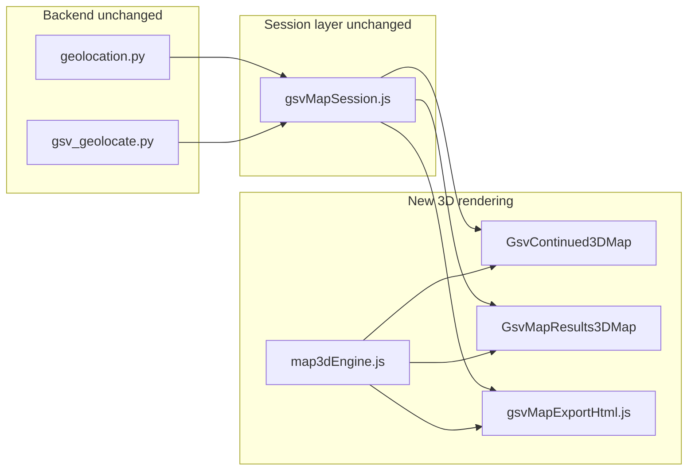

# GSV 3D Map Migration Plan

## Current state

The GSV workflow uses **Leaflet + react-leaflet** with raster OSM/Esri tiles:

| Location | Component | Role |
|----------|-----------|------|
| [`frontend/src/pages/GsvContinuedPage.jsx`](frontend/src/pages/GsvContinuedPage.jsx) | [`DatasetMap.jsx`](frontend/src/components/DatasetMap.jsx) | Live session map: 10k+ location clusters, trail, detection pins |
| [`frontend/src/pages/GsvMapResultsPage.jsx`](frontend/src/pages/GsvMapResultsPage.jsx) | [`GsvMapResultsMap.jsx`](frontend/src/components/GsvMapResultsMap.jsx) | Results map: cameras, class-filtered detection pins, sight-line rays |
| [`frontend/src/lib/gsvMapExportHtml.js`](frontend/src/lib/gsvMapExportHtml.js) | Vanilla Leaflet (~750 lines) | Offline HTML export mirroring live UI |

**Geo data stays 2D** (`lat`, `lng`, `bearing_deg`, `ray_end_*`) from [`backend/geolocation.py`](backend/geolocation.py) and [`backend/gsv_geolocate.py`](backend/gsv_geolocate.py). No backend changes are required—MapLibre automatically **clamps markers and lines to terrain**.

The estimation UI in [`GsvContinuedDetectionTable.jsx`](frontend/src/components/GsvContinuedDetectionTable.jsx) and [`GsvContinuedImagePanel.jsx`](frontend/src/components/GsvContinuedImagePanel.jsx) stays as-is; only the map rendering layer changes.



---

## Recommended free 3D stack

| Piece | Choice | Cost | Why |
|-------|--------|------|-----|
| Map engine | [MapLibre GL JS](https://maplibre.org/maplibre-gl-js/) (BSD) | Free | Native 3D terrain, building extrusions, pitched camera, marker terrain-clamping |
| React binding | `react-map-gl` with `maplibre` import | Free | Maintained React wrapper; avoids reinventing map lifecycle hooks |
| Vector basemap | [OpenFreeMap](https://openfreemap.org/) `https://tiles.openfreemap.org/styles/liberty` | Free, no API key | OSM vector tiles; production-quality; already used in MapLibre 3D building examples |
| 3D buildings | OpenFreeMap `building` source-layer + `fill-extrusion` layer | Free | Uses OSM `render_height` / `render_min_height` from OpenMapTiles schema |
| 3D terrain | AWS Open Data Terrarium DEM tiles | Free | `https://s3.amazonaws.com/elevation-tiles-prod/terrarium/{z}/{x}/{y}.png` with `encoding: "terrarium"` |
| Terrain fallback | [Mapterhorn](https://mapterhorn.com/) PMTiles (optional) | Free | Faster WebP tiles if AWS is slow from your region |
| Satellite mode | Existing Esri World Imagery raster layer | Free (already used) | Overlay on MapLibre as `raster` source when user toggles basemap |
| Sky/atmosphere | MapLibre built-in `sky` layer | Free | Adds realism when terrain is enabled |

**Not using:** Mapbox GL (paid token), MapTiler (free tier limits), Cesium (heavier globe engine—overkill for city-scale GSV sessions), Google Maps 3D (paid).

**Rejected lighter alternative:** `@maplibre/maplibre-gl-leaflet` on top of existing Leaflet—adds vector tiles but **cannot deliver full 3D terrain + pitched navigation** the way native MapLibre can.

---

## Architecture: shared 3D engine + two thin wrappers

Create a small internal map module so GSV continued, results, and export share one implementation:

### New files

```
frontend/src/lib/map3d/
  map3dConfig.js       # style URLs, terrain source, 3D building layer paint, defaults
  map3dLayers.js       # build GeoJSON for cameras, detections, trail, rays; cluster config
  map3dMarkers.js      # emoji HTML marker factory (Leaflet-free version of detectionMapIcons)
  useMap3dControls.js  # flyTo, fitBounds, resize, pitch/bearing reset

frontend/src/components/
  Map3DBase.jsx        # shared MapLibre map: terrain, buildings, sky, basemap switch
  GsvContinued3DMap.jsx # clustering for 10k+ points, session trail + detection pins
  GsvMapResults3DMap.jsx # replaces GsvMapResultsMap (same props interface)
```

### Keep unchanged

- [`frontend/src/components/DatasetMap.jsx`](frontend/src/components/DatasetMap.jsx) — still Leaflet for `/dataset` explorer (per your scope choice)
- [`frontend/src/lib/gsvMapSession.js`](frontend/src/lib/gsvMapSession.js) — marker schema unchanged
- Estimation table / image panel components

### Refactor [`detectionMapIcons.js`](frontend/src/lib/detectionMapIcons.js)

Split into:
- `detectionMarkerHtml(className, selected)` — pure HTML string (shared by MapLibre markers + export)
- Keep existing Leaflet `makeDetectionSymbolIcon` for DatasetMap (unchanged)

---

## 3D visual design

Default camera on load:
- **Pitch:** 55–60° (oblique city view)
- **Bearing:** auto from first trail segment or 0
- **Zoom:** same as today (14 continued fit, 17 fly-to selection)

On style load, programmatically add:

1. **Terrain** — `map.setTerrain({ source: 'terrain', exaggeration: 1.2 })`
2. **3D buildings** — `fill-extrusion` on `building` layer (MapLibre official OpenFreeMap example pattern), minzoom 15, height from `render_height`
3. **Sky layer** — subtle gradient for depth
4. **Light** — MapLibre `light` property for building shadows

### Layer stack (bottom to top)

```
OpenFreeMap Liberty vector basemap
  → 3D building extrusions
  → terrain mesh (drapes basemap)
  → Esri satellite raster (satellite mode only)
  → trail polyline (green)
  → sight-line rays (dashed, class-colored)
  → camera circle markers (blue/green)
  → detection emoji HTML markers (class-colored border)
  → clustered location dots (continued page only)
```

### New map controls (alongside existing toggles)

| Control | Behavior |
|---------|----------|
| **Reset 3D view** | Restore pitch/bearing to session defaults |
| **Terrain** | Toggle `setTerrain(null)` vs terrain on |
| **Buildings** | Toggle 3D extrusion layer visibility |
| Street / Satellite | Keep existing basemap toggle |
| Sight lines / Raw detections | Keep existing toggles on results page |

Right-drag rotates bearing; Ctrl+drag or two-finger pitch already built into MapLibre.

---

## Component migration details

### 1. [`GsvContinuedPage.jsx`](frontend/src/pages/GsvContinuedPage.jsx)

Replace `DatasetMap` import with `GsvContinued3DMap`. Pass the **same props** already wired today:

- `points`, `selectedId`, `trailPoints`, `detectionMarkers`, `filterClass`, `basemap`, session legend flags

**Clustering:** Use MapLibre GeoJSON source with `cluster: true`, `clusterRadius: 50` (matches current Leaflet `maxClusterRadius`). Selected point renders as a separate unclustered marker on top (green pin).

### 2. [`GsvMapResultsPage.jsx`](frontend/src/pages/GsvMapResultsPage.jsx)

Replace `GsvMapResultsMap` with `GsvMapResults3DMap`. **Keep the same props interface** so page logic (class filter chips, KPI counts, detection table row-click → map selection) is untouched.

### 3. [`gsvMapExportHtml.js`](frontend/src/lib/gsvMapExportHtml.js)

Rewrite the embedded viewer (~lines 467–755) from Leaflet CDN to **MapLibre GL JS CDN** + shared `map3dConfig` logic inlined (export must be self-contained HTML with no React bundle).

Reuse the same GeoJSON/marker HTML generation patterns from `map3dLayers.js` / `map3dMarkers.js`—consider extracting a **build-only copy** or a small shared pure-JS module that both React and export import.

---

## Dependencies

Add to [`frontend/package.json`](frontend/package.json):

```json
"maplibre-gl": "^5.x",
"react-map-gl": "^8.x"
```

Remove Leaflet deps **only if** no other page needs them—since DatasetMap, MapView, and BatchDashboardMap still use Leaflet, **keep all existing Leaflet packages**.

CSS: import `maplibre-gl/dist/maplibre-gl.css` in the new map components (or `main.jsx`).

---

## CSS updates

Extend [`frontend/src/dashboard.css`](frontend/src/dashboard.css):

- `.dashboard-map-wrap` — ensure MapLibre canvas fills container (same as Leaflet today)
- `.maplibregl-marker` — pointer cursor for detection pins
- Reuse existing `.map-detection-symbol`, `.dashboard-map-controls`, `.dashboard-map-legend` classes
- Add `.map3d-control-bar` for pitch/terrain/building toggles

---

## Performance considerations

| Concern | Mitigation |
|---------|------------|
| 10k+ location points on continued page | GeoJSON clustering (MapLibre native); only render detection pins unclustered (typically dozens) |
| Terrain tile load time | Lazy-enable terrain after style loads; show 2D map first, fade in 3D |
| AWS DEM latency | Document Mapterhorn fallback in config; swap URL if slow in your region |
| Export HTML size | MapLibre CDN is ~same as Leaflet CDN; no imagery change |

---

## Testing plan

1. **Continued session:** Start map detection → visit 3+ locations → verify cameras, trail, class pins appear on 3D terrain; cluster click selects location
2. **Class filter:** Filter by class chip → only matching emoji pins remain; legend updates
3. **Results page:** Load saved session → fly-to on detection/row click; sight lines drape on terrain
4. **Basemap toggle:** Street (3D buildings) ↔ satellite raster overlay
5. **3D controls:** Terrain/buildings/reset view toggles work without breaking selection
6. **Export:** Download HTML → open offline → map renders 3D with same markers/filters
7. **Regression:** `/dataset` explorer still uses 2D Leaflet DatasetMap

Run existing backend tests unchanged; add optional frontend smoke test only if you already have a frontend test harness (none today).

---

## Implementation order

1. Add deps + `map3dConfig.js` / `map3dMarkers.js` — verify a standalone 3D map renders OpenFreeMap + terrain in a dev spike
2. Build `Map3DBase.jsx` with terrain, buildings, sky, basemap switch
3. Build `GsvMapResults3DMap.jsx` (simpler—no clustering) and swap into results page
4. Build `GsvContinued3DMap.jsx` with clustering and swap into continued page
5. Rewrite export HTML viewer
6. CSS polish + 3D control bar
7. Manual test pass on a real GSV session with traffic signals / multi-class detections

---

## Risks and mitigations

| Risk | Mitigation |
|------|------------|
| OpenFreeMap public instance downtime | Config supports self-hosted Btrfs/MBTiles (document in `.env.example` optional `MAP3D_STYLE_URL`) |
| Sparse 3D building data in rural areas | Expected OSM limitation; terrain still adds depth |
| Esri satellite + terrain visual clash | Satellite mode disables building extrusions; slightly lower pitch default |
| Export HTML drift from live map | Share marker/layer builders between React and export module |

No paid services, no API keys, no backend geo changes required.
