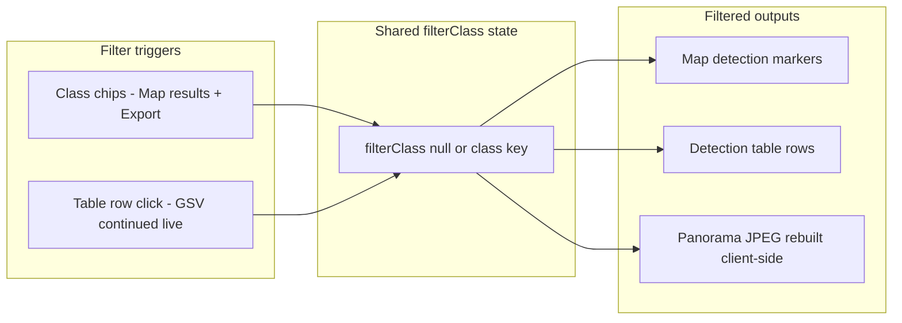

# GSV Class Filter — Table + Panorama Sync

## Problem

Class filtering is **partially implemented**:

| Surface | Map markers | Detection table | Panorama imagery |
|---------|---------------|-----------------|------------------|
| [GsvMapResultsPage.jsx](frontend/src/pages/GsvMapResultsPage.jsx) | Filtered via chips | Shows **all** classes | Shows **all** boxes (baked JPEG) |
| [GsvContinuedPage.jsx](frontend/src/pages/GsvContinuedPage.jsx) | No filter | Shows **all** classes | Shows **all** boxes |
| [gsvMapExportHtml.js](frontend/src/lib/gsvMapExportHtml.js) | Filtered via chips | Shows **all** classes at location | Shows **all** boxes |

The API already returns everything needed for client-side class filtering:
- Flat `detections[]` with `class`, `view`, `bbox`, `confidence`
- Per-view breakdown in `views["1".."4"].detections`
- Pre-stitched `panorama_image_b64` (all classes baked in — cannot be filtered in-place)

Reference pattern: [BatchDashboard.jsx](frontend/src/pages/BatchDashboard.jsx) `DetectionList` filters by `filterClass`; map results page already filters markers the same way.

---

## Target behavior



- **GSV continued live** ([GsvContinuedPage.jsx](frontend/src/pages/GsvContinuedPage.jsx)): click a detection table row → filter to that class; click the same row again (or a small “Show all” control) → clear filter. No new chip row on this page (per your preference).
- **Map results + export**: existing class chips continue to drive `filterClass`; chips must also filter the table and panorama for the selected location.
- **Export HTML**: table rows clickable (same toggle UX) in addition to chips; both stay in sync.

When `filterClass` is set, only matching detections appear in the table. The panorama is rebuilt from raw view tiles + filtered bbox data (not the pre-baked stitch).

When `filterClass` is null, keep using the fast pre-baked `panorama_image_b64`.

---

## Phase 1 — Shared panorama filter utility

**New file:** [frontend/src/lib/gsvPanoramaClassFilter.js](frontend/src/lib/gsvPanoramaClassFilter.js)

Responsibilities:

1. **`filterDetections(detections, filterClass)`** — return all if `filterClass` is null, else `d.class === filterClass`.

2. **`drawAnnotatedView(ctx, detections, filterClass)`** — canvas draw matching backend style in [detector.py](backend/detector.py) `_draw_and_encode` (semi-transparent fill + border + label), using [CLASS_COLORS](frontend/src/constants/classes.js) hex values.

3. **`buildFilteredPanoramaB64({ panoViews, viewsByKey, getRawViewSrc, filterClass })`** — async:
   - For each view in `panoViews`, load raw image (URL or base64)
   - Get detections from `viewsByKey[view].detections` (or filter flat list by view)
   - Draw filtered boxes on canvas
   - Normalize tile heights, stitch horizontally, add title band (“360 Degree Street Asset Panorama”)
   - Return `data:image/jpeg;base64,...`

4. **`extractViewsData(detectionResult)`** — normalize `detectionResult.views` into a lookup keyed by view number.

5. **`fetchViewAsB64(locationId, view)`** — helper for export collection: `fetch(gsvContinuedImageUrl(...))` → blob → FileReader base64.

**React hook (same file or adjacent):** `useFilteredPanorama({ detectionResult, filterClass, locationId })` → `{ displayB64, rebuilding }` — memoize on inputs; cancel in-flight work on location/filter change.

---

## Phase 2 — Detection table: filter + row-click

**Modify:** [frontend/src/components/GsvContinuedDetectionTable.jsx](frontend/src/components/GsvContinuedDetectionTable.jsx)

- Add props: `filterClass`, `onFilterClassChange(cls)` (toggle: same class → null).
- Filter `detections` before render (re-number rows 1..N).
- Make rows clickable (`cursor: pointer`); highlight rows matching `filterClass` with existing `--highlight` style + active-class border.
- Empty state: `No {class} detections` when filtered.
- Optional slim banner above table when filtered: “Showing Street Light only · click row again to show all”.

**Modify:** [frontend/src/components/GsvPanoramaViewer.jsx](frontend/src/components/GsvPanoramaViewer.jsx) (or [GsvStreetViewViewer.jsx](frontend/src/components/GsvStreetViewViewer.jsx))

- Accept `filterClass` + use `useFilteredPanorama`.
- Pass `displayB64 ?? panoramaImageB64` to the ``.
- Show subtle “Filtering…” overlay while rebuilding.

---

## Phase 3 — Wire up live pages

### [GsvContinuedPage.jsx](frontend/src/pages/GsvContinuedPage.jsx)

- Add `filterClass` state; reset to `null` when `selectedId` changes.
- Pass to `GsvContinuedDetectionTable` and `GsvStreetViewViewer`.
- Row-click handler toggles filter.
- When `mapSessionActive`, filter `sessionDetectionMarkers` by `filterClass` before passing to `DatasetMap` (same as BatchDashboard map markers).

### [GsvMapResultsPage.jsx](frontend/src/pages/GsvMapResultsPage.jsx)

- Pass existing `filterClass` to `GsvContinuedDetectionTable` and `GsvStreetViewViewer`.
- Optionally wire row-click to `setFilterClass` (toggle) so chips and row-click stay in sync.
- When filter changes, if `selectedDetectionId` is not in `filteredDetections`, clear selection or auto-select first visible detection at current location.

**Modify:** [frontend/src/components/GsvContinuedImagePanel.jsx](frontend/src/components/GsvContinuedImagePanel.jsx) (small)

- Accept optional `filterClass`; show filtered count from `detectionResult.counts[filterClass]` instead of total when active.

---

## Phase 4 — Exported HTML

**Modify:** [frontend/src/lib/gsvMapExportHtml.js](frontend/src/lib/gsvMapExportHtml.js)

### Export payload extension

In `collectSessionImagery` / `locationImageryFromResponse`, embed per-view tile data needed for offline filtered panorama rebuild:

```js
{
  lat, lng, pano_views,
  panorama_image_b64,          // used when filterClass === null
  view_tiles: {
    "1": { raw_b64, detections: [...] },
    "2": { ... },
  }
}
```

- Pull `detections` (+ bbox) from cached detect response `views[view].detections` (already in `detectionCache` after browsing).
- Fetch raw view JPEGs via `gsvContinuedImageUrl` at export time (parallel, same concurrency as panorama fetch).
- **Size note:** adds ~4 raw tiles per location; keep existing confirm dialog for large sessions.

### Export viewer script changes (inside `EXPORT_VIEWER_SCRIPT`)

1. **`renderTable()`** — filter by `selectedLocationId` **and** `filterClass`; wire row `click` → toggle `filterClass` → `renderTable()` + `renderPanorama()` + `renderMap()`.

2. **`renderPanorama()`** (new) — if `filterClass` null use `panorama_image_b64`; else rebuild from `view_tiles` using inlined canvas stitch logic (mirror Phase 1 util as vanilla JS).

3. **`initFilters()`** chip click handler — add `renderTable()` + `renderPanorama()` (today only calls `renderMap()`).

4. **`selectCamera()`** — when filtered, pick first detection matching `filterClass` at that location.

5. **`selectDetection()`** — if clicked detection class differs from active filter, optionally set filter to that class (keeps row-click and chips aligned).

Duplicate minimal draw/stitch helpers into the export template string (no React/bundler in exported file). Keep logic aligned with `gsvPanoramaClassFilter.js`.

---

## Files touched

| Action | File |
|--------|------|
| **Create** | [frontend/src/lib/gsvPanoramaClassFilter.js](frontend/src/lib/gsvPanoramaClassFilter.js) |
| **Modify** | [frontend/src/components/GsvContinuedDetectionTable.jsx](frontend/src/components/GsvContinuedDetectionTable.jsx) |
| **Modify** | [frontend/src/components/GsvStreetViewViewer.jsx](frontend/src/components/GsvStreetViewViewer.jsx) |
| **Modify** | [frontend/src/components/GsvContinuedImagePanel.jsx](frontend/src/components/GsvContinuedImagePanel.jsx) |
| **Modify** | [frontend/src/pages/GsvContinuedPage.jsx](frontend/src/pages/GsvContinuedPage.jsx) |
| **Modify** | [frontend/src/pages/GsvMapResultsPage.jsx](frontend/src/pages/GsvMapResultsPage.jsx) |
| **Modify** | [frontend/src/lib/gsvMapExportHtml.js](frontend/src/lib/gsvMapExportHtml.js) |

No backend changes.

---

## Testing plan

1. **GSV continued live:** detect location with multiple classes → click a Street Light row → table shows only Street Light; panorama boxes match; click row again → all return.
2. **Map session:** start session, visit 2 locations, row-filter → map emoji markers filter too.
3. **Map results:** chip “Lights” → map, table, and panorama all show only Street Light; chip “All” restores full panorama.
4. **Export:** open exported HTML → chip filter updates table + panorama; row-click toggles same; offline (no backend) still works for imagery.
5. **Edge cases:** filter class with 0 rows at selected location → empty table message; switching location resets filter on continued page; export location with no matching class shows empty table, blank annotated tiles.

---

## Out of scope

- Backend `?class=` query param on panorama detect (unnecessary — bbox data already client-side).
- Filtering overlay/sky views 0/5 (panorama path only uses side views 1–4 today).
- Re-exporting sessions saved before this change (old exports lack `view_tiles`; they will still filter map + table but panorama stays all-classes unless re-exported).
