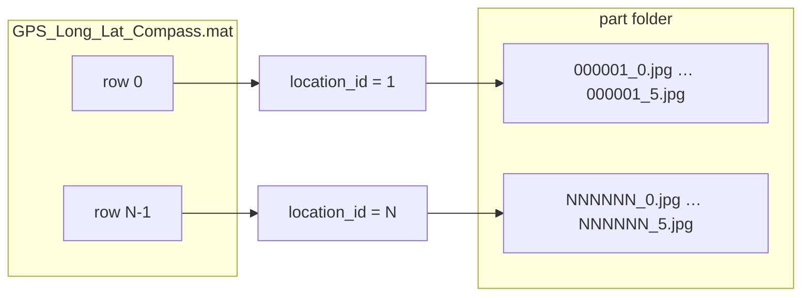
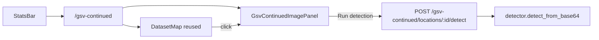

# GSV Continued (PitOrlManh dataset)

## Prerequisites status

| Step | Status |
|------|--------|
| Copy dataset to [`Dataset_PitOrlManh/`](Dataset_PitOrlManh/) | **Done** (user, Jun 4 2026) |
| `GPS_Long_Lat_Compass.mat` present | Yes |
| `zipped images/part1/` — 6,594 JPGs (1,099 locations × 6 views) | Yes |
| `gsv_continued_index.json` | Not yet — created by index build script during implementation |
| Code + Docker mount | Pending implementation |

## Dataset analysis (workspace copy: [`Dataset_PitOrlManh/`](Dataset_PitOrlManh/))

| Asset | Role |
|-------|------|
| `GPS_Long_Lat_Compass.mat` | Variable `GPS_Compass`: **10,343 × 3** — col0 **lat**, col1 **lng**, col2 **compass (deg)** |
| `Cartesian_Location_Coordinates.mat` | `XYZ_Cartesian` — not needed for map/detect |
| `GIST.mat`, `Color_hist.mat` | Feature matrices — **out of scope** |
| `zipped images/part1/` | **6 views per location**: `{locationId:06d}_{view}.jpg` where `view` = 0…5 (~500–850 KB each) |

**Image ↔ GPS linking (1-based location id):**



- **Formula:** `location_id` = row index + 1; GPS at `GPS_Compass[location_id - 1]`.
- **part1 today:** ids **1–1099** (6,594 files, no gaps). Full torrent implies ~**10 parts** (~1,099 locations each) → 10,343 total.
- **part1 geographic span:** lat 40.44°, lng -80° (Pittsburgh corridor); full `.mat` spans lat 28.5–40.8, lng -81.4 to -73.9.

You chose: **map shows only locations with at least one image on disk** (1,099 points for part1).

---

## What already exists (reuse, do not replace)

The app already has a parallel flow for a *different* dataset (10k PNGs + `coords.csv`):

- Route: [`/dataset`](frontend/src/pages/DatasetExplorerPage.jsx) — nav label **"Google Street View & Detection"** in [`StatsBar.jsx`](frontend/src/components/StatsBar.jsx)
- Backend: [`dataset_service.py`](backend/dataset_service.py) + routes in [`main.py`](backend/main.py) (`/dataset/*`)
- UI: [`DatasetMap.jsx`](frontend/src/components/DatasetMap.jsx) (clustering + deferred markers), [`DatasetImagePanel.jsx`](frontend/src/components/DatasetImagePanel.jsx)

**GSV continued** is a **second** explorer at `/gsv-continued` with its own API prefix and nav link **"GSV continued"**. Leave `/dataset` unchanged.

---

## Target UX

Same layout as [`DatasetExplorerPage.jsx`](frontend/src/pages/DatasetExplorerPage.jsx): **map ~60% | panel ~40%**.

1. User clicks **GSV continued** in [`StatsBar.jsx`](frontend/src/components/StatsBar.jsx) → `/gsv-continued`.
2. Map loads clustered dots for **available** locations only; `fitBounds` to those points.
3. Click dot → panel shows **one** street-view frame (default **view 0**); optional **view picker 0–5** (only views that exist on disk).
4. **Run detection** → `POST` with `location_id` + `view`; show annotated image + counts (same shape as existing dataset detect).
5. Header subtitle: e.g. `1,099 locations with images · 6 views each · part1 loaded`.



---

## Workspace layout (after you copy)

Copy the torrent folder to:

`D:\Street_view_detection\Dataset_PitOrlManh\`

Expected tree (minimum for part1 test):

```
Dataset_PitOrlManh/
  GPS_Long_Lat_Compass.mat
  zipped images/
    part1/
      000001_0.jpg … 001099_5.jpg
```

Add to [`.gitignore`](.gitignore): `Dataset_PitOrlManh/` (multi-GB; never commit).

---

## Backend design

### 1. Index build (fast startup, no per-request directory walks)

**New:** [`backend/scripts/build_gsv_continued_index.py`](backend/scripts/build_gsv_continued_index.py) (run once after copy, or on first deploy):

- Read `GPS_Long_Lat_Compass.mat` with **scipy** (dev/script dependency only).
- Walk `zipped images/part*/` and parse filenames with regex `^(\d{6})_(\d)\.jpg$`.
- Write cache: `Dataset_PitOrlManh/gsv_continued_index.json`:

```json
{
  "total_locations_in_mat": 10343,
  "locations": [
    {
      "id": 1,
      "lat": 40.440309,
      "lng": -80.0,
      "compass": 115.74,
      "views": [0,1,2,3,4,5],
      "part": "part1"
    }
  ]
}
```

- Only include locations with **≥1** image file.
- Store `part` (folder name) per location so image lookup is O(1).

**New:** [`backend/gsv_continued_service.py`](backend/gsv_continued_service.py):

- Root: `GSV_CONTINUED_ROOT` env (default `repo/Dataset_PitOrlManh`).
- Load `gsv_continued_index.json` at startup; if missing → log warning + 503 with message to run build script.
- Helpers: `get_meta()`, `get_points()`, `get_location(id)`, `get_image_path(id, view)`, `list_views(id)`.

**Re-scan when user adds part2+:** document `python backend/scripts/build_gsv_continued_index.py` after extracting new parts (no hot-reload of 60k files in request path).

### 2. API routes in [`main.py`](backend/main.py)

| Method | Path | Behavior |
|--------|------|----------|
| `GET` | `/gsv-continued/meta` | `{ count, bounds, total_locations_in_mat, parts: ["part1"], views_per_location: 6 }` |
| `GET` | `/gsv-continued/points` | `[{ id, lat, lng }, ...]` — only indexed locations (~50–80 KB for 1,099; ~600 KB if all parts) |
| `GET` | `/gsv-continued/locations/{id}/image` | Query `view` (0–5, default 0). `FileResponse` `image/jpeg`. Optional `max_width` for **preview** via Pillow (e.g. 1280) — detection uses full file |
| `POST` | `/gsv-continued/locations/{id}/detect` | Query `view`; read JPG → base64 → `detect_from_base64`; return same envelope as [`dataset_detect`](backend/main.py) with `source: "gsv_continued"` |

Validation: `id` in `1..10343` and present in index; `view` in location’s `views` list; path traversal blocked via resolved paths under root.

### 3. Docker / env

[`docker-compose.yml`](docker-compose.yml) — add read-only mount:

```yaml
- ./Dataset_PitOrlManh:/app/Dataset_PitOrlManh:ro
```

[`backend` environment](docker-compose.yml): `GSV_CONTINUED_ROOT=/app/Dataset_PitOrlManh`

[`.env.example`](.env.example): document `GSV_CONTINUED_ROOT` and index build command.

**Script dependency:** `scipy` only for the build script (e.g. `pip install scipy` on host when building index, or optional `backend/requirements-dev.txt`). Runtime backend stays on existing [`requirements.txt`](backend/requirements.txt) (Pillow already present for optional resize).

---

## Frontend design

### 1. Routing — [`App.jsx`](frontend/src/App.jsx)

```jsx
<Route path="/gsv-continued" element={<GsvContinuedPage />} />
```

### 2. API — [`api.js`](frontend/src/api.js)

```js
getGsvContinuedMeta()
getGsvContinuedPoints()
gsvContinuedImageUrl(id, view = 0, maxWidth = 1280)  // preview query
detectGsvContinuedLocation(id, view = 0)
```

Use same `withRetry` / timeouts as dataset points (120s for large point payloads when all parts exist).

### 3. New page — `frontend/src/pages/GsvContinuedPage.jsx`

Clone structure from [`DatasetExplorerPage.jsx`](frontend/src/pages/DatasetExplorerPage.jsx):

- Title: **GSV continued**
- Back link: `← Map`
- State: `points`, `selectedId`, `selectedView`, `detectionResult`, `detecting`
- Reuse [`DatasetMap`](frontend/src/components/DatasetMap.jsx) unchanged (`id` = `location_id`)

### 4. New panel — `frontend/src/components/GsvContinuedImagePanel.jsx`

Based on [`DatasetImagePanel.jsx`](frontend/src/components/DatasetImagePanel.jsx) with:

- Filename label: `000042_3.jpg` style
- **View selector:** 6 buttons (disable missing views from `location.views` in meta/detail endpoint if needed — can pass `views` on select via small `GET /gsv-continued/locations/{id}` or embed in points payload as optional `views` array; for 1,099 points adding `views` per point is fine)
- Preview `` via `gsvContinuedImageUrl(id, view, maxWidth=1280)`
- **Run detection** uses full-res on server (no `max_width` on POST)

### 5. Navigation — [`StatsBar.jsx`](frontend/src/components/StatsBar.jsx)

Add link next to existing dataset link:

```jsx
<Link to="/gsv-continued">GSV continued</Link>
```

---

## Crash / performance safeguards

| Risk | Mitigation |
|------|------------|
| 10k+ Leaflet markers | Reuse `MarkerClusterGroup` + `chunkedLoading` + 200ms deferred render in [`DatasetMap.jsx`](frontend/src/components/DatasetMap.jsx) |
| Loading 6k+ full JPGs in browser | **Never** bulk-fetch; single `img` per selection; optional `max_width` preview |
| Reading 4.9 GB zip / all files on each request | **Index JSON** built offline; O(1) lookup |
| Detection memory | One file read per click; existing inference timeout |
| Missing index / dataset | 503 + toast; page shows “Dataset unavailable” (same pattern as dataset page) |
| Docker without mount | Clear error in logs and API detail |

When all **10 parts** are present (~10,343 × 6 images), map still only sends lightweight points JSON; clustering keeps pan/zoom responsive.

---

## Files to create / modify

| Action | File |
|--------|------|
| Create | `backend/scripts/build_gsv_continued_index.py` |
| Create | `backend/gsv_continued_service.py` |
| Modify | `backend/main.py` (4 routes + `init` hook) |
| Modify | `docker-compose.yml`, `.env.example`, `.gitignore` |
| Create | `frontend/src/pages/GsvContinuedPage.jsx` |
| Create | `frontend/src/components/GsvContinuedImagePanel.jsx` |
| Modify | `frontend/src/App.jsx`, `frontend/src/api.js`, `frontend/src/components/StatsBar.jsx` |

**Optional small refactor (only if it stays tiny):** pass `title` / `api` props into a shared explorer shell — not required for v1.

---

## Setup steps

1. ~~Copy dataset to `Dataset_PitOrlManh/`~~ **Done** — verified: `.mat` files + `part1` (6,594 JPGs).
2. *(During implementation)* Run index build: `python backend/scripts/build_gsv_continued_index.py` (needs `scipy` once on host).
3. *(During implementation)* `docker compose up` with `./Dataset_PitOrlManh` volume mount.
4. Open `/gsv-continued` — expect **1,099** dots over Pittsburgh; click → preview; **Run detection** with inference server up.

When **part2+** arrive: extract under `zipped images/part2/`, re-run index script, restart backend.

---

## Out of scope

- Serving or indexing `GIST.mat` / `Color_hist.mat`
- Batch-detect all views/locations
- Mapillary overlay on this page (local JPGs, not Mapillary tiles)
- Auto-unzipping torrent parts inside the app

---

## Test plan

1. Index build produces `gsv_continued_index.json` with **1,099** locations and 6 views each.
2. `GET /gsv-continued/meta` → `count: 1099`, bounds around Pittsburgh.
3. `GET /gsv-continued/points` length 1099; id `1` matches `GPS_Compass[0]`.
4. `GET .../locations/1/image?view=0` returns JPEG; `view=3` works.
5. UI: map clusters, click dot, switch views 0–5, preview updates.
6. **Run detection** on one image returns annotated b64 + counts (inference running).
7. StatsBar **GSV continued** ↔ main map back link works; `/dataset` still works independently.
