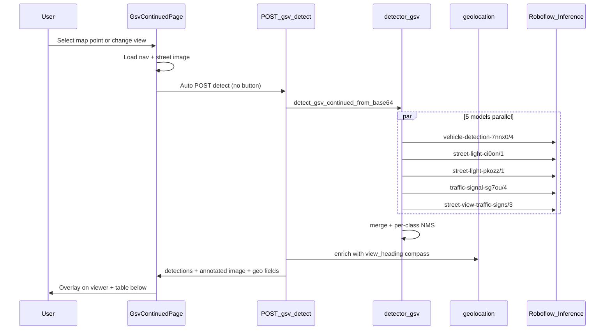

# GSV Continued: All Models + Auto-Detect + Results Table

## Current state

| Area | Today |
|------|--------|
| Page | [`frontend/src/pages/GsvContinuedPage.jsx`](frontend/src/pages/GsvContinuedPage.jsx) |
| Panel | [`frontend/src/components/GsvContinuedImagePanel.jsx`](frontend/src/components/GsvContinuedImagePanel.jsx) — **Run detection** button (manual) |
| API | `POST /gsv-continued/locations/{id}/detect` in [`backend/main.py`](backend/main.py) |
| Models | Shared 3-model pipeline in [`backend/detector.py`](backend/detector.py): `vehicle-detection-7nnx0/4`, `street-light-ci0on/1`, `traffic-signal-sg7ou/4` |
| Geo | Location-level `lat`/`lng` only — **no** per-detection `geo_lat`/`geo_lng` on GSV |
| UI results | Card list (class + confidence), no table |

**Scope constraint:** Map page, dataset explorer, and batch dashboard stay unchanged. Only GSV Continued route and its dedicated detect endpoint change.

---

## Target behavior



---

## 1. Backend — GSV-only 5-model detection pipeline

**File:** [`backend/detector.py`](backend/detector.py)

Add GSV-specific env vars (defaults match your Roboflow model IDs):

| Role | Model ID | Env vars |
|------|----------|----------|
| Primary (existing) | `vehicle-detection-7nnx0/4` | reuse `PROJECT_ID` / `MODEL_VERSION` |
| Street light A (existing) | `street-light-ci0on/1` | reuse `STREET_LIGHT_*` |
| Street light B (**new**) | `street-light-pkozz/1` | `GSV_STREET_LIGHT_PK0ZZ_PROJECT_ID`, `GSV_STREET_LIGHT_PK0ZZ_MODEL_VERSION`, `ENABLE_GSV_STREET_LIGHT_PK0ZZ` |
| Traffic signal (existing) | `traffic-signal-sg7ou/4` | reuse `TRAFFIC_SIGNAL_*` |
| Traffic signs (**new**) | `street-view-traffic-signs/3` | `GSV_TRAFFIC_SIGNS_PROJECT_ID`, `GSV_TRAFFIC_SIGNS_MODEL_VERSION`, `ENABLE_GSV_TRAFFIC_SIGNS` |

Implementation pattern (isolated from app-wide `detect_from_base64`):

- Extract shared helper `_run_model_specs(image_payload, specs: list[tuple[str, str]])` from current `_run_models`
- Add `GSV_CONTINUED_MODEL_SPECS` list (5 entries when all enabled)
- Add `async def detect_gsv_continued_from_base64(b64_str) -> dict` — same annotate/merge flow as today, but uses GSV specs
- Bump timeout for GSV: `30 + 15 * (enabled_optional_count)` → ~90s with 4 optional models
- Add **Traffic Sign** class support:
  - `CLASS_ALIASES` for sign outputs (`traffic sign`, `stop sign`, etc.)
  - `CLASS_COLORS` / `CLASS_EMOJIS` in detector + [`frontend/src/constants/classes.js`](frontend/src/constants/classes.js)
- `source_model` values: `primary`, `street_light_ci0on`, `street_light_pkozz`, `traffic_signal`, `traffic_signs` (helps debugging in table)

**Config/docs:** update [`.env.example`](.env.example) and [`docker-compose.yml`](docker-compose.yml) with the 3 new GSV env var groups.

---

## 2. Backend — Per-detection geolocation on GSV detect

**File:** [`backend/main.py`](backend/main.py) — `gsv_continued_detect` handler (~line 493)

After detection, enrich each bbox using existing [`backend/geolocation.py`](backend/geolocation.py) (same as `/detect/street`):

```python
compass_angle = gsv_continued_service.view_heading(loc["compass"], view)
detections = geolocation.enrich_detections_with_geo(
    result["detections"],
    camera_lat=loc["lat"],
    camera_lng=loc["lng"],
    compass_angle=compass_angle,
    image_width=result["image_size"]["width"],
    image_height=result["image_size"]["height"],
    # No Mapillary focal — falls back to HORIZONTAL_FOV_DEG bearing estimate
)
```

Also add `Traffic Sign` to `STATIC_GROUND_CLASSES` / `ASSUMED_OBJECT_HEIGHT_M` in geolocation (reuse traffic-signal height ~5m) so sign anchors use ground-contact pixels.

Response shape per detection (table-ready):

- `class`, `confidence`, `source_model`
- `camera_lat`, `camera_lng` (same for all rows in one image)
- `geo_lat`, `geo_lng`, `geo_method` (estimated object position; `null` if bbox too small or enrichment skipped)

Top-level response keeps existing fields: `lat`, `lng`, `compass`, `annotated_image_b64`, `counts`.

---

## 3. Frontend — Auto-run on image load (remove button)

**File:** [`frontend/src/pages/GsvContinuedPage.jsx`](frontend/src/pages/GsvContinuedPage.jsx)

- Remove manual `handleRunDetection` / button wiring
- Add `useEffect` triggered by `selectedId`, `selectedView`, and resolved `view` from `navData`:
  - Set `detecting = true` immediately
  - Call `detectGsvContinuedLocation(id, view)` with `AbortController` to cancel stale navigations
  - On success: `setDetectionResult(data)`; on abort: ignore
  - On error: toast (no success toast on every auto-run — too noisy)
- **Stop clearing** `detectionResult` in `enterLocation` / `handleViewChange` — keep prior results visible until the new request finishes (avoids flicker while navigating)
- Increase axios timeout in [`frontend/src/api.js`](frontend/src/api.js) if needed (150s for 5 models)

**File:** [`frontend/src/components/GsvContinuedImagePanel.jsx`](frontend/src/components/GsvContinuedImagePanel.jsx)

- Remove **Run detection** button and `onRunDetection` prop
- Show compact status: `Detecting…` spinner/text in header when `detecting` is true
- Keep view tabs (V0–V5) and filename/coords header

---

## 4. Frontend — Detection results table

**New file:** `frontend/src/components/GsvContinuedDetectionTable.jsx`

Reuse table styles from [`frontend/src/dashboard.css`](frontend/src/dashboard.css) (`.dashboard-table`, `.dashboard-table-scroll`) — same look as [`BatchResultsTable.jsx`](frontend/src/components/BatchResultsTable.jsx).

| Column | Source |
|--------|--------|
| # | row index |
| Object | `det.class` + emoji |
| Confidence | `det.confidence` |
| Cam lat | `det.camera_lat` or top-level `lat` |
| Cam lng | `det.camera_lng` or top-level `lng` |
| Est lat | `det.geo_lat` or `—` |
| Est lng | `det.geo_lng` or `—` |
| Model | `det.source_model` (optional narrow column) |

Empty states:
- While `detecting && !detectionResult`: "Running detection…"
- After detect with 0 objects: "No objects detected"
- Missing geo: show `—` in Est columns

**Layout change** in `GsvContinuedPage.jsx`:

- Increase bottom panel from `maxHeight: 38%` to ~`45%` to fit table
- Structure: `GsvContinuedImagePanel` (compact header + view tabs) → `GsvContinuedDetectionTable` below
- Remove the old card-list detection UI from the panel (replaced by table)

`GsvStreetViewViewer` unchanged — still overlays `detectionResult.annotated_image_b64` when available.

---

## 5. Files touched (GSV-only scope)

| File | Change |
|------|--------|
| [`backend/detector.py`](backend/detector.py) | GSV 5-model specs + `detect_gsv_continued_from_base64` |
| [`backend/main.py`](backend/main.py) | GSV detect uses new function + geo enrichment |
| [`backend/geolocation.py`](backend/geolocation.py) | Traffic Sign ground-anchor support |
| [`.env.example`](.env.example) | New GSV model env vars |
| [`docker-compose.yml`](docker-compose.yml) | Pass new env vars to backend |
| [`frontend/src/pages/GsvContinuedPage.jsx`](frontend/src/pages/GsvContinuedPage.jsx) | Auto-run effect, layout, wire table |
| [`frontend/src/components/GsvContinuedImagePanel.jsx`](frontend/src/components/GsvContinuedImagePanel.jsx) | Remove button; slim header |
| `frontend/src/components/GsvContinuedDetectionTable.jsx` | **New** results table |
| [`frontend/src/constants/classes.js`](frontend/src/constants/classes.js) | Traffic Sign color/emoji |
| [`frontend/src/api.js`](frontend/src/api.js) | Optional AbortSignal + timeout bump |

**Not changed:** `MapPage`, `DatasetExplorerPage`, `detect_from_url`, `detect_from_base64`, batch pipeline.

---

## 6. Verification checklist

1. Select a map point → image loads → detection runs automatically (no button)
2. Change view tab → new auto-detect for that view
3. Navigate forward/back → auto-detect on new location
4. Annotated boxes appear on street view after detect completes
5. Table shows one row per detection with Cam lat/lng + Est lat/lng
6. Other pages (map, dataset) still use 3-model manual/same behavior as before
7. Inference server has all 5 models available (Roboflow `inference server start` with API key)

**Risk:** First load of new models (`street-light-pkozz/1`, `street-view-traffic-signs/3`) may cold-start on inference server — expect longer first request; optional models log warnings and continue if one fails (primary still required).
