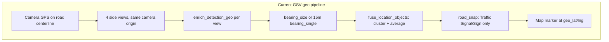
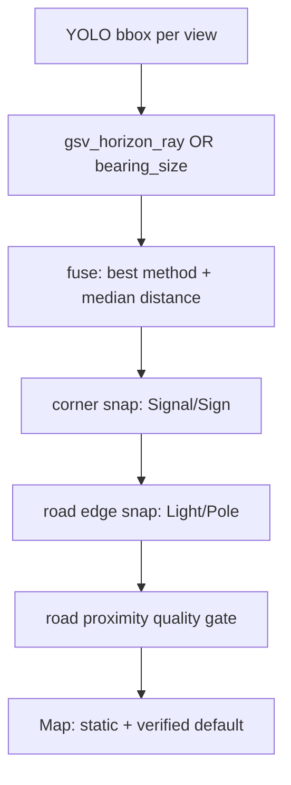

# GSV Static Asset Geolocation Mitigation Plan

## Problem confirmed in your screenshot

Pins are rendered **exactly** as the backend computes them — the frontend has no coordinate correction ([`gsvMapSession.js`](frontend/src/lib/gsvMapSession.js) copies `geo_lat`/`geo_lng` → `lat`/`lng`; maps use those verbatim).

Your screenshot shows **Street Light / Traffic Signal / Traffic Sign** pins offset onto buildings and open lots. That matches known failure modes in the current pipeline:



### Root causes (ranked)

| Rank | Cause | Effect on map |
|------|-------|---------------|
| 1 | **Camera on centerline, no lateral parallax** | Vertical assets at road edge appear “on buildings” when bearing is slightly off |
| 2 | **Distance from assumed height** ([`estimate_distance_from_bbox`](backend/geolocation.py)) | Wrong height → wrong range; signal mount scaling (`mount_h/head_h`) can overshoot |
| 3 | **Road snap only for Traffic Signal/Sign** ([`SNAP_CLASSES`](backend/road_snap.py)) | Street Light / Pole stay on projected ray |
| 4 | **Snap rejection** (`SNAP_MAX_DISPLACEMENT_M=25`) | Bad estimate kept when corner snap would move pin >25m |
| 5 | **No within-location LOB** (same camera for all 4 views) | Cannot triangulate from parallax; fusion only clusters/averages bad points |
| 6 | **GSV lacks 3D camera ray** (no `computed_rotation`) | Mapillary-only path in [`camera_ray.py`](backend/camera_ray.py); GSV uses 2D bearing |
| 7 | **Cars shown with `bearing_single` + 15m** | Noise on map (out of scope — you chose static-only) |

A prior plan ([`gsv_traffic_signal_geo_fix`](.cursor/plans/gsv_traffic_signal_geo_fix_036d82a6.plan.md)) addressed signal anchors, dedup, and corner snap. **Remaining errors are expected** for Street Light/Pole and for signals where snap fails or bearing/HFOV is miscalibrated.

---

## Strategy (static infrastructure only)

Three layers, in order of ROI:

1. **Measure** — quantify errors on real sessions before tuning
2. **Constrain** — snap static assets to plausible road geometry; hide bad estimates
3. **Calibrate** — tune HFOV/compass/height priors on PitOrlManh validation intersections

---

## Phase 0 — Baseline audit (1 session)

**Goal:** Turn “looks wrong” into metrics.

Use existing [`backend/scripts/audit_gsv_session_geo.py`](backend/scripts/audit_gsv_session_geo.py) on the session JSON exported from map results.

Track per class (static only):

- `bearing_single_pct` — should be ~0% for poles/lights after fixes
- `centerline_pct` — pins within 3m of drive trail (bad for corner-mounted assets)
- `traffic_signal_off_centerline_pct` — government gate target ≥80%
- `snap_rejected` count — pins where corner snap was refused
- Per-pin `geo_method`, `geo_quality`, `snap_displacement_m`

Also populate [`data/gsv_intersection_validation.json`](data/gsv_intersection_validation.json) via [`backend/scripts/validate_gsv_intersections.py`](backend/scripts/validate_gsv_intersections.py) and manually label 5–10 known signal/light positions for regression tests.

**Deliverable:** audit report + labeled ground-truth fixtures in `backend/tests/fixtures/gsv_geo/`.

---

## Phase 1 — Map scope: static assets only (quick win)

**Goal:** Remove misleading Car/mobile pins immediately.

### Backend
- In [`gsv_geolocate.fuse_location_objects`](backend/gsv_geolocate.py) or [`process_panorama_official_objects`](backend/gsv_geolocate.py), optionally filter to `STATIC_GROUND_CLASSES` (already defined in [`geolocation.py`](backend/geolocation.py)) when building `official_objects`.
- Keep raw detections in API for debug table; official map uses static-only.

### Frontend
- [`gsvMapSession.js`](frontend/src/lib/gsvMapSession.js): default map markers = static classes only
- [`GsvMapResultsPage.jsx`](frontend/src/pages/GsvMapResultsPage.jsx) / [`GsvContinuedPage.jsx`](frontend/src/pages/GsvContinuedPage.jsx): class filter defaults to static union; Cars still visible in table if detected
- Export HTML ([`gsvMapExportHtml.js`](frontend/src/lib/gsvMapExportHtml.js)): government export = static + verified only

---

## Phase 2 — Road-edge snap for Street Light and Pole (highest backend impact)

**Goal:** Move vertical assets from “ray on flat ground” to **road-adjacent** positions.

Extend [`road_snap.py`](backend/road_snap.py) (currently `SNAP_CLASSES = {Traffic Signal, Traffic Sign}`):

### New module logic: `snap_to_road_edge`

```
Input: estimated pin, camera_lat/lng, bearing_deg, road_bearing, class
Output: pin projected to nearest plausible roadside point
```

**Algorithm (reuse existing OSM/Overpass infra):**

1. Query OSM `highway=*` ways within `SNAP_SEARCH_RADIUS_M` (new Overpass query for way geometry, not just intersection nodes).
2. Project estimated point onto nearest road centerline segment (same math as audit script’s `_point_to_segment_m`).
3. Offset **perpendicular** to road by `ROAD_EDGE_OFFSET_M` (new env, default ~6–8m) using lateral sign from [`_lateral_sign_from_detection`](backend/road_snap.py).
4. Clamp displacement with class-specific max (`SNAP_MAX_DISPLACEMENT_M` may need separate values: signals already use 25m; poles/lights may allow 35m).
5. Set `geo_method = "road_edge_snap"`, `geo_quality = "high"` when snap succeeds.

**Fallback chain** (mirror intersection snap):

```
OSM road geometry → GSV nav road bearing + centerline offset → keep estimate (low quality)
```

**Classes:** `Street Light`, `Pole` (and optionally re-apply edge snap to Traffic Signal/Sign *after* corner snap if corner snap rejected).

### Key files to change

- [`backend/road_snap.py`](backend/road_snap.py) — new OSM way query, projection, `snap_roadside_object`
- [`backend/gsv_geolocate.py`](backend/gsv_geolocate.py) — call roadside snap after fuse, before/alongside corner snap
- [`backend/main.py`](backend/main.py) — panorama detect + session refine paths already call `snap_official_objects`; extend signature
- [`.env.example`](.env.example) — `ROAD_EDGE_OFFSET_M`, `SNAP_ROADSIDE_CLASSES`, `SNAP_OSM_WAYS_ENABLED`

---

## Phase 3 — Improve bearing + distance for static classes

**Goal:** Reduce pre-snap error so road snap succeeds more often.

### 3a. GSV horizon ray (pseudo-3D without OpenSfM)

Add [`backend/gsv_camera_ray.py`](backend/gsv_camera_ray.py):

- Assume GSV side views: camera pitch ≈ 0°, known `CAMERA_ALTITUDE_M`
- Use anchor pixel **y** relative to image horizon (mid-height for side tiles) to compute depression angle
- Ground intersection gives distance (replaces or refines `bearing_size` when bbox height unreliable)

Wire into [`enrich_detection_geo`](backend/geolocation.py) when `computed_rotation` is absent and `source == gsv_continued`:

```python
# After line ~346 in geolocation.py — new branch before bearing_single fallback
if gsv_mode and focal_thumb:
    ray = gsv_camera_ray.ground_hit(...)
    if ray: use geo_method = "gsv_horizon_ray"
```

Rank in [`_METHOD_RANK`](backend/gsv_geolocate.py): above `bearing_size`, below `camera_ray_3d`.

### 3b. Smarter within-location fusion

Current [`_fuse_cluster`](backend/gsv_geolocate.py) **averages lat/lng** when multiple views cluster — averaging wrong distances makes things worse.

Change to:

- Pick **best detection by method rank** (already in `_pick_best_detection`)
- If 2+ views agree on bearing within 5° but distances differ, use **median distance** (robust to one bad view)
- Do **not** average positions unless methods are equal rank

### 3c. Height / anchor tuning

Env tuning on validation set (document recommended ranges in `.env.example`):

| Parameter | Current | Tune against ground truth |
|-----------|---------|---------------------------|
| `HFOV_SCALE` | 1.0 | Lateral bearing error |
| `COMPASS_BEARING_OFFSET_DEG` | 0 | Systematic rotation |
| `ASSUMED_STREET_LIGHT_HEIGHT_M` | 6 | Distance for lights |
| `TRAFFIC_SIGNAL_POLE_EXTEND_RATIO` | 2.0 | Signal anchor depth |
| `GSV_HORIZONTAL_FOV_DEG` | unset (90) | PitOrlManh tile FOV |

---

## Phase 4 — Snap and quality policy tightening

**Goal:** Never show high-confidence pins that are geometrically implausible.

### Backend quality gates

In [`gsv_geolocate._fuse_cluster`](backend/gsv_geolocate.py) and snap modules:

- After all snaps, if pin is **> X m from nearest road centerline** (cross-track) → force `geo_quality = low`, `tier = estimated`
- If `bearing_single` for static class → exclude from `official_objects` (keep in raw debug)
- Record `placement_confidence` enum: `verified | estimated | rejected`

### Session refine

[`refine_session_locations`](backend/gsv_geolocate.py) already runs cross-location LOB + snap on session end ([`GsvContinuedPage.jsx`](frontend/src/pages/GsvContinuedPage.jsx) line ~236, only when >1 location).

Improvements:

- Always run refine when ≥2 locations (already done)
- Pass `image_width` + per-location compass into refine payload ([`buildRefinePayload`](frontend/src/lib/gsvMapSession.js)) — verify all fields present
- Re-run roadside snap after cross-location LOB merge

---

## Phase 5 — Frontend trust UX

**Goal:** Make remaining uncertainty visible; default to trustworthy pins.

| Change | File |
|--------|------|
| Default map: **verified-only** toggle (official tier + high quality) | [`GsvMapResultsPage.jsx`](frontend/src/pages/GsvMapResultsPage.jsx) |
| Marker styling: verified = solid icon, estimated = dimmed/hollow | [`GsvMapResultsMap.jsx`](frontend/src/components/GsvMapResultsMap.jsx), [`map3dMarkers.js`](frontend/src/lib/map3d/map3dMarkers.js) |
| Banner: “N estimated pins hidden” when filter on | results page |
| Table: highlight `road_edge_snap` / `intersection_corner_snap` methods | [`GsvContinuedDetectionTable.jsx`](frontend/src/components/GsvContinuedDetectionTable.jsx) |
| Sight lines (already exist) — encourage use for debugging bearing | keep as-is |

---

## Phase 6 — Tests and validation gate

### New tests

| Test file | Coverage |
|-----------|----------|
| `backend/tests/test_roadside_snap.py` | OSM geometry projection, lateral offset, displacement rejection |
| `backend/tests/test_gsv_camera_ray.py` | Horizon ray distance vs known geometry |
| `backend/tests/test_gsv_geolocate.py` | Fusion no longer averages mixed-quality clusters |
| `backend/tests/fixtures/gsv_geo/*.json` | 5 PitOrlManh intersections with expected pin zones |

### Acceptance criteria (static assets)

- `bearing_single_pct` for static classes **< 5%** in audit
- **≥ 70%** of Street Light / Pole pins within 12m of road edge (new metric in audit script)
- **≥ 80%** of Traffic Signal pins off centerline (existing gate)
- No regression in existing [`test_geolocation.py`](backend/tests/test_geolocation.py), [`test_road_snap.py`](backend/tests/test_road_snap.py)

---

## Architecture after changes



---

## Out of scope (per your choice)

- Car / mobile object map placement
- ML depth models (MiDaS, etc.)
- Building footprint occlusion
- DEM / terrain

These can be a future phase if needed.

---

## Implementation order (recommended)

1. Phase 0 audit + fixtures (blocks informed tuning)
2. Phase 1 static-only map filter (immediate visual cleanup)
3. Phase 2 road-edge snap (biggest accuracy gain for lights/poles)
4. Phase 3b fusion fix + 3c calibration (low risk)
5. Phase 3a GSV horizon ray (medium effort)
6. Phase 4–5 quality gates + UI
7. Phase 6 tests + validation gate

Estimated effort: **~3–5 days** for Phases 0–2+5 (meaningful improvement); full plan through Phase 6 **~1–2 weeks**.
