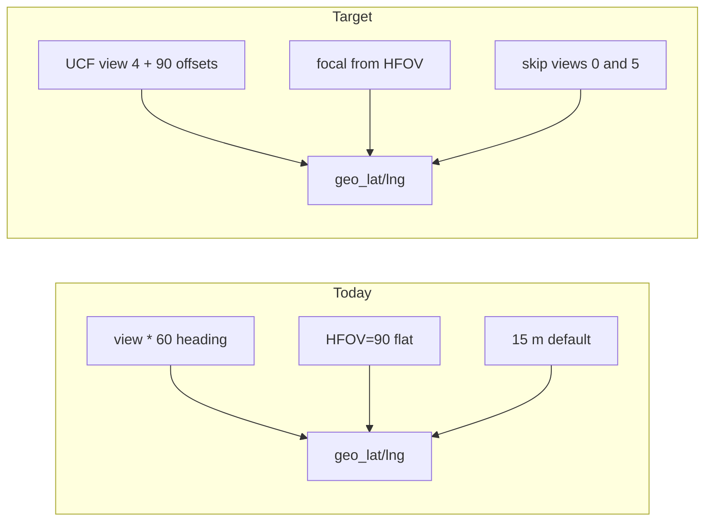

# GSV Continued Geolocation Fix

## Problem

The GSV continued tab reuses [`backend/geolocation.py`](backend/geolocation.py) correctly, but feeds it **wrong camera headings** and **no intrinsics**:

| Issue | Current code | UCF dataset truth |
|-------|--------------|-------------------|
| Base heading | `compass + view * 60`, view 0 = compass | `.mat` compass = **view 4** heading |
| View spacing | 60° × 6 views | Side views **1–4** are **90°** apart |
| Invalid views | Geo runs on 0 (overlay) and 5 (sky) | Only 1–4 are horizontal |
| Distance | Fixed 15 m (`bearing_single`) | No `camera_focal_px` passed → bbox-height + 3D ray skipped |

Road **navigation** (forward/back arrows) is fine — it uses raw `compass` from the index. Only **detection geolocation** is broken.



---

## Phase 1 — Correct view / heading model (backend core)

**File:** [`backend/gsv_continued_service.py`](backend/gsv_continued_service.py)

Replace the 60° helpers with UCF-aligned constants and functions:

```python
SIDE_VIEWS = (1, 2, 3, 4)
OVERLAY_VIEW = 0
SKY_VIEW = 5
# Offsets from mat compass (view 4 = 0°); verify rotation sign on one sample
SIDE_VIEW_OFFSET_DEG = {4: 0, 3: 90, 2: 180, 1: 270}
```

1. **`normalize_compass(raw: float) -> float`** — apply optional CCW→CW conversion (UCF: “degrees from North towards West”):
   - Env `GSV_COMPASS_CCW=true` (default): `bearing = (360 - raw) % 360`
   - Env `GSV_COMPASS_CCW=false`: use raw value as-is (fallback if validation shows no flip needed)

2. **`view_heading(compass_raw, view) -> float | None`**
   - Return `None` for views 0 and 5 (not valid horizontal headings)
   - For views 1–4: `normalize_compass(compass_raw) + SIDE_VIEW_OFFSET_DEG[view]`, wrapped 0–360

3. **`side_view_for_bearing(compass_raw, bearing) -> int`**
   - Replace `view_for_bearing` 60° logic
   - `delta = (bearing - normalize_compass(compass_raw)) % 360`
   - `idx = int(round(delta / 90.0)) % 4` → map `[4, 3, 2, 1][idx]` (view 4 when travel bearing matches compass)

4. **Update `get_nav()`**
   - Default `suggested_view` to **4** (compass-facing side view), not 0
   - When `from_id` present: use `side_view_for_bearing`; clamp to available side views in `views`
   - Extend response with metadata for frontend:
     - `side_views: [1,2,3,4]`, `overlay_view: 0`, `sky_view: 5`
     - `view_labels: {0: "Overlay", 1: "Side 1", ...}`

**No index rebuild required** — `compass` in [`gsv_continued_index.json`](Dataset_PitOrlManh/gsv_continued_index.json) stays as-is; interpretation changes in code only.

---

## Phase 2 — Distance estimation for GSV (focal from HFOV)

**File:** [`backend/geolocation.py`](backend/geolocation.py)

Add a small helper (no Mapillary dependency):

```python
def focal_px_from_hfov(image_width: int, h_fov_deg: float) -> float:
    half = math.radians(h_fov_deg / 2.0)
    return (image_width / 2.0) / math.tan(half)
```

**File:** [`backend/main.py`](backend/main.py) — `gsv_continued_detect`

After resolving `compass_angle = view_heading(...)`:

- If `compass_angle is None` (views 0/5): return detections **without** geo enrichment; set `geo_skipped_reason: "non_horizontal_view"` on response
- Else pass derived intrinsics into `enrich_detections_with_geo`:
  ```python
  hfov = geolocation.effective_h_fov_deg(detection_width=iw)
  focal = geolocation.focal_px_from_hfov(iw, hfov)
  enrich_detections_with_geo(..., compass_angle=compass_angle,
      camera_focal_px=focal, source_width=iw, image_height=ih)
  ```
- This unlocks `bearing_size` for poles/lights/signs (bbox height) when boxes are large enough; 3D ray still skipped (no `computed_rotation`) — acceptable for GSV

**Config:** [`.env.example`](.env.example) — add GSV-specific section:

```env
GSV_COMPASS_CCW=true
GSV_HORIZONTAL_FOV_DEG=90   # optional override; else reuse HORIZONTAL_FOV_DEG
```

Wire `GSV_HORIZONTAL_FOV_DEG` in `gsv_continued_detect` if set, else fall back to `HORIZONTAL_FOV_DEG`.

---

## Phase 3 — Frontend alignment

**[`frontend/src/pages/GsvContinuedPage.jsx`](frontend/src/pages/GsvContinuedPage.jsx)**
- On `enterLocation`: default `selectedView` to `nav.suggested_view ?? 4` (not 0)
- On first map click (no `from_id`): start at view **4** instead of 0

**[`frontend/src/components/GsvContinuedImagePanel.jsx`](frontend/src/components/GsvContinuedImagePanel.jsx)**
- Label views: **Side 1–4** (primary), **Overlay (0)** / **Sky (5)** with muted styling
- Highlight side views 1–4 as recommended for detection/geo
- Show warning when view 0 or 5 is active: “No map estimate for overlay/sky views”

**[`frontend/src/components/GsvStreetViewViewer.jsx`](frontend/src/components/GsvStreetViewViewer.jsx)**
- Remove fallback `(compass + view * 60) % 360`; use `nav.view_heading[view]` only
- HUD: `Side 2 · 118°` for views 1–4; `Overlay` / `Sky` for 0/5

**[`frontend/src/components/GsvContinuedDetectionTable.jsx`](frontend/src/components/GsvContinuedDetectionTable.jsx)**
- Add columns: **Bearing**, **Dist (m)**, **Method** (`bearing_single` / `bearing_size`)
- Show `—` when geo fields absent (views 0/5)

---

## Phase 4 — Tests and validation

**New:** [`backend/tests/test_gsv_continued_geo.py`](backend/tests/test_gsv_continued_geo.py)

| Test | Assert |
|------|--------|
| `view_heading(115.74, 4)` with CCW | ≈ 244.26° (360−115.74) or raw per env |
| `view_heading(_, 0)` and `(_, 5)` | `None` |
| Views 1–4 | 90° apart |
| `side_view_for_bearing(C, C)` | returns 4 |
| `focal_px_from_hfov(1280, 90)` | ≈ 640 |

**Manual validation** (document in plan, run after deploy):

1. Pick location on a straight road chain (e.g. ids 2→3→4→5 from nav plan) — forward arrow should land on view **4** or nearest side view facing travel direction
2. On **view 4**, detect a visible pole/sign — estimated pin should fall **ahead** along the road on satellite, not ~240° off
3. Toggle `GSV_COMPASS_CCW` if left/right appears mirrored
4. Tune `HFOV_SCALE` / `GSV_HORIZONTAL_FOV_DEG` if edge objects are systematically too far left/right

**Also update:** [`scripts/build_share_dataset.py`](scripts/build_share_dataset.py) — use new `view_heading` so share metadata matches reality

---

## Out of scope (future v2)

- Horizontal panorama scroller ([`gsv_panorama_scroll` plan](.cursor/plans/gsv_panorama_scroll_ff106fd0.plan.md)) — UX only, not required for geo fix
- Multi-view LOB triangulation across nearby GSV locations — same as batch dashboard, larger effort
- Full calibration CSV tool — use existing `HFOV_SCALE` / `COMPASS_BEARING_OFFSET_DEG` env vars manually after manual validation

---

## Files to change

| File | Change |
|------|--------|
| [`backend/gsv_continued_service.py`](backend/gsv_continued_service.py) | UCF view model, `get_nav` defaults |
| [`backend/geolocation.py`](backend/geolocation.py) | `focal_px_from_hfov` helper |
| [`backend/main.py`](backend/main.py) | GSV detect: skip 0/5 geo, pass focal |
| [`backend/tests/test_gsv_continued_geo.py`](backend/tests/test_gsv_continued_geo.py) | New unit tests |
| [`frontend/src/pages/GsvContinuedPage.jsx`](frontend/src/pages/GsvContinuedPage.jsx) | Default view 4 |
| [`frontend/src/components/GsvContinuedImagePanel.jsx`](frontend/src/components/GsvContinuedImagePanel.jsx) | View labels + warning |
| [`frontend/src/components/GsvStreetViewViewer.jsx`](frontend/src/components/GsvStreetViewViewer.jsx) | Correct heading HUD |
| [`frontend/src/components/GsvContinuedDetectionTable.jsx`](frontend/src/components/GsvContinuedDetectionTable.jsx) | Bearing/dist/method columns |
| [`.env.example`](.env.example) | GSV compass + FOV vars |
| [`scripts/build_share_dataset.py`](scripts/build_share_dataset.py) | Correct `view_heading_deg` in metadata |
