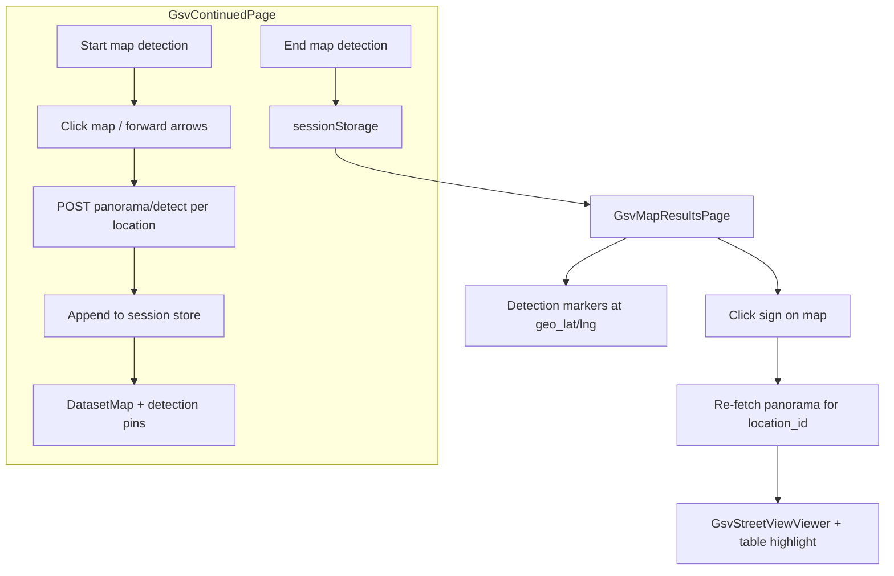

# GSV Map Detection Session + Results Map

## Goal

While exploring GSV continued (click map dots, use forward arrows), the user can **start a map-detection session**, visit locations (detection already runs per location), and **end** the session. The app then navigates to a **new results page** showing all collected signs/objects on a map at `geo_lat`/`geo_lng`, with a **class legend** and **click-to-imagery** — the same interaction pattern as [`BatchDashboard`](frontend/src/pages/BatchDashboard.jsx) but for GSV location IDs instead of Mapillary image IDs.

Confirmed scope: **manual navigation session only** (not polygon batch).

---

## Current state (what we reuse)

| Piece | Status |
|-------|--------|
| Per-location panorama detect + geo | Done — `POST /gsv-continued/locations/{id}/panorama/detect` returns merged `detections[]` with `geo_lat`, `geo_lng`, `view`, `bearing_deg`, etc. |
| Geo pipeline | Done — [`backend/geolocation.py`](backend/geolocation.py) + GSV view headings in [`backend/gsv_continued_service.py`](backend/gsv_continued_service.py) |
| Detection table with coords | Done — [`GsvContinuedDetectionTable.jsx`](frontend/src/components/GsvContinuedDetectionTable.jsx) |
| Map marker + legend pattern | Done — [`BatchDashboardMap.jsx`](frontend/src/components/BatchDashboardMap.jsx) + `CLASS_COLORS` / `CLASS_META` in [`constants/classes.js`](frontend/src/constants/classes.js) |
| GSV map (camera pins only) | Done — [`DatasetMap.jsx`](frontend/src/components/DatasetMap.jsx) on [`GsvContinuedPage.jsx`](frontend/src/pages/GsvContinuedPage.jsx) |

**Gap:** detections are ephemeral per location; no session accumulator, no detection map layer, no dedicated results page.

---

## Architecture



**No backend changes in v1.** Session data lives in `sessionStorage` (survives page navigation within the tab). Panorama imagery is re-fetched on marker click via existing API (avoids storing large base64 blobs).

---

## Phase 1 — Session store module

**New file:** [`frontend/src/lib/gsvMapSession.js`](frontend/src/lib/gsvMapSession.js)

Responsibilities:
- `createSession()` → `{ sessionId, startedAt, locations: [], detections: [], aggregate_counts: {} }`
- `appendLocationResult(session, panoramaResponse)` — called after each successful detect while session is active
  - Replace prior entries for same `location_id` if revisited
  - Flatten `detections[]` into map markers with stable IDs: `` `${locationId}:${view}:${index}` ``
  - Skip detections missing `geo_lat`/`geo_lng` (overlay/sky views)
  - Store per-detection: `location_id`, `view`, `class`, `confidence`, `geo_lat`, `geo_lng`, `bearing_deg`, `geo_method`, `geo_distance_m`, `camera_lat`, `camera_lng`, `ray_end_lat`, `ray_end_lng`
  - Store per-location summary: `location_id`, `lat`, `lng`, `counts`, `visited_order`
- `finalizeSession(session)` → set `endedAt`, persist to `sessionStorage` key `gsv-map-session:{sessionId}`
- `loadSession(sessionId)`, `listSessions()` (optional, for history dropdown later)

---

## Phase 2 — GsvContinuedPage session controls

**File:** [`frontend/src/pages/GsvContinuedPage.jsx`](frontend/src/pages/GsvContinuedPage.jsx)

### New state
- `mapSessionActive: boolean`
- `mapSession: object | null`
- `sessionDetectionMarkers: array` (derived from session for map)

### Header UI (next to "Hide map" toggle)
- **Start map detection** — creates session, sets active, toast "Session started — navigate and detect"
- While active: pulsing badge + counts (`X locations · Y objects`)
- **End map detection** — disabled until ≥1 location with geo detections; finalizes session, `navigate(/gsv-continued/map-results/${sessionId})`

### Hook into existing detect effect
After `setDetectionResult(res.data)` succeeds and `mapSessionActive`:
```js
const updated = appendLocationResult(mapSession, res.data)
setMapSession(updated)
```

### Behavior rules
- Starting a session does **not** change detection behavior (still auto-runs panorama on each `selectedId` change)
- End with zero geo detections → toast warning, stay on page
- Cancel option (small "Cancel session" link) clears active session without navigating

---

## Phase 3 — Live detection layer on explore map

**Extend:** [`frontend/src/components/DatasetMap.jsx`](frontend/src/components/DatasetMap.jsx)

Add optional props (mirroring batch map):
- `detectionMarkers = []`
- `selectedDetectionId`
- `onSelectDetection`
- `showSessionLegend = false`

Render class-colored pins at `geo_lat/geo_lng` using `CLASS_COLORS`. Add compact overlay legend:
- Camera pin (blue) — GSV capture point
- Object pin (class color) — estimated sign position
- Optional class chips for classes present in session

During active session, pass `sessionDetectionMarkers` + trail polyline (already exists). Selected detection pin gets larger ring (same as `BatchDashboardMap`).

---

## Phase 4 — New results page

**New file:** [`frontend/src/pages/GsvMapResultsPage.jsx`](frontend/src/pages/GsvMapResultsPage.jsx)

**Route:** add to [`frontend/src/App.jsx`](frontend/src/App.jsx):
```jsx
<Route path="/gsv-continued/map-results/:sessionId" element={<GsvMapResultsPage />} />
```

### Layout (clone BatchDashboard split)
- **Header:** back link to `/gsv-continued`, session summary (locations visited, total objects, duration)
- **Class filter chips:** reuse `CLASS_META` + `aggregate_counts` pattern from BatchDashboard
- **Left ~55%:** map panel
- **Right ~45%:** imagery + detection detail

### Map component

**Option A (preferred):** Extract shared detection-map logic from `BatchDashboardMap` into a thin wrapper [`GsvMapResultsMap.jsx`](frontend/src/components/GsvMapResultsMap.jsx) that omits Mapillary/polygon/object-cluster layers and uses GSV-specific legend labels.

**Option B:** Reuse `BatchDashboardMap` directly with empty `cameraMarkers`/`objectMarkers`/`polygon` — faster but legend text says "Camera/Object/Best location" (Mapillary-centric).

Map features:
- Detection markers at `geo_lat/geo_lng`, color = `CLASS_COLORS[class]`
- Camera markers at visited `location_id` positions (blue pins)
- Trail polyline connecting visit order
- **Sight lines toggle** (camera → `ray_end_lat/lng`) for coordinate verification on satellite
- **Basemap toggle** (street / satellite) — important for validating "perfect coordinates"
- **Class legend** overlay: static pin types + dynamic class color swatches for classes in session

### Click marker → imagery flow

On `onSelectDetection(detectionId)`:
1. Parse `location_id` + `view` from marker
2. `getGsvContinuedNav(location_id)` for nav context
3. `detectGsvContinuedPanorama(location_id)` for annotated panorama (or cache per-location in page state to avoid re-fetch on repeat clicks)
4. Set `selectedView` / `activeView` to detection's `view` → panorama scrolls to correct tile
5. Highlight row in `GsvContinuedDetectionTable` (add optional `highlightDetectionId` prop)
6. Map flies to `geo_lat/geo_lng`

Reuse existing viewer stack:
- [`GsvStreetViewViewer.jsx`](frontend/src/components/GsvStreetViewViewer.jsx)
- [`GsvContinuedDetectionTable.jsx`](frontend/src/components/GsvContinuedDetectionTable.jsx)
- [`GsvContinuedImagePanel.jsx`](frontend/src/components/GsvContinuedImagePanel.jsx) (location meta)

### Empty / error states
- Invalid/missing `sessionId` → redirect to `/gsv-continued` with toast
- Session with no geo detections → empty state explaining overlay/sky views lack map coords

---

## Phase 5 — API client (minimal)

**File:** [`frontend/src/api.js`](frontend/src/api.js)

No new endpoints. Optionally add a small helper:
```js
export function buildGsvDetectionId(locationId, view, index) {
  return `${locationId}:${view}:${index}`
}
```

---

## Phase 6 — Styling

**File:** [`frontend/src/dashboard.css`](frontend/src/dashboard.css)

Reuse existing `.dashboard-map-legend`, `.dashboard-chip`, `.dashboard-filters`, `.dashboard-body` split. Add:
- `.gsv-session-active` badge in header
- `.gsv-session-controls` button group
- `.legend-dot.detection` per-class swatch variant (if needed)

---

## Data model (session JSON)

```json
{
  "sessionId": "uuid",
  "startedAt": "ISO",
  "endedAt": "ISO",
  "locations": [
    { "id": 42, "lat": 40.44, "lng": -80.0, "order": 0, "counts": { "Traffic Sign": 2 } }
  ],
  "detections": [
    {
      "detection_id": "42:3:0",
      "location_id": 42,
      "view": 3,
      "class": "Traffic Sign",
      "confidence": 0.91,
      "lat": 40.44012,
      "lng": -80.00034,
      "bearing_deg": 205.3,
      "geo_method": "bearing_size",
      "geo_distance_m": 12.4,
      "camera_lat": 40.44,
      "camera_lng": -80.0,
      "ray_end_lat": 40.4398,
      "ray_end_lng": -80.0005
    }
  ],
  "aggregate_counts": { "Traffic Sign": 5, "Street Light": 3 }
}
```

---

## Testing plan

1. **Manual flow:** Start session → visit 3+ locations along a road chain → End → lands on results page
2. **Map accuracy:** Toggle satellite + sight lines; verify detection pins align with visible signs
3. **Click-through:** Click each marker type (Traffic Sign, Street Light, Pole) → correct location imagery + view scroll
4. **Revisit:** Return to same location during session → old markers for that location replaced, not duplicated
5. **Edge cases:** Location with zero detections; location with only overlay/sky geo-skipped; End with empty session blocked
6. **Regression:** GSV continued works normally when session not started

---

## Future enhancements (out of scope)

- Backend-persisted sessions (SQLite) for large routes and shareable URLs
- LOB triangulation across multiple GSV viewpoints (like Mapillary batch `geolocate`)
- Polygon auto-batch on GSV map
- Session history list on results page

---

## Files to create / modify

| Action | File |
|--------|------|
| Create | `frontend/src/lib/gsvMapSession.js` |
| Create | `frontend/src/pages/GsvMapResultsPage.jsx` |
| Create | `frontend/src/components/GsvMapResultsMap.jsx` (or extend DatasetMap) |
| Modify | `frontend/src/pages/GsvContinuedPage.jsx` — Start/End session, accumulator |
| Modify | `frontend/src/components/DatasetMap.jsx` — optional detection markers + legend |
| Modify | `frontend/src/components/GsvContinuedDetectionTable.jsx` — row highlight prop |
| Modify | `frontend/src/App.jsx` — new route |
| Modify | `frontend/src/dashboard.css` — session badge + controls |

No backend changes required for v1.
