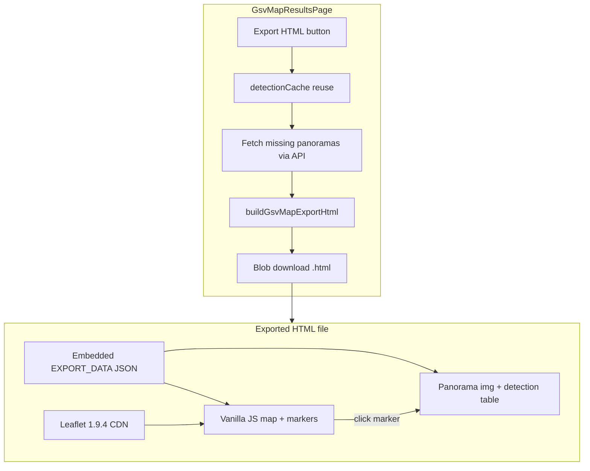

# GSV Map Detection — Shareable HTML Export

## Goal

On [`GsvMapResultsPage`](frontend/src/pages/GsvMapResultsPage.jsx), add **Export HTML** so you can download a single `.html` file that reproduces the results experience for anyone: class-colored emoji detection markers, camera pins, visit trail, legend, and **embedded annotated panorama JPEGs** (no backend required to view after download).

You chose **map + embedded images** — the export runs panorama detect for each session location at click time, then bakes base64 JPEGs into the file.

---

## Current state

| Piece | Status |
|-------|--------|
| Session data (geo markers, locations, counts) | In browser [`gsvMapSession.js`](frontend/src/lib/gsvMapSession.js) → `sessionStorage` |
| Live map UI | [`GsvMapResultsMap.jsx`](frontend/src/components/GsvMapResultsMap.jsx) — Leaflet + emoji `divIcon` via [`detectionMapIcons.js`](frontend/src/lib/detectionMapIcons.js) |
| Imagery source | `POST /gsv-continued/locations/{id}/panorama/detect` → `panorama_image_b64` (stitched annotated views 1–4) |
| Existing download pattern | [`GsvPanoramaViewer.jsx`](frontend/src/components/GsvPanoramaViewer.jsx) — `<a download>` from base64 |
| HTML export | **None** anywhere in repo |

**Gap:** session store intentionally omits images (keeps storage small). Export must **re-fetch** panoramas at export time and embed them.

---

## Architecture



**No backend changes.** Export uses existing [`detectGsvContinuedPanorama`](frontend/src/api.js) while the app is running; the downloaded file is fully self-contained for viewing (map tiles still need internet for OSM/Esri).

---

## Phase 1 — Export builder module

**New file:** [`frontend/src/lib/gsvMapExportHtml.js`](frontend/src/lib/gsvMapExportHtml.js)

### Responsibilities

1. **`collectSessionImagery(session, existingCache, onProgress)`**
   - For each `session.locations` entry, reuse `existingCache[locationId]` if it has `panorama_image_b64`
   - Otherwise call `detectGsvContinuedPanorama(locationId)` (sequential or concurrency 2 to avoid hammering backend)
   - Report progress: `{ done, total, locationId }`
   - Return `{ [locationId]: { panorama_image_b64, lat, lng, pano_views: [1,2,3,4] } }`
   - On any fetch failure: throw with location id so UI can toast a clear error

2. **`buildGsvMapExportHtml(session, imageryByLocation)`**
   - Produce a complete HTML string with:
     - **Leaflet 1.9.4** CSS/JS from unpkg CDN (same version as [`package.json`](frontend/package.json))
     - **Inline dark-theme CSS** mirroring key rules from [`dashboard.css`](frontend/src/dashboard.css): header, split layout (~55/45), map legend, detection symbol styles, chips, panorama scroll area
     - **`EXPORT_DATA`** embedded via `JSON.stringify` in a `<script type="application/json" id="export-data">` tag (safer than inline JS for large base64 blobs)
     - **Vanilla JS** (~200 lines) to:
       - Parse `EXPORT_DATA` (session + imagery + `CLASS_COLORS` + `CLASS_EMOJIS`)
       - Init Leaflet map, fit bounds, render camera pins, emoji detection markers, green trail polyline
       - Optional toggles: basemap street/satellite, sight lines (same logic as [`GsvMapResultsMap.jsx`](frontend/src/components/GsvMapResultsMap.jsx))
       - Class filter chips (filter markers client-side)
       - **Click detection marker** → fly to coords, load location panorama, scroll to detection `view`, highlight row in detection table
       - **Click camera marker** → load that location's panorama
       - Detection table columns: class (emoji), confidence, lat/lng, bearing, geo method, distance

3. **`downloadGsvMapExportHtml(session, imageryByLocation)`**
   - `new Blob([html], { type: 'text/html;charset=utf-8' })`
   - Trigger download: `gsv-map-{shortSessionId}-{YYYYMMDD}.html`
   - Revoke object URL after click (standard Blob download pattern)

### Imagery payload (minimal)

Only embed what the viewer needs — **not** full API responses:

```js
{
  session: { sessionId, startedAt, endedAt, locations, detections, aggregate_counts },
  imagery: {
    "42": { lat, lng, pano_views: [1,2,3,4], panorama_image_b64: "data:image/jpeg;base64,..." }
  },
  classColors: { ... },
  classEmojis: { ... }
}
```

Per-view `annotated_image_b64` is **omitted** — the stitched `panorama_image_b64` already contains annotated tiles ([`detector.py`](backend/detector.py) `stitch_annotated_panorama`).

### Marker rendering in export

Replicate [`makeDetectionSymbolIcon`](frontend/src/lib/detectionMapIcons.js) as a plain `L.divIcon` HTML string builder inside the export template (no React/Leaflet app bundle in the file).

---

## Phase 2 — UI on results page

**Modify:** [`frontend/src/pages/GsvMapResultsPage.jsx`](frontend/src/pages/GsvMapResultsPage.jsx)

### Export button placement

Add **Export HTML** in the header (right side, near KPIs) — same visual weight as map toggles.

### Export handler

```js
const [exporting, setExporting] = useState(false)

async function handleExportHtml() {
  setExporting(true)
  try {
    const imagery = await collectSessionImagery(session, detectionCache, setExportProgress)
    downloadGsvMapExportHtml(session, imagery)
    toast.success('HTML exported — share the downloaded file')
  } catch (err) {
    toast.error(apiErrorMessage(err, 'Export failed'))
  } finally {
    setExporting(false)
  }
}
```

### UX details

- Button disabled while `exporting` — label: `Exporting 3/12…` when progress known, else `Export HTML`
- **Size warning** before starting if `session.locations.length > 8`: toast or `window.confirm` explaining file may be large (each panorama JPEG ~0.5–2 MB base64)
- Reuse already-loaded `detectionCache` so re-clicking export after browsing locations is faster

---

## Phase 3 — Styling

**Modify:** [`frontend/src/dashboard.css`](frontend/src/dashboard.css)

Add `.gsv-export-html-btn` (or reuse `.dashboard-map-toggle` / header button pattern) for the export control in the results header. No new page route.

---

## Exported file behavior (recipient experience)

| Feature | In export |
|---------|-----------|
| Detection emoji icons + class colors | Yes |
| Camera pins + visit trail | Yes |
| Class legend + filter chips | Yes |
| Basemap / sight-line toggles | Yes |
| Click marker → panorama + detection table | Yes |
| Navigate between GSV locations (forward arrows) | No (nav graph not in session; out of scope) |
| Re-fetch imagery from API | No (fully embedded) |
| Offline map tiles | No (OSM/Esri need network; imagery is offline) |

Footer in exported HTML: generated date, session id, location/object counts, attribution for OSM/Esri.

---

## File size and limits

| Locations | Approx. export size |
|-----------|---------------------|
| 5 | ~3–10 MB |
| 15 | ~10–30 MB |
| 30+ | May be slow; confirm dialog recommended |

If `Blob` + download fails (browser memory), toast: "Session too large — try exporting after visiting fewer locations." No server-side zip/split in v1.

---

## Testing plan

1. **Small session (2–3 locations):** Export → open `.html` in Chrome/Firefox → verify markers, legend, class filter, click-through to correct panorama view
2. **Cache reuse:** Load 2 locations in app, export → network tab shows only unfetched locations requested
3. **Satellite + sight lines:** Toggles work in exported file
4. **Offline imagery:** Disable backend, open exported HTML → panoramas still display; map tiles load only with internet
5. **Failure path:** Stop backend mid-export → clear error toast, no corrupt download
6. **Regression:** Results page works normally when not exporting

---

## Files to create / modify

| Action | File |
|--------|------|
| **Create** | [`frontend/src/lib/gsvMapExportHtml.js`](frontend/src/lib/gsvMapExportHtml.js) — collect imagery, HTML template, download |
| **Modify** | [`frontend/src/pages/GsvMapResultsPage.jsx`](frontend/src/pages/GsvMapResultsPage.jsx) — Export button + handler + progress state |
| **Modify** | [`frontend/src/dashboard.css`](frontend/src/dashboard.css) — export button styles |

No backend, route, or `gsvMapSession.js` changes required.

---

## Future enhancements (out of scope)

- Export from active session on [`GsvContinuedPage`](frontend/src/pages/GsvContinuedPage.jsx) before ending
- Backend-persisted sessions + shareable URL (from existing plan)
- Optional "map only" export for email size limits
- GeoJSON / CSV sidecar download
