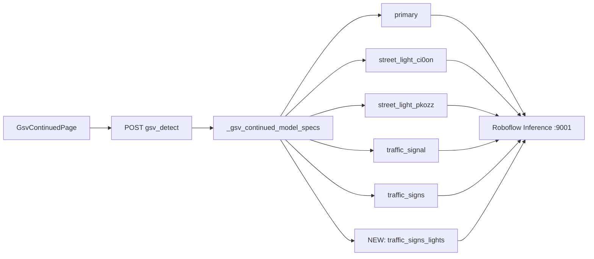

# GSV Continued: Add 6th Model + Verify All Models

## Current state

GSV Continued already runs **5 models** in parallel via [`backend/detector.py`](backend/detector.py) `_gsv_continued_model_specs()`:

| Source key | Model ID |
|------------|----------|
| `primary` | `vehicle-detection-7nnx0/4` |
| `street_light_ci0on` | `street-light-ci0on/1` |
| `street_light_pkozz` | `street-light-pkozz/1` |
| `traffic_signal` | `traffic-signal-sg7ou/4` |
| `traffic_signs` | `street-view-traffic-signs/3` |

**Gaps found today:**

1. **New model not wired:** `traffic-signs-and-traffic-lights/6` is not in the codebase.
2. **No per-model health check:** [`GET /health`](backend/main.py) only pings the inference server root — it does not test each `model_id`.
3. **Failures are invisible:** Optional model errors are logged in `_run_model_specs()` but not returned to the GSV frontend; detections can silently miss models.
4. **`.env` misconfiguration:** [`.env`](.env) has a typo `NFERENCE_SERVER_URL` (missing `I`) instead of `INFERENCE_SERVER_URL`, and is missing explicit GSV model vars (code defaults apply, but Docker/env overrides may not).
5. **`/config` incomplete:** [`get_model_config()`](backend/detector.py) lists only 3 app-wide models — GSV-only models are not exposed.



---

## 1. Add `traffic-signs-and-traffic-lights/6` (GSV only)

**File:** [`backend/detector.py`](backend/detector.py)

- Add env vars (defaults):
  - `GSV_TRAFFIC_SIGNS_LIGHTS_PROJECT_ID=traffic-signs-and-traffic-lights`
  - `GSV_TRAFFIC_SIGNS_LIGHTS_MODEL_VERSION=6`
  - `ENABLE_GSV_TRAFFIC_SIGNS_LIGHTS=true`
- Build model ID: `traffic-signs-and-traffic-lights/6`
- Append to `_gsv_continued_model_specs()` with source key `traffic_signs_lights`
- Extend `CLASS_ALIASES` for likely outputs from this model (e.g. `traffic light`, `traffic lights`, `red light`, `green light`) mapping to existing classes:
  - lights → `Street Light` or `Traffic Signal` (prefer `Traffic Signal` for signal heads, `Street Light` for luminaire-on-pole — use common Roboflow label names after first probe)
  - signs → `Traffic Sign`
- **Do not** add to `_default_model_specs()` — map/dataset pages unchanged

**Config files:**
- [`.env.example`](.env.example) — document new vars
- [`docker-compose.yml`](docker-compose.yml) — pass vars to backend
- [`.env`](.env) — fix `INFERENCE_SERVER_URL` typo and add all GSV model vars explicitly

**Timeout:** 6 models → inference timeout ~105s (`30 + 5×15`). Bump [`detectGsvContinuedLocation`](frontend/src/api.js) timeout from 150s → **180s**.

---

## 2. Per-model health check (verify all models working)

**File:** [`backend/detector.py`](backend/detector.py)

Add:

```python
def get_gsv_continued_model_specs() -> list[dict]:
    # returns [{source, model_id, enabled}, ...]

async def probe_models(specs, test_image_b64) -> list[dict]:
    # call each model_id individually; return status per model
```

Each probe result:

```json
{
  "source": "traffic_signs_lights",
  "model_id": "traffic-signs-and-traffic-lights/6",
  "enabled": true,
  "status": "ok",
  "latency_ms": 4200,
  "prediction_count": 3,
  "error": null
}
```

**Test image:** reuse one JPG from [`share dataset/location_000001/view_0.jpg`](share%20dataset/location_000001/view_0.jpg) (or read via `gsv_continued_service` location 1 view 0) — avoids Mapillary dependency.

**New endpoint in [`backend/main.py`](backend/main.py):**

```
GET /gsv-continued/models/health
```

Response:

```json
{
  "inference_server": "connected",
  "inference_url": "http://host.docker.internal:9001",
  "models": [ /* 6 probe results */ ],
  "summary": { "total": 6, "ok": 5, "failed": 1 }
}
```

**CLI script:** [`scripts/test_gsv_models.py`](scripts/test_gsv_models.py)

- Calls probe logic directly (or hits the new endpoint)
- Prints a table: model_id | status | latency | error
- Exit code 1 if primary fails or any enabled model fails

---

## 3. Surface model status on each detect (runtime visibility)

**File:** [`backend/detector.py`](backend/detector.py)

Refactor `_run_model_specs()` to return metadata alongside results:

```python
{
  "results": [(source, raw), ...],
  "model_status": [
    {"source": "...", "model_id": "...", "status": "ok"|"failed", "error": "..."}
  ]
}
```

**File:** [`backend/main.py`](backend/main.py) — include `model_status` in `POST /gsv-continued/locations/{id}/detect` response.

**Optional UI (minimal):** [`GsvContinuedImagePanel.jsx`](frontend/src/components/GsvContinuedImagePanel.jsx) — show compact line when any model failed, e.g. `4/6 models OK`. No new page required.

---

## 4. Expose GSV model registry in config

**File:** [`backend/detector.py`](backend/detector.py) — extend `get_model_config()` with `gsv_continued_models[]`.

**File:** [`backend/main.py`](backend/main.py) — add `gsv_continued_models` block to `GET /config` (read-only, for debugging).

---

## 5. Verification checklist (run after implementation)

| Step | Command / action | Pass criteria |
|------|------------------|---------------|
| Fix env | Correct `INFERENCE_SERVER_URL` in `.env`, restart backend | `/health` shows `inference_server: connected` |
| Probe all models | `python scripts/test_gsv_models.py` | All 6 models `status: ok` |
| API health | `GET /gsv-continued/models/health` | `summary.failed == 0` |
| Live detect | Open GSV Continued, select a point | `model_status` shows 6 ok; table + overlay populate |
| Regression | Map page + dataset detect | Still 3-model pipeline, unchanged |

**If a model fails:** check inference server logs (cold start, wrong workspace access, API key). Optional models log warnings today — the new health endpoint makes this explicit.

---

## Files to change

| File | Change |
|------|--------|
| [`backend/detector.py`](backend/detector.py) | 6th model, probe helpers, model_status in run |
| [`backend/main.py`](backend/main.py) | `/gsv-continued/models/health`, detect response + config |
| [`.env.example`](.env.example) | New GSV model vars |
| [`docker-compose.yml`](docker-compose.yml) | Pass new env vars |
| [`.env`](.env) | Fix `INFERENCE_SERVER_URL` typo, add GSV vars |
| [`frontend/src/api.js`](frontend/src/api.js) | `getGsvContinuedModelsHealth()`, timeout 180s |
| [`frontend/src/components/GsvContinuedImagePanel.jsx`](frontend/src/components/GsvContinuedImagePanel.jsx) | Optional model status line |
| `scripts/test_gsv_models.py` | **New** CLI health check |

**Not changed:** map detect, dataset detect, batch pipeline, global 3-model `_default_model_specs()`.
