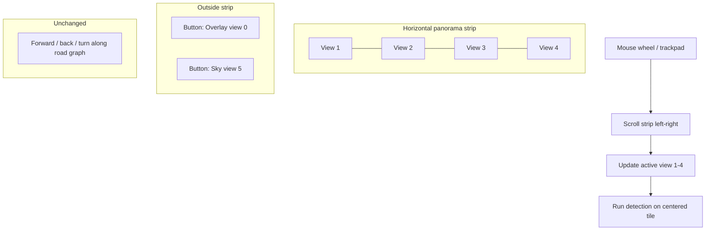

# GSV Continued: Scroll Panorama (Views 1–4)

## Problem

PitOrlManh images are **not** one equirectangular file. Each location has **six 1280×1024 tiles** from a 360° capture ([UCF dataset](https://www.crcv.ucf.edu/data/GMCP_Geolocalization/)):

| View | Meaning |
|------|---------|
| 0 | Street View UI overlay (labels) — **exclude from pano** |
| 1–4 | Horizontal side views — **panorama strip** |
| 5 | Upward / sky — **separate “Sky” mode** |

Today [`GsvStreetViewViewer.jsx`](frontend/src/components/GsvStreetViewViewer.jsx) shows **one** tile and treats views as 60° steps (`view 0 = compass`), which does not match the dataset and does not feel panoramic.

You chose: **views 1–4 in the scroll strip**; 0 and 5 as separate controls.

---

## Target UX



| Interaction | Behavior |
|-------------|----------|
| Horizontal scroll / wheel | Move through views 1–4 like Street View panning |
| Scroll snap | Tiles snap to center for a stable “current look direction” |
| Location change | Strip resets; scroll centers on **suggested side view** (from travel bearing) |
| Run detection | Runs on **active side view** (1–4), not the whole strip |
| Overlay / Sky | Toggle full-screen single tile for view 0 or 5 |
| Road arrows | Still change **location** via existing `nav` graph |

---

## Backend

### 1. Panorama metadata — [`backend/gsv_continued_service.py`](backend/gsv_continued_service.py)

Add constants and helpers:

```python
PANO_SIDE_VIEWS = [1, 2, 3, 4]
OVERLAY_VIEW = 0
SKY_VIEW = 5
```

- `get_pano_meta(location_id)` → `{ side_views: [1,2,3,4], compass, labels: {1:"Side 1", ...} }`
- Fix **`suggested_view`** for arrival: map travel bearing to **nearest side view 1–4** (90° sectors around `compass`), not 60°/view-0 logic. Keep `view_for_bearing` for sides only or replace with:

```python
def side_view_for_bearing(compass, bearing) -> int:
    delta = (bearing - compass) % 360
    # views 1-4 ~ 90° apart; index 0..3 -> views 1..4
    idx = int(round(delta / 90.0)) % 4
    return PANO_SIDE_VIEWS[idx]
```

- Extend `get_nav()` response with `pano_side_views`, `overlay_view`, `sky_view`, `view_labels`.

### 2. Optional stitched preview — new route in [`backend/main.py`](backend/main.py)

`GET /gsv-continued/locations/{id}/panorama?max_height=1024`

- Pillow: concatenate views **1,2,3,4** horizontally (same height), JPEG quality ~85.
- **Not required for v1** if frontend uses 4 lazy `` tiles (simpler, no huge 5k-wide single download). Prefer **frontend tile strip first**; add stitched endpoint only if scroll jank or 4-request latency is an issue.

### 3. Detection — unchanged path

[`POST .../detect?view=N`](backend/main.py) stays per-tile; frontend passes **active** view (1–4). No multi-tile inference in v1 (avoids 4× GPU time).

---

## Frontend

### 1. New component — `frontend/src/components/GsvPanoramaScroller.jsx`

Responsibilities:

- Outer: `overflow-x: auto`, `overflow-y: hidden`, `scroll-snap-type: x mandatory`, full height of viewer.
- Inner row: four segments, each `scroll-snap-align: center`, fixed height 100%, width ~25% of strip (or intrinsic image width).
- Each segment: `` — reuse existing API (~1280 wide per tile).
- **Wheel handler**: `preventDefault` + add `deltaY` to `scrollLeft` (classic pano feel on mouse wheel).
- **Scroll listener**: derive `activeView` from which tile is closest to container center; call `onActiveViewChange(view)`.
- **Programmatic center**: on `locationId` / `initialView` change, `scrollTo` center of tile for suggested view 1–4.
- **Detection overlay mode**: when `detectionResult` present, show annotated image **only on active tile** (or full-width overlay for that segment) — keep memory safe.

### 2. Refactor — [`GsvStreetViewViewer.jsx`](frontend/src/components/GsvStreetViewViewer.jsx)

Modes:

| Mode | UI |
|------|-----|
| `panorama` (default) | `GsvPanoramaScroller` + road nav arrows on top |
| `overlay` | Single img view 0 |
| `sky` | Single img view 5 |

- Props: add `activeView`, `onActiveViewChange`, `viewerMode`, `onViewerModeChange`.
- HUD: show `Side 2 · 118°` instead of `View 0–5` when in pano mode.
- Keyboard: Left/Right arrow **in pano mode** scroll strip by one tile; Up/Down still road forward/back (unchanged).

### 3. Update — [`GsvContinuedPage.jsx`](frontend/src/pages/GsvContinuedPage.jsx)

- State: `viewerMode` (`panorama` | `overlay` | `sky`), `activeView` (default 2 or `suggested_view` mapped to 1–4).
- On `enterLocation`: set mode `panorama`, set `activeView` from nav `suggested_view` (clamped to 1–4).
- `handleRunDetection`: use `activeView` (not legacy `selectedView` 0–5 default).
- Pass `activeView` to panel for filename `000042_2.jpg`.

### 4. Update — [`GsvContinuedImagePanel.jsx`](frontend/src/components/GsvContinuedImagePanel.jsx)

Replace six generic `V0–V5` chips with:

- **Panorama** (default) — enables scroller
- **Overlay (0)** / **Sky (5)** — mode toggles
- Optional small dots **1 2 3 4** to jump-scroll a tile

Subtitle hint: “Scroll or use wheel to look around · views 1–4”.

### 5. CSS — [`frontend/src/dashboard.css`](frontend/src/dashboard.css) (small addition)

```css
.gsv-pano-scroll { overflow-x: auto; overflow-y: hidden; scroll-snap-type: x mandatory; }
.gsv-pano-tile { scroll-snap-align: center; flex: 0 0 auto; height: 100%; }
```

Hide horizontal scrollbar optionally (thin bar) for cleaner GSV look.

---

## Performance / stability

| Risk | Mitigation |
|------|------------|
| 4 images × 1280px | Lazy load; `max_width=1280` per tile (not 1920×4 at once on first paint) |
| Memory | Only mount 4 imgs for **current** location; unmount on location change |
| Annotated b64 huge | Show annotation on **one** active tile only |
| Scroll jank with detection | Debounce `activeView` updates (~50ms) during scroll |
| Wrong view for detect | Detection button label: “Detect this view (Side N)” |

---

## Out of scope (v2)

- True WebGL equirectangular sphere
- Seamless blending between tiles (exposure matching)
- Detect all 4 tiles in one click
- Wrap-around duplicate tile at strip ends (can add later for infinite scroll illusion)

---

## Files to create / modify

| Action | File |
|--------|------|
| Create | `frontend/src/components/GsvPanoramaScroller.jsx` |
| Modify | `frontend/src/components/GsvStreetViewViewer.jsx` |
| Modify | `frontend/src/pages/GsvContinuedPage.jsx` |
| Modify | `frontend/src/components/GsvContinuedImagePanel.jsx` |
| Modify | `backend/gsv_continued_service.py` (side view bearing, pano meta in `get_nav`) |
| Modify | `frontend/src/dashboard.css` (pano scroll styles) |
| Optional | `backend/main.py` + service `read_panorama_strip()` if 4-request latency is too high |

---

## Test plan

1. Select map point → horizontal strip shows 4 tiles; wheel scrolls left/right smoothly.
2. Scroll snap centers a tile; HUD shows Side 1–4 and heading.
3. Run detection → only active side view is sent; boxes appear on that tile.
4. Overlay / Sky buttons switch to single view 0 or 5; back to Panorama restores strip.
5. Forward along road → new location, strip re-centers on travel direction (side view 1–4).
6. Left/Right keys step between side tiles in pano mode; Up/Down still move along road.
