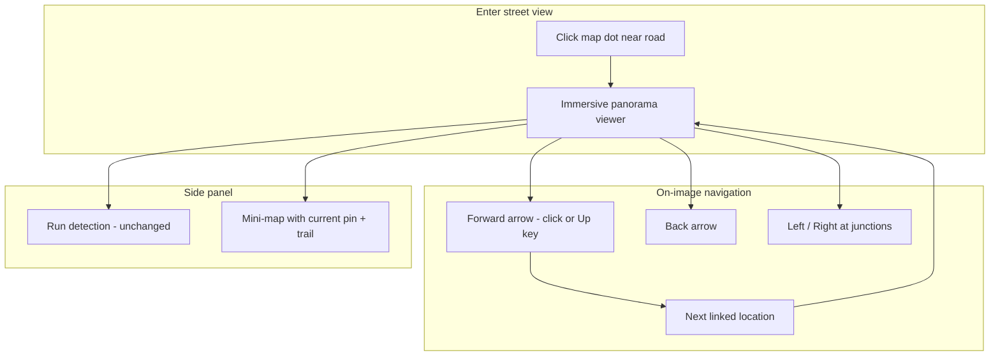

# GSV Continued: Street View Navigation

## Current state (already shipped)

- [`/gsv-continued`](frontend/src/pages/GsvContinuedPage.jsx): 60% map + 40% static image panel
- Index: 1,099 locations, 6 JPG views each (`000001_0.jpg` … `_5.jpg`), compass in [`gsv_continued_index.json`](Dataset_PitOrlManh/gsv_continued_index.json)
- APIs: meta, points, image, detect ([`backend/gsv_continued_service.py`](backend/gsv_continued_service.py))

**Gap vs Google Street View:** no “drive” along the road—only map dot + manual view buttons 0–5.

## Dataset insight (drives the design)

Analysis of part1 coordinates:

| Pattern | Example | Implication |
|---------|---------|-------------|
| Dense chain | id 2→3→4→5 ~10 m, bearing ≈ compass (±2°) | Locations sample the street centerline |
| ID gaps | id 1→2 ~576 m, id 5→6 ~550 m | **`id + 1` is not “forward”** |
| Best “ahead” from id 5 | id 9 @ 47 m, 2.6° from compass | Need **spatial + compass graph**, not sequential ids |

Six views per location are treated as **60° steps around the camera** (standard 6-direction sampling):

```text
viewHeading(v) = (compass + v * 60) % 360
viewForBearing(b) = round(((b - compass) % 360) / 60) % 6
```

(Validate on 2–3 sample locations during implementation; adjust offset if images look sideways.)

---

## Target UX (Google Street View–like)



| GSV behavior | Our implementation |
|--------------|-------------------|
| Large panorama | **Primary panel** (~70% width/height), not a small scroll image |
| Click ahead on road | **Forward** control → `nav.forward` location |
| Go back | **Back** → `nav.backward` |
| Turn at intersection | **Left / Right** → `nav.left` / `nav.right` (when graph has links) |
| Pegman / map | **Inset map** (bottom-right): current position, optional breadcrumb polyline |
| Pick any covered street | **Map click** still works; auto-enters viewer at that location |

Keep **Run detection** on the current view (full-res POST, same as today).

---

## Backend: navigation graph

### 1. Extend index build — [`backend/scripts/build_gsv_continued_index.py`](backend/scripts/build_gsv_continued_index.py)

After loading locations, for each `id` compute neighbors among indexed points:

- Distance band: **3 m – 45 m** (tunable constants)
- Bearing from A → B vs A’s `compass`:
  - **forward:** Δbearing ≤ **35°**
  - **backward:** Δbearing ≥ **145°**
  - **left:** ~90° (55°–125°)
  - **right:** ~270° (235°–305°)

Pick **one** link per direction: closest distance in that cone (if any).

Store per location in index:

```json
{
  "id": 5,
  "lat": 40.436,
  "lng": -79.998,
  "compass": 118.4,
  "views": [0,1,2,3,4,5],
  "part": "part1",
  "nav": {
    "forward": 9,
    "backward": 4,
    "left": null,
    "right": 7
  }
}
```

Re-run script after adding part2+ (same as today). Document in [`.env.example`](.env.example).

### 2. Service helpers — [`backend/gsv_continued_service.py`](backend/gsv_continued_service.py)

- `get_nav(location_id) -> { id, lat, lng, compass, views, nav, suggested_view }`
- `suggested_view` when arriving from `from_id`: bearing(A→B) mapped to view index (continuity along travel)
- `bearing_deg(lat1, lng1, lat2, lng2)` — reuse pattern from [`backend/geolocation.py`](backend/geolocation.py) `destination_point` / haversine helpers (small local function, no new dependency)

### 3. New API — [`backend/main.py`](backend/main.py)

| Method | Path | Purpose |
|--------|------|---------|
| `GET` | `/gsv-continued/locations/{id}/nav` | Nav links + `suggested_view`; optional query `from={id}` after a step |
| `GET` | `/gsv-continued/locations/{id}/nearby` | Optional: nearest location to map click `?lat=&lng=` within 25 m (enter street view without hitting exact dot) |

Existing image/detect routes unchanged.

---

## Frontend

### 1. Layout — refactor [`GsvContinuedPage.jsx`](frontend/src/pages/GsvContinuedPage.jsx)

- **Default after selecting a location:** Street View mode (large viewer)
- **Left or bottom:** collapsible map (30% width, or toggle “Show map”) using existing [`DatasetMap`](frontend/src/components/DatasetMap.jsx)
- State additions: `fromLocationId` (for `suggested_view`), `trailIds[]` (session breadcrumb), `streetViewMode` boolean

Flow:

1. Load points once (unchanged).
2. Map click → `setSelectedId`, `fetchNav(id)`, enter viewer with `suggested_view` or view 0.
3. Forward click → `nav.forward` + `from=current` → update id, view, map flyTo, append trail.

### 2. New component — `frontend/src/components/GsvStreetViewViewer.jsx`

Responsibilities:

- Full-width image (`gsvContinuedImageUrl` with `max_width=1920`)
- **Overlay arrows** (bottom center = forward, bottom left/right = turn, top/side = back)—hidden when `nav.*` is null
- **Click zones** on image (lower third center ≈ forward) matching GSV affordance
- Keyboard: `ArrowUp` forward, `ArrowDown` back, `ArrowLeft`/`ArrowRight` turn
- Compass label (debug-friendly): “Facing view 2 · 118°”

Props: `locationId`, `view`, `nav`, `onNavigate(direction)`, `onViewChange`, detection props delegated to slim toolbar.

### 3. Slim toolbar — update [`GsvContinuedImagePanel.jsx`](frontend/src/components/GsvContinuedImagePanel.jsx)

- Move view 0–5 chips + Run detection + detection list into a **compact bar** under the viewer (or right strip)
- Remove duplicate large image (viewer owns preview)

### 4. API — [`frontend/src/api.js`](frontend/src/api.js)

```js
getGsvContinuedNav(id, fromId = null)
// optional: getGsvContinuedNearest(lat, lng)
```

### 5. Map enhancements (lightweight)

In [`DatasetMap.jsx`](frontend/src/components/DatasetMap.jsx) or GSV page wrapper:

- Highlight **selected** pin (already)
- Optional: draw **polyline** for `trailIds` (session path)
- On navigate, `MapFlyTo` selected point (reuse existing helper)

---

## Performance / stability (unchanged principles)

- Nav graph precomputed in JSON — **O(1)** per step, no scanning 1k+ files on click
- Still one image request per step (`max_width` preview)
- No loading all panoramas; cluster map markers as today
- 10k locations later: graph build may take ~30s offline once; runtime unchanged

---

## Files to create / modify

| Action | File |
|--------|------|
| Modify | [`backend/scripts/build_gsv_continued_index.py`](backend/scripts/build_gsv_continued_index.py) — add `nav` links |
| Modify | [`backend/gsv_continued_service.py`](backend/gsv_continued_service.py) — nav + view mapping |
| Modify | [`backend/main.py`](backend/main.py) — `GET .../nav`, optional `.../nearby` |
| Create | `frontend/src/components/GsvStreetViewViewer.jsx` |
| Modify | [`frontend/src/pages/GsvContinuedPage.jsx`](frontend/src/pages/GsvContinuedPage.jsx) — layout + navigation state |
| Modify | [`frontend/src/components/GsvContinuedImagePanel.jsx`](frontend/src/components/GsvContinuedImagePanel.jsx) — toolbar only |
| Modify | [`frontend/src/api.js`](frontend/src/api.js) |
| Modify | [`.env.example`](.env.example) — note re-build index after code change |

**Out of scope (v2):**

- True WebGL 360° sphere (equirectangular) — JPGs are flat faces; 6-view switching is enough for v1
- Mapillary-style graph from external API
- Batch drive / autoplay along route

---

## Setup / migration

1. Rebuild index: `python backend/scripts/build_gsv_continued_index.py`
2. `docker compose restart backend`
3. Open `/gsv-continued` → click map → use forward arrow to walk the street

---

## Test plan

1. Index entries for id 3 include `nav.forward === 4` (≈10 m, aligned bearing).
2. id 5 forward is **not** id 6 (550 m jump); should match spatial neighbor (e.g. 9).
3. UI: forward arrow visible only when `nav.forward` set; click moves image + map pin.
4. Back from 4 returns to 3 with sensible view index.
5. Left/right work at a junction where graph has lateral links (spot-check manually).
6. Run detection still works after navigating.
7. Keyboard arrows mirror on-screen controls.
