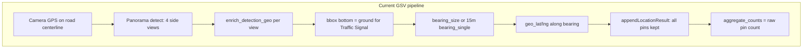
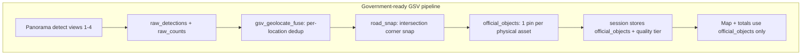

# GSV Traffic Signal & Asset Estimate Fix (Government-Ready)

## Your symptom — confirmed in code

When you finish a GSV map detection session, the results page shows **`{locations} · {totalObjects} objects`** ([`GsvMapResultsPage.jsx`](frontend/src/pages/GsvMapResultsPage.jsx)) where `totalObjects` = sum of [`aggregate_counts`](frontend/src/lib/gsvMapSession.js) — **one count per raw geo’d detection pin**, with **no deduplication**.

Traffic signals appearing **on the road** is expected with the current algorithm, not a display bug. Pins are placed exactly where [`enrich_detection_geo`](backend/geolocation.py) computes them; the map renders `geo_lat`/`geo_lng` verbatim ([`GsvMapResultsMap.jsx`](frontend/src/components/GsvMapResultsMap.jsx)).



---

## Root causes (ranked by impact on traffic signals)

### 1. Wrong pixel anchor for traffic signals (high)

[`geo_anchor_pixel`](backend/geolocation.py) uses **bottom-center of bbox** for `Traffic Signal` (same as poles). GSV models box the **signal head**, not the pole base. The ray is cast through the bottom of the head and projected to a flat ground plane → pin lands on **pavement ahead**, not at the intersection corner mount.

```76:88:backend/geolocation.py
def geo_anchor_pixel(det: dict, class_name: str) -> tuple[int, int]:
    ...
    if len(bbox) >= 4 and class_name in STATIC_GROUND_CLASSES:
        y = int(bbox[3])  # bottom of bbox treated as ground contact
```

There is **no test** for Traffic Signal anchor (only Pole is tested in [`test_geolocation.py`](backend/tests/test_geolocation.py)).

### 2. Camera origin is road centerline (structural)

GSV index GPS comes from `GPS_Long_Lat_Compass.mat` ([`build_gsv_continued_index.py`](backend/scripts/build_gsv_continued_index.py)). Every ray starts on the **street center**. Traffic signals at intersection **corners** are inherently offset laterally; a forward bearing + distance model cannot reach corners without **lateral offset or road snapping**.

### 3. No intersection-corner placement (missing feature)

The bearing-calibration plan listed OSM road snap as **future** ([`geolocation_bearing_calibration_0099cebf.plan.md`](.cursor/plans/geolocation_bearing_calibration_0099cebf.plan.md) Phase 5). **No OSM geometry query exists in the codebase today** — only OSM raster tiles for display.

### 4. Asset counts are inflated (high for government totals)

[`detect_gsv_continued_panorama`](backend/detector.py) **sums counts across all 4 views** with no cross-view dedup:

```760:761:backend/detector.py
        for cls, cnt in result.get("counts", {}).items():
            all_counts[cls] = all_counts.get(cls, 0) + cnt
```

[`gsv_continued_panorama_detect`](backend/main.py) merges all enriched detections into one flat list. [`appendLocationResult`](frontend/src/lib/gsvMapSession.js) stores every pin and recomputes `aggregate_counts` from pin count.

**Result:** One physical signal visible in 3 side views → **3 map pins + count of 3**.

Mapillary batch avoids this with [`geolocate_batch.run_geolocate_job`](backend/geolocate_batch.py) (LOB + 10 m clustering → `batch_object_locations`). **GSV has no equivalent.**

### 5. Multi-view LOB from same camera cannot fix distance

Batch LOB requires **different camera positions** (`_find_intersections` skips same `image_id`). GSV panorama views share one `lat/lng` — diverging bearings from one point do not triangulate distance. Distance must come from bbox-height model or snapping, not LOB-within-location.

### 6. `bearing_single` fallback (15 m) places pins down the road

When bbox is too small or height estimate fails, [`enrich_detection_geo`](backend/geolocation.py) uses `DEFAULT_OBJECT_DISTANCE_M=15` along the view bearing — almost always **on the road surface**.

---

## Target architecture



**Government-facing rule:** Summary counts and map markers use **`official_objects` only**. Raw per-view detections remain available in debug/export for audit.

---

## Phase 0 — Audit before any government demo (read-only, 1 day)

Build a diagnostic script and run it on your actual session data.

**New:** [`backend/scripts/audit_gsv_session_geo.py`](backend/scripts/audit_gsv_session_geo.py)

For each detection pin in a saved session JSON (or re-detect sample locations):

| Metric | How |
|--------|-----|
| Pins on road centerline | Distance from pin to nearest GSV camera trail segment &lt; 3 m |
| `bearing_single` rate | % with `geo_method=bearing_single` (unreliable distance) |
| Multi-view duplicates | Same `location_id` + class + pins within 15 m |
| Inflated count ratio | `aggregate_counts[Traffic Signal]` / deduped unique count |
| Compass sanity | Toggle `GSV_COMPASS_CCW` on 5 known intersections |

**Deliverable:** CSV report per session — **do not present until duplicate ratio &lt; 1.2 and &gt;80% of traffic signals are off centerline**.

---

## Phase 1 — Traffic-signal-specific geo model (backend core)

**Modify:** [`backend/geolocation.py`](backend/geolocation.py)

1. **Split anchor policy by class** — remove `Traffic Signal` from blanket bottom-anchor, or add class-specific anchor:

   - **Traffic Signal / Traffic Sign:** extrapolate pole base below bbox:
     - `y_anchor = bbox[3] + TRAFFIC_SIGNAL_POLE_EXTEND_RATIO * bbox_height` (env, default ~1.5–2.5× head height)
     - `x_anchor = bbox center` (unchanged)
   - Keep bottom-anchor for `Pole` / `Street Light` (full pole visible more often).

2. **Split height model:**
   - `ASSUMED_TRAFFIC_SIGNAL_HEAD_HEIGHT_M` (default 1.2) — for bbox-height distance when only head is boxed
   - `ASSUMED_TRAFFIC_SIGNAL_MOUNT_HEIGHT_M` (default 5.5) — total mounting height for ray/offset math
   - Deprecate using 5 m as both head and mount

3. **Add `geo_quality` field** on each enriched detection:
   - `high` = `bearing_size` + bbox width ≥ threshold
   - `low` = `bearing_single`
   - `skipped` = no geo

4. **Tests:** [`backend/tests/test_geolocation.py`](backend/tests/test_geolocation.py) — Traffic Signal anchor below bbox bottom; distance differs from Pole for same bbox.

**Env additions in** [`.env.example`](.env.example):
```env
TRAFFIC_SIGNAL_POLE_EXTEND_RATIO=2.0
ASSUMED_TRAFFIC_SIGNAL_HEAD_HEIGHT_M=1.2
ASSUMED_TRAFFIC_SIGNAL_MOUNT_HEIGHT_M=5.5
```

---

## Phase 2 — Per-location fusion & deduplicated counts (backend)

**New:** [`backend/gsv_geolocate.py`](backend/gsv_geolocate.py)

Called at end of [`gsv_continued_panorama_detect`](backend/main.py) after per-view geo enrichment.

### 2a. Within-location clustering

For each class (especially `Traffic Signal`):

- Group detections at same `location_id` whose initial `geo_lat/lng` fall within `GSV_LOC_CLUSTER_RADIUS_M` (default **12 m**, tunable)
- Merge cluster → **one candidate object**:
  - Prefer `bearing_size` over `bearing_single`
  - Prefer highest confidence, then largest bbox height
  - Retain `support_views: [1,3,4]` and `support_count`

### 2b. Cross-location session clustering (when recording drive)

When session has multiple locations, cluster `official_objects` across locations:

- Same class + haversine ≤ `GSV_SESSION_CLUSTER_RADIUS_M` (default **10 m**)
- **LOB triangulation across different camera positions** (re-use [`intersect_lob_2d`](backend/geolocation.py) + [`cluster_points`](backend/geolocation.py)) — this is valid because drive locations have different GPS
- Output `geo_method: gsv_lob_triangulation` when ≥2 drive positions agree

### 2c. Response shape change

Extend panorama detect response:

```python
{
  "detections": [...],           # raw per-view (audit)
  "counts": {...},               # raw per-view sum (audit)
  "official_objects": [...],     # deduped assets for map + totals
  "official_counts": {...},      # deduped counts for government summary
}
```

**Modify:** [`frontend/src/lib/gsvMapSession.js`](frontend/src/lib/gsvMapSession.js) — `flattenDetections` uses `official_objects` when present; `aggregate_counts` from `official_counts`.

---

## Phase 3 — Intersection corner snap (your requirement)

**New:** [`backend/road_snap.py`](backend/road_snap.py)

Post-process `official_objects` for `Traffic Signal` (and optionally `Traffic Sign`).

### 3a. Find intersection anchor

**Primary — OSM Overpass** (new dependency: `httpx` already present):

- Query `highway` ways + intersection nodes within `SNAP_SEARCH_RADIUS_M` (default 40 m) of estimated pin
- Pick nearest intersection node to initial estimate

**Fallback — GSV nav graph** (no network, uses existing index):

- Location is intersection-like when [`nav.left`](backend/scripts/build_gsv_continued_index.py) **and** `nav.right` are both set, or node degree ≥ 3 among forward/back/left/right
- Intersection center ≈ GSV location GPS at that node (or centroid of connected nav nodes within 25 m)

### 3b. Pick corner (not centerline)

Given intersection center + approach road bearing (location `compass` / travel direction):

1. Compute detection bearing relative to road axis → quadrant (ahead-left, ahead-right, left, right)
2. Generate **4 corner candidates** offset from intersection center along road arm bisectors (default offset `INTERSECTION_CORNER_OFFSET_M` = 6–10 m, env-tunable)
3. Select corner minimizing angular error to detection bearing **and** on correct side of road (left/right from camera frame via `pixel_to_bearing_delta` sign)
4. Set `geo_lat/lng` to corner; `geo_method: intersection_corner_snap`; `geo_quality: high` only if OSM node found

### 3c. Reject bad snaps

- If no intersection within radius → keep fused estimate but flag `geo_quality: low`, **exclude from government total** unless manually reviewed
- If snap moves pin &gt; `SNAP_MAX_DISPLACEMENT_M` (default 25 m) → reject snap, flag for review

**Wire in:** [`backend/main.py`](backend/main.py) panorama endpoint + optional `POST /gsv-continued/sessions/{id}/refine` to re-snap stored sessions.

---

## Phase 4 — Frontend & government export

| File | Change |
|------|--------|
| [`GsvMapResultsPage.jsx`](frontend/src/pages/GsvMapResultsPage.jsx) | `totalObjects` from `official_counts`; subtitle shows deduped totals |
| [`GsvContinuedPage.jsx`](frontend/src/pages/GsvContinuedPage.jsx) | Live recording counter uses official counts |
| [`GsvMapResultsMap.jsx`](frontend/src/components/GsvMapResultsMap.jsx) | Official markers only by default; toggle “Show raw detections (debug)” |
| [`GsvContinuedDetectionTable.jsx`](frontend/src/components/GsvContinuedDetectionTable.jsx) | Badge: `official` / `raw` / `excluded`; show `support_views` |
| [`gsvMapExportHtml.js`](frontend/src/lib/gsvMapExportHtml.js) | Embed `official_objects`; government HTML uses deduped layer; methodology footnote |

**Government summary line (proposed):**
> `12 locations · 8 traffic signals (verified) · 2 estimated · session 4m 32s`

Where “verified” = corner-snapped or multi-location LOB; “estimated” = low-quality singles excluded from primary count.

---

## Phase 5 — Validation protocol (mandatory before government)

Manual checklist on **PitOrlManh known intersections** (document in repo, not shown to officials):

1. Pick 5 locations where `nav.left` and `nav.right` exist (true intersections)
2. Run panorama detect → open **satellite basemap** + **show rays**
3. For each traffic signal:
   - Pin must be within **5 m** of visible intersection corner on satellite
   - Deduped count must match **human count** of distinct signal heads (±0)
4. Run audit script — thresholds:
   - Traffic Signal duplicate inflation **&lt; 20%**
   - Corner snap success rate **≥ 85%** at intersections
   - Zero `bearing_single`-only signals in “verified” tier
5. If left/right mirrored → tune `GSV_COMPASS_CCW` / `COMPASS_BEARING_OFFSET_DEG`
6. If lateral offset systematic → tune `HFOV_SCALE` / `GSV_HORIZONTAL_FOV_DEG`

**New tests:**
- [`backend/tests/test_gsv_geolocate.py`](backend/tests/test_gsv_geolocate.py) — within-location dedup, cross-location LOB
- [`backend/tests/test_road_snap.py`](backend/tests/test_road_snap.py) — corner selection geometry (mock OSM + nav fallback)

---

## What NOT to show government until fixed

- Raw `aggregate_counts` (inflated multi-view totals)
- Per-view detection pins for traffic signals (duplicate road pins)
- Any pin with `geo_method=bearing_single` and no corner snap
- Sessions recorded before re-snap (must re-run detect or `refine` endpoint)

---

## Implementation order (strict)

1. **Phase 0 audit** — quantify your current session error (proves the problem with numbers)
2. **Phase 1 anchor fix** — stops worst “on road ahead” placement
3. **Phase 2 dedup** — fixes asset count (government KPI)
4. **Phase 3 corner snap** — meets intersection-corner requirement
5. **Phase 4 UI/export** — government-facing presentation
6. **Phase 5 validation** — sign-off gate

---

## Risk notes

| Risk | Mitigation |
|------|------------|
| OSM missing intersection in study area | GSV nav-graph fallback + flag as `estimated` |
| Overpass API rate limits | Cache intersection queries per bbox in session; offline nav fallback |
| Non-intersection signals (mid-block) | Only apply corner snap when intersection found; mid-block uses fused bearing_size pin offset laterally from centerline |
| Old sessions in sessionStorage | Re-detect or run refine endpoint; export warns if pre-fix session |

---

## Files to create / modify

| Action | File |
|--------|------|
| **Create** | `backend/gsv_geolocate.py` |
| **Create** | `backend/road_snap.py` |
| **Create** | `backend/scripts/audit_gsv_session_geo.py` |
| **Create** | `backend/tests/test_gsv_geolocate.py` |
| **Create** | `backend/tests/test_road_snap.py` |
| **Modify** | `backend/geolocation.py` |
| **Modify** | `backend/main.py` |
| **Modify** | `frontend/src/lib/gsvMapSession.js` |
| **Modify** | `frontend/src/pages/GsvMapResultsPage.jsx` |
| **Modify** | `frontend/src/pages/GsvContinuedPage.jsx` |
| **Modify** | `frontend/src/components/GsvMapResultsMap.jsx` |
| **Modify** | `frontend/src/lib/gsvMapExportHtml.js` |
| **Modify** | `.env.example` |

No changes to Roboflow models required — this is geometry, dedup, and road snapping.
