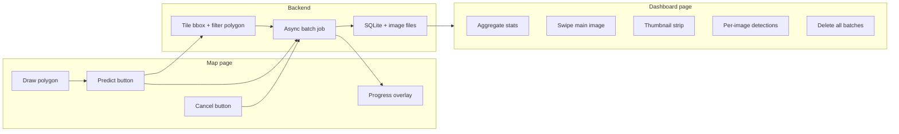
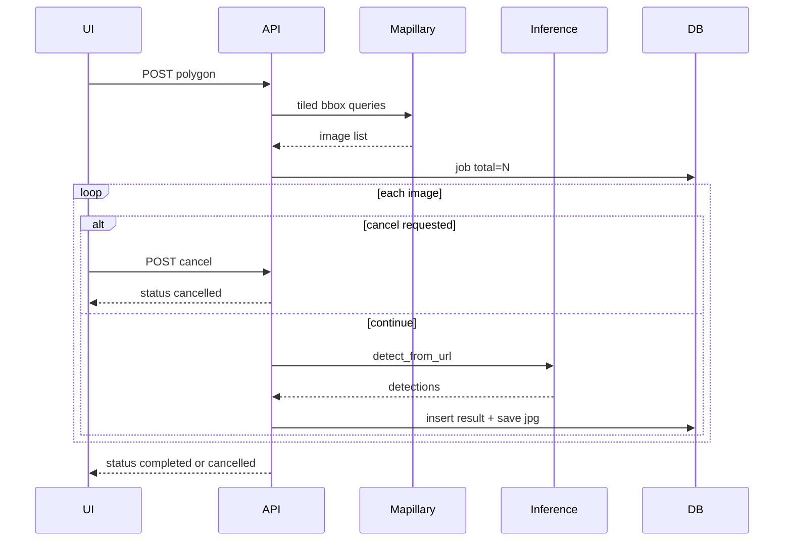

# Polygon batch detection and dashboard

## Current state

| Layer | Today |
|-------|--------|
| Map | Single-click detect via [`frontend/src/components/MapView.jsx`](frontend/src/components/MapView.jsx) → `POST /detect/street` |
| Images | One nearest image per click in [`backend/mapillary.py`](backend/mapillary.py) (`radius` / small `bbox`, `limit` 100) |
| Inference | Dual models + merge in [`backend/detector.py`](backend/detector.py) (`_run_models`, `detect_from_url`) |
| UI state | In-memory only in [`frontend/src/context/DetectionContext.jsx`](frontend/src/context/DetectionContext.jsx) |
| Routing | None — single [`frontend/src/App.jsx`](frontend/src/App.jsx) |

## Target user flow



1. User enables **Draw area** on the map, completes a polygon.
2. User clicks **Predict** → backend discovers all Mapillary images whose coordinates fall inside the polygon (no artificial cap per your choice).
3. Backend runs **both models** on each image (reuse existing `detect_from_url` pipeline).
4. User sees **live progress** on the map (e.g. `42 / 187 images`) and can click **Cancel** at any time to stop the whole job.
5. When finished, cancelled, or on demand, user opens **Dashboard** (`/dashboard` or `/dashboard/:jobId`) — filmstrip thumbnails, swipe/carousel for annotated images, detection list, class totals, filters. **Cancelled jobs** keep partial results already processed.
6. **Delete all** wipes SQLite rows and stored image files (with confirmation).

---

## Backend design

### 1. Mapillary: images inside polygon

New module [`backend/mapillary_batch.py`](backend/mapillary_batch.py):

- **BBox** from polygon vertices (`min/max` lng/lat).
- **Tile the bbox** into sub-boxes each **&lt; 0.01 deg²** (Mapillary hard limit). Simple grid subdivision in pure Python (no new dependency required).
- For each tile: `GET https://graph.mapillary.com/images?bbox=...&limit=2000` (reuse `_params` / `IMAGE_FIELDS` from [`backend/mapillary.py`](backend/mapillary.py)).
- **Dedupe** by `image.id`.
- **Point-in-polygon** filter (ray-casting) on `geometry.coordinates` `[lng, lat]`.
- Return normalized list: `image_id`, `thumb_url`, `image_lat`, `image_lng`, `captured_at`, `compass_angle`, `sequence_id`.

**Operational note (document in README):** dense urban polygons can yield hundreds/thousands of images; total runtime scales linearly (~2× inference calls per image). Progress UI and **Cancel** are required for long runs.

### 2. Async batch jobs + cancel

New module [`backend/batch_service.py`](backend/batch_service.py):

- `POST /batch/polygon` — body: `{ "polygon": [[lng, lat], ...] }` (closed ring).
  - Validates polygon (≥ 3 points, reasonable area).
  - Creates job row `status=queued`, stores polygon JSON.
  - Registers `asyncio.Event` in an in-memory `_cancel_events[job_id]` map.
  - `asyncio.create_task(run_batch_job(job_id))`.
  - Returns `{ "job_id", "image_count" }` after discovery phase (or `image_count` updated as discovery completes).

- `POST /batch/{job_id}/cancel` — request cooperative stop of the **entire** job.
  - Sets the job’s cancel event and updates DB `status=cancelling`.
  - Idempotent: safe if job already `completed`, `cancelled`, or `failed`.
  - Returns `{ "job_id", "status": "cancelling" }`.

- `GET /batch/{job_id}` — `{ status, total, processed, failed, cancelled_at?, errors[], summary }`.
  - `status` values: `queued` | `discovering` | `running` | `cancelling` | `cancelled` | `completed` | `failed`.

- `GET /batch/{job_id}/results?offset=&limit=` — paginated image results (avoid loading 500+ full payloads at once).

- `GET /batch` — list recent jobs (for dashboard default / history).

- `DELETE /batch` — **delete all** jobs + wipe storage directory.

- `DELETE /batch/{job_id}` — delete one job (optional but low cost).

**Cooperative cancellation (implementation):**

- Worker loop checks `_cancel_events[job_id].is_set()`:
  - **Between** Mapillary bbox tiles during discovery.
  - **Before** starting each image’s inference (do not start a new image after cancel).
  - **After** current in-flight inference finishes (do not kill mid-request to avoid corrupt partial writes).
- On cancel detected: set `status=cancelled`, `finished_at=now`, unregister event; **retain** all `batch_results` rows and JPEGs already saved.
- If cancel arrives while `status=queued` or `discovering`, abort before inference starts.

**Concurrency:** `asyncio.Semaphore(3)` (env `BATCH_CONCURRENCY`) when calling `detector.detect_from_url` so the inference server is not overwhelmed.

**Per-image failure:** log and increment `failed`; do not abort entire job (unless user cancelled).

### 3. Persistence (SQLite + files)

New [`backend/storage.py`](backend/storage.py) + data dir `backend/data/batches/` (gitignored via `.gitignore`):

| Table | Purpose |
|-------|---------|
| `batch_jobs` | `id`, `status`, `polygon_json`, `created_at`, `finished_at`, `cancelled_at`, `total`, `processed`, `failed`, `aggregate_counts_json` |
| `batch_results` | `job_id`, `image_id`, `lat`, `lng`, `captured_at`, `thumb_url`, `counts_json`, `detections_json`, `annotated_path`, `error` |

- **Annotated images:** save JPEG files under `backend/data/batches/{job_id}/{image_id}.jpg` (decode from existing `_draw_and_encode` output) instead of storing huge base64 in SQLite.
- **Thumbnails in API:** `GET /batch/{job_id}/images/{image_id}/annotated` serves the file.
- **Aggregate counts:** recompute on each successful image (sum of `counts` dicts) for fast dashboard KPIs.

Add volume in [`docker-compose.yml`](docker-compose.yml):

```yaml
volumes:
  - ./backend/data:/app/data
```

### 4. Wire into FastAPI

Extend [`backend/main.py`](backend/main.py) with batch routes and mount `StaticFiles` or a small file-serving route for annotated JPEGs.

Reuse existing detection shape from `detect_from_url` so the dashboard can share UI patterns with [`frontend/src/components/DetectionPanel.jsx`](frontend/src/components/DetectionPanel.jsx).

---

## Frontend design

### 1. Routing

Add `react-router-dom`:

- `/` — existing map workspace ([`App.jsx`](frontend/src/App.jsx) layout preserved).
- `/dashboard` — latest completed job or job picker.
- `/dashboard/:jobId` — specific batch.

Wrap app in `BrowserRouter` in [`frontend/src/main.jsx`](frontend/src/main.jsx).

### 2. Polygon drawing on map

Add `leaflet-draw` (+ CSS in `main.jsx`).

New [`frontend/src/components/PolygonDrawControl.jsx`](frontend/src/components/PolygonDrawControl.jsx):

- Toolbar: **Draw area** | **Clear** | **Predict** (disabled until polygon exists).
- While drawing: disable map click-to-detect ([`ClickHandler`](frontend/src/components/MapView.jsx)) to avoid conflicts.
- On Predict: `POST /batch/polygon`, start polling `GET /batch/{job_id}` every 1–2s.

Progress overlay on map ([`BatchProgressOverlay.jsx`](frontend/src/components/BatchProgressOverlay.jsx)):

- Progress bar + `processed / total` (and phase label: `Discovering…` vs `Detecting…`).
- **Cancel** button (prominent, always visible while `queued` / `discovering` / `running` / `cancelling`).
- On Cancel: call `POST /batch/{job_id}/cancel`, show `Cancelling…` until poll returns `cancelled`.
- Toast: “Batch cancelled — N images saved” with link to dashboard for partial results.
- **Open dashboard** when `status=completed` or `cancelled` (partial results viewable).

Same **Cancel** control on dashboard header when viewing a job still in `running` / `cancelling` (poll continues until terminal state).

### 3. API client

Extend [`frontend/src/api.js`](frontend/src/api.js):

- `startBatchPolygon(polygon)`
- `getBatchJob(jobId)`
- `cancelBatchJob(jobId)`
- `getBatchResults(jobId, offset, limit)`
- `listBatchJobs()`
- `deleteAllBatches()`
- `annotatedImageUrl(jobId, imageId)`

### 4. Dashboard page (new)

[`frontend/src/pages/BatchDashboard.jsx`](frontend/src/pages/BatchDashboard.jsx) + subcomponents:

| Section | Behavior |
|---------|----------|
| Header | Job meta (area approx, image count, duration, **Cancelled** badge if applicable), nav back to map, **Cancel** (if in progress), **Delete all** with confirm modal |
| KPI row | Total images, success/fail, per-class totals (reuse `CLASS_META` from [`StatsBar.jsx`](frontend/src/components/StatsBar.jsx)) |
| Main viewer | Large annotated image; **swipe** left/right (touch + arrow keys); optional keyboard `←` `→` |
| Filmstrip | Scrollable row of small thumbnails; click to jump index |
| Detail panel | Class chips, confidence bars (same visual language as `DetectionPanel`) |
| Class filter | Filter filmstrip + counts to one class |

**Pagination:** load results in pages of ~20–50; prefetch next page when user nears end of filmstrip.

**Empty states:** no jobs yet → CTA back to map; job running → poll and show progress.

### 5. Context

Light [`frontend/src/context/BatchContext.jsx`](frontend/src/context/BatchContext.jsx) optional — mostly route-driven fetches; keep [`DetectionContext`](frontend/src/context/DetectionContext.jsx) for single-click flow unchanged.

---

## Key implementation details

**Discovery then infer (two phases):**



**Unlimited images:** no hard cap in code; enforce only Mapillary/API practical limits. Show warning toast if `total > 200` (“This may take a long time”). Consider env `BATCH_WARN_THRESHOLD` only for UI messaging.

**Delete all:** `DELETE /batch` removes all rows and `rm -rf backend/data/batches/*` (or per-job folders); dashboard resets to empty state.

**Security:** batch file routes must validate `job_id` / `image_id` path segments (no path traversal).

---

## Files to add / change (summary)

| Action | Path |
|--------|------|
| Add | `backend/mapillary_batch.py`, `backend/batch_service.py`, `backend/storage.py` |
| Edit | `backend/main.py`, `backend/requirements.txt` (if any), `docker-compose.yml`, `.gitignore` |
| Add | `frontend/src/pages/BatchDashboard.jsx`, `PolygonDrawControl.jsx`, `BatchProgressOverlay.jsx` |
| Edit | `frontend/src/App.jsx`, `MapView.jsx`, `api.js`, `main.jsx`, `package.json` |
| Edit | `README.md` — polygon batch usage, storage path, delete-all |

---

## Testing plan (manual)

1. Draw small polygon over known green Mapillary coverage → Predict → verify `total` matches expectation.
2. Confirm dual-model detections (`source_model` on detections) still present in batch results.
3. Open dashboard → swipe images, filmstrip sync, class filter.
4. Refresh browser on `/dashboard/:jobId` → data still loads from backend.
5. Delete all → DB empty, files gone, dashboard empty.
6. Docker: confirm `backend/data` volume persists across container restart.
7. Start large batch → Cancel mid-run → status `cancelled`, `processed < total`, dashboard shows partial results only.
8. Cancel during discovery phase → no inference runs, job ends with `processed=0`.

---

## Out of scope (unless requested later)

- GeoJSON export of batch results
- GPU batching on inference server
- Cross-device sync (would need auth + cloud storage)
