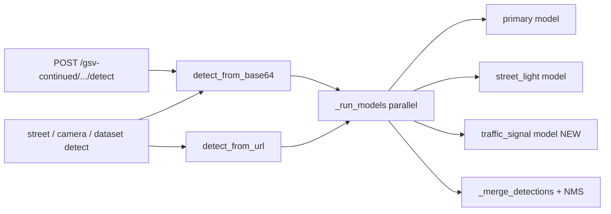

# Add Traffic Signal Model (app-wide)

## Context

GSV continued **Run detection** already calls [`detect_from_base64`](backend/detector.py) via [`POST /gsv-continued/locations/{id}/detect`](backend/main.py) — same path as map camera, dataset explorer, and street detect. No separate GSV detector exists.

Today [`detector.py`](backend/detector.py) runs **two** models in parallel when enabled:

- Primary: `vehicle-detection-7nnx0/4`
- Secondary: `street-light-ci0on/1` (`ENABLE_STREET_LIGHT_MODEL`)

New model from [Roboflow Universe](https://universe.roboflow.com/project-5/traffic-signal-eym6e):

| Field | Value |
|-------|--------|
| Workspace | `project-5` |
| Project | `traffic-signal-eym6e` |
| Model ID (inference) | `traffic-signal-eym6e/{version}` (default version **1** unless your workspace uses another) |
| Universe URL | `https://universe.roboflow.com/project-5/traffic-signal-eym6e/model/1` |

`Traffic Signal` is already in [`CLASS_COLORS`](backend/detector.py), [`CLASS_EMOJIS`](frontend/src/constants/classes.js), and geolocation height assumptions — no new UI class row required.



You chose **app-wide** scope (same as street-light).

---

## Backend changes

### 1. [`backend/detector.py`](backend/detector.py)

Add env vars (mirror street-light):

```python
TRAFFIC_SIGNAL_WORKSPACE = os.getenv("TRAFFIC_SIGNAL_WORKSPACE", "project-5")
TRAFFIC_SIGNAL_PROJECT_ID = os.getenv("TRAFFIC_SIGNAL_PROJECT_ID", "traffic-signal-eym6e")
TRAFFIC_SIGNAL_MODEL_VERSION = os.getenv("TRAFFIC_SIGNAL_MODEL_VERSION", "1")
ENABLE_TRAFFIC_SIGNAL_MODEL = os.getenv("ENABLE_TRAFFIC_SIGNAL_MODEL", "true").lower() in (...)
TERTIARY_MODEL_ID = f"{TRAFFIC_SIGNAL_PROJECT_ID}/{TRAFFIC_SIGNAL_MODEL_VERSION}"
```

- Extend `_run_models()` to append `("traffic_signal", TERTIARY_MODEL_ID)` when `ENABLE_TRAFFIC_SIGNAL_MODEL` is true (run all enabled models with `asyncio.gather`, same failure rules: primary failure raises; optional models log warning and skip).
- Bump `INFERENCE_TIMEOUT` when multiple optional models run (e.g. 60s if both street-light and traffic-signal enabled).
- Add **`CLASS_ALIASES`** entries for common Roboflow class strings, e.g. `traffic signal`, `traffic-signal`, `TrafficSignal`, `signal` → `"Traffic Signal"`.
- Extend `get_model_config()` with traffic-signal fields for `/config`.

### 2. [`backend/main.py`](backend/main.py) — `/config`

Add third entry to `models` array:

```python
{
  "role": "traffic_signal",
  "model_id": cfg["traffic_signal_model_id"],
  "workspace": ts_workspace,
  "project": ts_project,
  "version": ts_version,
  "enabled": traffic_signal_enabled,
  "universe_url": "https://universe.roboflow.com/project-5/traffic-signal-eym6e/model/1",
}
```

No change to `gsv_continued_detect` — it already uses `detect_from_base64`.

### 3. Config files

| File | Change |
|------|--------|
| [`.env.example`](.env.example) | Document `TRAFFIC_SIGNAL_*` and `ENABLE_TRAFFIC_SIGNAL_MODEL` |
| [`docker-compose.yml`](docker-compose.yml) | Pass new env vars with defaults (same pattern as `STREET_LIGHT_*`) |

User must ensure the model is available on the local inference server (same API key / workspace access as other Roboflow models).

---

## Frontend (minimal)

### [`frontend/src/components/StatsBar.jsx`](frontend/src/components/StatsBar.jsx)

Optionally show a third line under the title when `models` includes `role: "traffic_signal"` and enabled (same pattern as street-light `+ project vN`). **GSV continued** uses the same detection pipeline; no page-specific API changes.

[`GsvContinuedImagePanel.jsx`](frontend/src/components/GsvContinuedImagePanel.jsx) already lists detections by class — traffic-signal hits appear as **Traffic Signal** automatically.

---

## Operational notes

1. Add to `.env` (or rely on compose defaults):

```env
TRAFFIC_SIGNAL_WORKSPACE=project-5
TRAFFIC_SIGNAL_PROJECT_ID=traffic-signal-eym6e
TRAFFIC_SIGNAL_MODEL_VERSION=1
ENABLE_TRAFFIC_SIGNAL_MODEL=true
```

2. Restart inference server / backend after env change: `docker compose restart backend`
3. On GSV continued: click a point → **Run detection** → expect merged boxes including traffic signals from the new model.

If inference returns 404 for model version, set `TRAFFIC_SIGNAL_MODEL_VERSION` to the version shown on your Roboflow model page.

---

## Test plan

1. `GET /config` lists three models; `traffic_signal.enabled` is true.
2. `POST /gsv-continued/locations/1/detect?view=0` succeeds with combined `counts` and `detections` (check for `Traffic Signal` entries when present in image).
3. Same behavior on `/dataset/images/0/detect` and `/detect/camera` (app-wide).
4. Disabling `ENABLE_TRAFFIC_SIGNAL_MODEL=false` removes tertiary calls without breaking primary/street-light.
5. StatsBar (optional) shows traffic-signal model line when enabled.

---

## Files to modify

| File | Action |
|------|--------|
| [`backend/detector.py`](backend/detector.py) | Third model, aliases, timeout, `get_model_config` |
| [`backend/main.py`](backend/main.py) | `/config` models list |
| [`.env.example`](.env.example) | New env vars |
| [`docker-compose.yml`](docker-compose.yml) | New env defaults |
| [`frontend/src/components/StatsBar.jsx`](frontend/src/components/StatsBar.jsx) | Optional third model label |

No changes to [`gsv_continued_service.py`](backend/gsv_continued_service.py) or GSV index/nav code.
