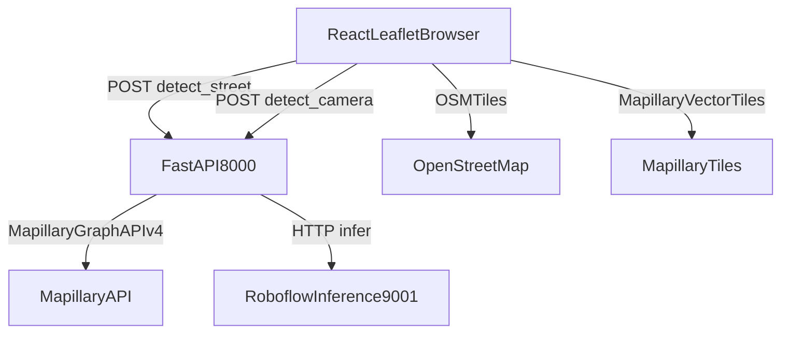

# Dockerized Urban Detector Implementation Plan

## Scope Locked
- Build from scratch directly in workspace root: `d:/Street_view_detection`.
- Run all runtime services in Docker Compose, including Roboflow inference server.
- Implement backend/frontend exactly per your provided API/UI specs and acceptance criteria.

## Target File Layout
- Backend: [`backend/main.py`](backend/main.py), [`backend/detector.py`](backend/detector.py), [`backend/mapillary.py`](backend/mapillary.py), [`backend/requirements.txt`](backend/requirements.txt), [`backend/.env.example`](backend/.env.example), [`backend/.env`](backend/.env)
- Frontend: [`frontend/src/App.jsx`](frontend/src/App.jsx), [`frontend/src/components/MapView.jsx`](frontend/src/components/MapView.jsx), [`frontend/src/components/MapillaryLayer.jsx`](frontend/src/components/MapillaryLayer.jsx), [`frontend/src/components/CameraView.jsx`](frontend/src/components/CameraView.jsx), [`frontend/src/components/DetectionPanel.jsx`](frontend/src/components/DetectionPanel.jsx), [`frontend/src/components/StatsBar.jsx`](frontend/src/components/StatsBar.jsx), [`frontend/src/components/MarkerPopup.jsx`](frontend/src/components/MarkerPopup.jsx), [`frontend/src/context/DetectionContext.jsx`](frontend/src/context/DetectionContext.jsx), [`frontend/src/api.js`](frontend/src/api.js), [`frontend/src/main.jsx`](frontend/src/main.jsx), [`frontend/src/index.css`](frontend/src/index.css), [`frontend/vite.config.js`](frontend/vite.config.js), [`frontend/package.json`](frontend/package.json), [`frontend/index.html`](frontend/index.html)
- Docker/ops/docs: [`docker-compose.yml`](docker-compose.yml), [`backend/Dockerfile`](backend/Dockerfile), [`frontend/Dockerfile`](frontend/Dockerfile), [`start.sh`](start.sh), [`README.md`](README.md), [`.env.example`](.env.example)

## Runtime Architecture

## Implementation Plan
- Scaffold monorepo folders and initialize frontend (Vite React) and backend (FastAPI Python) with exact module/component names you specified.
- Implement backend core:
  - `detector.py`: async inference call to `/{project_id}/{model_version}`, prediction normalization, class counts, OpenCV annotation, base64 output, health check.
  - `mapillary.py`: token init, nearest-image query via Graph API with progressive radius and haversine selection.
  - `main.py`: CORS, `/health`, `/config`, `/detect/street`, `/detect/camera`, request models, startup connectivity checks.
- Implement frontend core:
  - Global detection context for markers/active item/session counts.
  - Map with OSM base layer, Mapillary vector tile overlay, click-to-detect, loading marker, pin rendering, popup integration.
  - Detection panel with annotated image + confidence list, camera panel with `getUserMedia`, stats bar with animated totals, API client.
  - Theme/fonts/style tokens and Leaflet Vite marker fix.
- Dockerize everything:
  - Backend image (Python runtime, dependencies, uvicorn entrypoint).
  - Frontend image (Node + Vite dev server for local iteration, configurable API URL).
  - Roboflow inference container service in Compose (port `9001`) with env wiring from `.env`.
  - Compose networking so backend reaches inference by service name, while frontend calls backend through exposed host port.
- Add root `.env.example` and backend `.env.example` documenting all required secrets and service URLs (no hardcoded secrets in frontend).
- Add `start.sh` wrapper that validates env and launches `docker compose up --build`.
- Write `README.md` with prereqs, one-command startup, key provisioning steps (Mapillary + Roboflow), usage flow, troubleshooting, and acceptance checklist.
- Validate via smoke tests:
  - Backend health/config endpoints and inference connectivity.
  - Street click flow and camera flow API payloads.
  - Frontend rendering and state updates against acceptance criteria.

## Verification Matrix (Acceptance Mapping)
- Map + Mapillary dots visible and interactive behavior matches click flow.
- Street detection places blue marker and returns annotated image/detections.
- Camera detection places orange marker when GPS available and updates panel.
- Popup and “View Full Detection” synchronize with right panel.
- Stats bar increments cumulative 8-class totals with animation.
- Error toasts for no imagery and inference unavailability are shown.
- `/health` reports inference connection status.
- Secrets remain server-side in `.env`; frontend only receives safe config values.

## Risks and Mitigations
- Roboflow container image/route differences across versions: pin tested image/tag and confirm endpoint during compose bring-up.
- Camera permissions/geolocation variability by browser: graceful fallback toast and continue detection without GPS.
- Mapillary sparse coverage: keep no-imagery UX with clear green-dot guidance.
